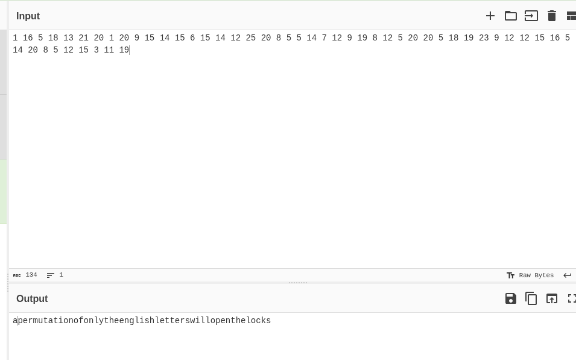
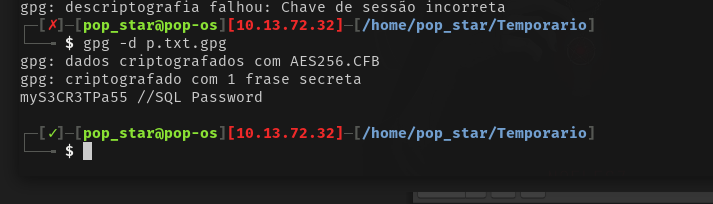

> [!Informações]
> - O IP da máquina foi adicionado ao `/etc/hosts` com a URL `http://rabbit.thm/`
> - Período: 22/09/2025 á 23/09/2025
> - Máquina do `TryHackMe` de Nível Difícil
> - Sistema Operacional: Linux

# Sumário
1. [[#1. Enumeração]]
	1. [[#1.1 NMap]]
	2. [[#1.2 Varredura de Diretórios]]
2. [[#2. Exploração]]
	1. [[#2.1 Analisando a aplicação]]
	2. [[#2.2 Falhas de Bug Bounty Exposto]]
	3. [[#2.3 Autenticando como Moderador]]
	4. [[#2.4 Quebrando a hash do Arquivo Criptografado]]
	5. [[#2.5 Autenticando no Banco de Dados]]
	6. [[#2.6 Acessando a conta do Super Moderador Através de Cookie Injection]]
	7. [[#2.7 Acesso via SSH]]
3. [[#3. Escalação de Privilégio com `pandoc`]]
4. [[#4. Pós-Exploração com Privilégios Máximos]]


## 1. Enumeração
### 1.1 NMap


A análise das três portas abertas sugere que a escalada inicial pode ocorrer via vazamento de credenciais de autenticação do MySQL.

## 1.2 Varredura de Diretórios


http://10.201.4.128/admin/


A partir da enumeração realizada com o Gobuster, infere-se que apenas a área de login do painel do administrador está exposta.

## 2. Exploração

### 2.1 Analisando a aplicação

Após extensa análise, verifiquei os usuários registrados e notei que apenas um possui foto de perfil. Embora aparentemente normal, esse detalhe será considerado durante a investigação.


Percebi também, que o mesmo contém algumas publicações então passei a investigar.


Nessa aplicação, nenhum campo estava editável nem os botões funcionavam; por meio do DOM, habilitei-os e enviei as requisições pelo Burp Suite.

### 2.2 Falhas de Bug Bounty Exposto
Durante a análise, identifiquei o arquivo `/reportPanel.php`, que listava todas as falhas reportadas. Ao avaliar os itens, uma vulnerabilidade se destacou pela simplicidade e passei a investigá-la para possível exploração.


Dessa forma, foram identificadas duas informações críticas a serem coletadas: a lista de usuários presente em `members.php` e as senhas padrão divulgadas pela vulnerabilidade. Após a construção da requisição e a execução de um ataque _Cluster Bomb_, foi possível extrair credenciais válidas.


> [!Credenciais]
> PalacerKing:qwerty
> ArnoldBagger:Luisfactor05

### 2.3 Autenticando como Moderador

Ao analisar os e-mails das duas contas e inspecionar as mensagens enviadas, encontrei uma mensagem que continha um caminho que não havia sido observado anteriormente.


Ao acessar esse diretório me deparei com um arquivo criptografado `p.txt.gpg` e o plugin que tantam falam pelos emails `modManagerv...`


## 2.4 Analisando Plugin Vulnerável


1. Ao acessar esse caminho não foi encontrado nenhum arquivo no diretório
2. A mensagem continha instruções sobre como conectar ao banco de dados.


/reportPanel.php





## 2.4 Quebrando a hash do Arquivo Criptografado

Acessando o diretório: `/0100101101100101011110010110110101100001011010110110010101110010`  
e entrando no código-fonte, é possível verificar alguns caracteres em chinês. Analisando com atenção, percebe-se que há caracteres escondidos dentro desses caracteres chineses. Juntando isso com a dica anterior sobre permutação, faremos um código em Python para trocar as posições das palavras, que provavelmente formam uma chave.


Script de Permutação
```
import itertools
#Eng-letters 
engletters = ['f', 'v', 'g', 'o', 'x', 'q']
var = itertools.permutations(engletters, 6)
#password-list
with open("pass.txt", "w") as f:
    for v in var:
        f.write('{}\n'.format(''.join(v)))
        f.close
```

Bem, juntando essas informações, a ideia agora é usar o John e, com a lista que será gerada pelo script, tentar a quebra do hash.


Com a senha em mãos, é hora de descriptografar.
`gpg -d p.txt.gpg`


## 2.5 Autenticando no Banco de Dados


```
mysql> select * from members;

+----------------+-----------------------------------------------------+
| user           | login_key                                           |
+----------------+-----------------------------------------------------+
| LucyRob        | xa72nhg3opUxviKUZWbMAwmyOekaJOFTGjiJjfAMhPkeIjk2Ig  |
| Wannabe_Hacker | LsVBnPTZGeUw6JkmMKFrzkSIUPu5TC0Nej8DAjwYXenQcCFEpv  |
| batmanZero     | TBTZq6GfniPvFfb2A3rA2mQoThcb5U7irVF5lLpr0L4cJcy5m9  |
| SandraJannit   | 6V5H71ZnvoW0FFbXx97YsV9LSnT4mltu9XB1v8qPo2X2CvfWBS  |
| biggieballo    | 75mXme5o0eY2o68sqeGBlTDvZcyJKmBhxUAusxiv6b816QilCG  |
| AimsGregger    | Xj8nuWt5Xn9UYzpIha1q2Fk4GUjyrEPPbpchDCwnniUO0ZzZyf  |
| BlackCat       | JY1Avl8cqCMkIFprMxWbTxwf8dSkiv7GJHzlPDWJWWg9gnG3FB  |
| Golderg        | clkNBtIoKICfzm6joGE2lTUiF2T8sVUfhtb2Aksst8zTRK2842  |
| TonyMontana    | 8CtllQvd9V2qqHv0ZSjUj3PzuTSD37pam4ld8YjlB7gDN0zVwE  |
| CaseBrax       | eHXBFESqEoE5Ba2gcOjD8oBMJcgNRkazcJOc8wQQ9mGVRpMdvU  |
| Ellie          | G9KY2siJp9OOymdCiQclQn9UhxL6rSpoA3MXHCDgvHCcrCOOuT  |
| Sosaxvector    | RURFzCfyEIBeTE3yzgQDY34zC9jWqiBwSnyzDooH33fSiYr9ci  |
| PalacerKing    | 49wrogyJpIQI834MlhDnDnbb3Zlm0tFehnpz8ftDroesKNGbAX  |
| Anderson       | lkJVgYjuKl9P4cg8WUb8XYlLsWKT4Zxl5sT9rgL2a2d5pgPU1w  |
| CrazyChris     | tpM9k17itNHwqqT7b1qpX8dMq5TK83knrDrYe6KmxgiztsS1QN  |
| StaceyLacer    | QD8HpoWWrvP1I7kC4fvTaEEunlUz2ABgFUG5Huj8nqeInlz7df  |
| ArnoldBagger   | OoTfmlJyJhdJiqHXucrvRueHvGhE6LnBi5ih27KLQBKfigQLud  |
| Carl_Dee       | 3mPkPyBRwo67MOrJCOW8JDorQ8FvLpuCnreGowYrMYymVvDDXr  |
| Xavier         | ZBs4Co6qovOGI7H9FOI1qPhURDOagvBUgdXo8gphst8DhIyukP  |
+----------------+-----------------------------------------------------+
```


## 2.6 Acessando a conta do Super Moderador Através de Cookie Injection

De acordo com o fórum do MyBB, é possível autenticar como um usuário alterando o valor do cookie para o formato `<ID_da_conta>_<login_key>`. Para acessar a conta do usuário **BlackCat** (supermoderador), basta definir o cookie para: `7_JY1Avl8cqCMkIFprMxWbTxwf8dSkiv7GJHzlPDWJWWg9gnG3FB`


Durante a análise dos arquivos pertencentes à conta do **Super Moderador**, identifiquei diversos documentos relevantes que continham informações sensíveis. Entre eles, destaquei materiais relacionados ao **SSH-TOTP**, um mecanismo de autenticação via SSH baseado em senhas temporárias (One-Time Passwords – OTP), nas quais o código gerado possui tempo de expiração de aproximadamente um minuto. Esse recurso tem como objetivo substituir ou reforçar métodos tradicionais de autenticação, agregando uma camada adicional de segurança ao acesso remoto.


## 2.7 Acesso via SSH

De forma geral, foi identificado o usuário **architect**. A autenticação dessa conta utiliza OTP baseado em tempo (TOTP), exigindo que o relógio do cliente esteja sincronizado com o servidor. Em arquivos encontrados há três **SharedToken** que, com scripts de análise, permite gerar o OTP necessário para o login via SSH.


# 3. Escalação de Privilégio com `pandoc`

Uma vez autenticado, procurei por binários SUID usando o comando `find / -perm -4000 2>/dev/null`. Como alternativa, poderia ter utilizado o LinPEAS.


Comecei a ler sobre o binário `pandoc` e percebi que ele pode ser usado para ler arquivos. Como possui o bit SUID definido e é executado com privilégios de root, torna-se um alvo ideal.


Uma vez autenticado, copiei `/etc/passwd` para `/tmp`. Em seguida gerei uma senha (por exemplo, `password123`) com `openssl` e a escrevi no arquivo que havia copiado. Por fim, usei o binário `pandoc`, que possui o bit SUID e é executado como root, para gravar o arquivo modificado de volta em `/etc/passwd`.


# 4. Pós-Exploração com Privilégios Máximos

Já com acesso root, examinei a pasta do usuário e identifiquei o `sharedSecret` necessário para futuras autenticações.


Ao analisar a pasta `/etc/`, encontrei um arquivo interessante, li seu conteúdo e o executei na minha máquina.


Para completar a pós-exploração, verificamos que a autenticação em `/admin/` exige um PIN (secret), que encontrei no arquivo `…/html/inc/config.php`.


